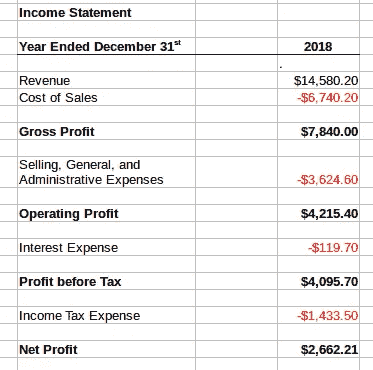
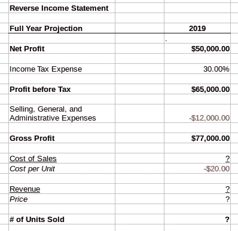
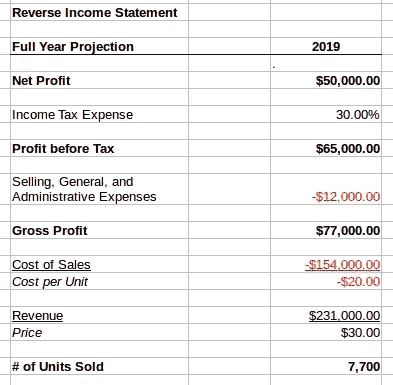

# 激发精益创业的鲜为人知的工具(以及你应该如何使用它)

> 原文：<https://medium.com/swlh/the-little-known-tool-that-inspired-the-lean-startup-and-how-you-should-be-using-it-ab45f3f4af96>

Photo by [Fancycrave](https://unsplash.com/photos/8JY7rLgUZHg?utm_source=unsplash&utm_medium=referral&utm_content=creditCopyText) on [Unsplash](https://unsplash.com/search/photos/modern-tool?utm_source=unsplash&utm_medium=referral&utm_content=creditCopyText)

我们现在对管理初创企业的想法大多来自于精益初创企业。像“pivot”和“最小可行产品”这样的词已经成为任何想要创业的人的标准词汇。

**但是经常被遗忘的一点是**,**作者 Eric Ries 多年来在撰写《精益创业》和发展他的方法论时，从许多不同的来源和该领域先前的研究中获得了灵感。**

其中一部作品是由哥伦比亚大学和沃顿商学院的教授撰写的，它不仅读起来很有趣，而且**他们开发了一个工具，我发现这个工具非常有用，以至于我发现自己在为几乎每一家初创企业提供建议时都会回头去看它。**

创造性地使用，这个工具可以做任何事情，从检查商业想法的可行性，设定你的价格，限制你的营销预算，到预测你需要销售的单位数量。

# 首先，简单介绍一下背景

我提到的这篇论文叫做[发现驱动规划](https://hbr.org/1995/07/discovery-driven-planning)，作者是哥伦比亚大学的丽塔·冈瑟·麦格拉思和沃顿商学院的伊恩·麦克米伦。

他们的原创作品产生于 20 世纪 90 年代中期，主要针对大型企业。他们研究了大公司以失败告终的产品发布历史。他们使用的一个著名例子是迪士尼推出的欧洲迪士尼主题公园。(这让你知道它有多老了！)

尽管已经 25 岁了，但他们的主要建议听起来非常现代:

*   **在不确定的情况下运营(比如启动一个新公司或一个新产品)需要不同的计划**,而不是一个对未来有很好想法的成熟企业
*   在这些不确定的条件下，**你将不得不做出假设，以弥补你不知道的事情**
*   为了成功和避免失败，**你需要识别和测试这些假设**
*   随着时间的推移，随着你了解的越来越多，你可以用真实的数据取代这些假设，并相应地改变你的策略

听起来熟悉吗？

很容易看出精益创业是如何受到发现驱动计划的影响的，它不懈地专注于识别假设并测试它们。

**主要区别在于，发现驱动计划最初是为世界上最大的公司中做出大型战略决策的高级经理设计的。**史蒂夫·布兰克和埃里克·里斯从这篇文章和其他作品中获得灵感，量身打造了我们现在称为精益创业的框架。

但这并不意味着我们不能从发现驱动的规划中学到更多。事实上，因为它是针对更大更复杂的公司，所以它是一个更全面的规划方法——**这意味着有更多隐藏的工具，我们可以适应我们作为初创公司或小企业的需求！**

其中一个工具是一个真正的游戏规则改变者，我在我建议的几乎每一家初创公司中都使用它:**反向损益表。**

# 逆向思考

反向损益表是发现驱动计划建议的主要工具之一，用于跟踪、测试和衡量假设。

提醒一下，一份普通的损益表应该是这样的:

**你从最上面一行的收入(从销售中获得的现金)开始，然后一直到扣除不同目的产生的费用后的净利润。**

对于过去没有接触过会计的人来说，这里要注意的主要事情是，销售成本是与你所销售的东西直接相关的成本*而**销售、一般和管理费用可能是你的租金、工资、营销和其他成本，这些成本不会在你每次销售东西时增加。***

> 对你的会计师来说，这一切都很好，但当你把损益表颠倒过来时，事情就变得有趣多了。

假设你有一个新的创业想法，但是你不确定它是否值得。为了继续做下去(比如说，辞职)，你认为你每年至少需要赚 50，000 美元。

你生活在一个税率为 30%的国家，你已经对租金和营销的间接成本进行了初步分析，估计每月为 1000 美元。你要销售的产品的生产成本是每件 20 美元。

有了这些信息，你就有了一个强大的决策模型！

它看起来是这样的:

只需一些基本信息和一点点回溯，你就能算出，为了使你的最低净利润达到 50，000 美元，你每年需要获得 77，000 美元的毛利。

但是这还不是全部——然后你可以开始插入假设，并用它来帮助做出一些真正的决定。假设你的大多数竞争对手的价格都在 30 美元左右，那么你一开始就假设自己的价格也差不多:

就这样，你就能准确计算出你需要卖出多少件才能达到你的目标！

这是一种测试商业模式并检验其可行性的好方法。**例如，如果你认为你最多能卖出 3000 件，那么你应该知道你现在应该保住你的工作！**

不仅如此，你还可以:

*   根据你认为你能卖出的数量，算出你需要收取的价格
*   根据现有销售额确定营销预算
*   通过投资设备来降低单位成本，尝试不同的生产场景

这些只是我想到的一些…我相信还有更多，这取决于你即将做出的重大决定。如果你不确定该做什么，试着逆向思考！

## 这篇文章发表在[《创业](https://medium.com/swlh)》上，这是 Medium 最大的创业刊物，有+413，678 人关注。

## 订阅接收[我们的头条新闻](http://growthsupply.com/the-startup-newsletter/)。

