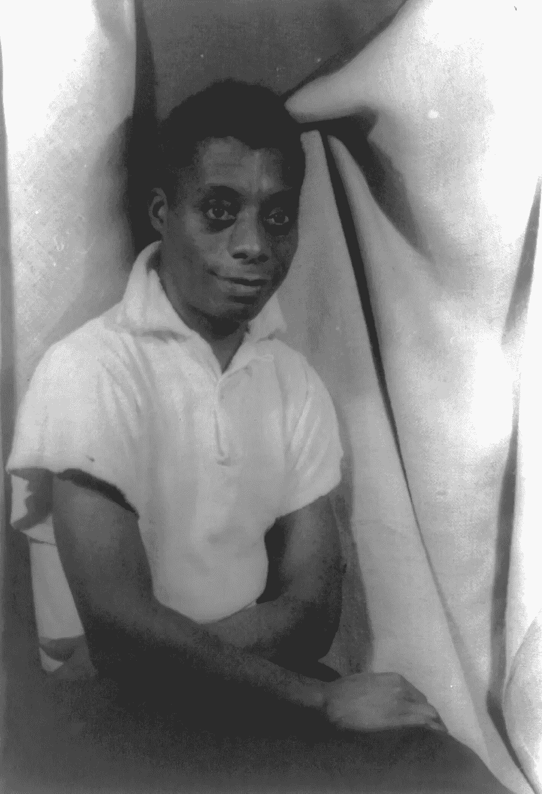

# 作家的疯狂，第四名:詹姆斯·鲍德温

> 原文：<https://medium.com/swlh/the-madness-of-writers-4-james-baldwin-431c0ef9da02>

Image by Carl Van Vechten [Public domain]

艾姆斯·鲍德温已经受够了。

他完了。

不再因为不可避免的自杀或意外服药过量或入狱而失去朋友。他不再试图写那些令人心碎的真相，而他周围的人却不想承认这些真相并与之抗争。绝望地完成，恐惧地完成。