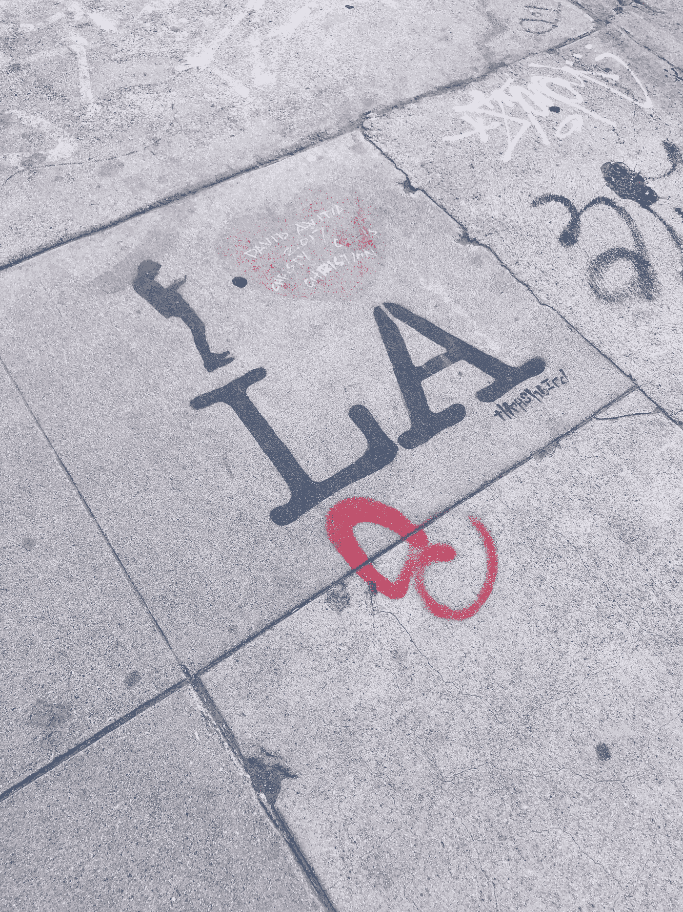

# 作家的疯狂，第五名:查尔斯·布可夫斯基

> 原文：<https://medium.com/swlh/the-madness-of-writers-5-charles-bukowski-63599171c1dd>

Photo by [Brandi Ibrao](https://unsplash.com/@brandialxndra?utm_source=unsplash&utm_medium=referral&utm_content=creditCopyText) on [Unsplash](https://unsplash.com/search/photos/los-angeles-bar?utm_source=unsplash&utm_medium=referral&utm_content=creditCopyText)

> “有些人永远不会发疯。他们必须过着多么可怕的生活啊。”~查尔斯·布可夫斯基

十几岁时，他因德国口音和粉刺而被嘲笑。成年后，《时代》杂志称他为“美国下层社会的桂冠诗人”。在他成长的过程中，他经常被父亲殴打。