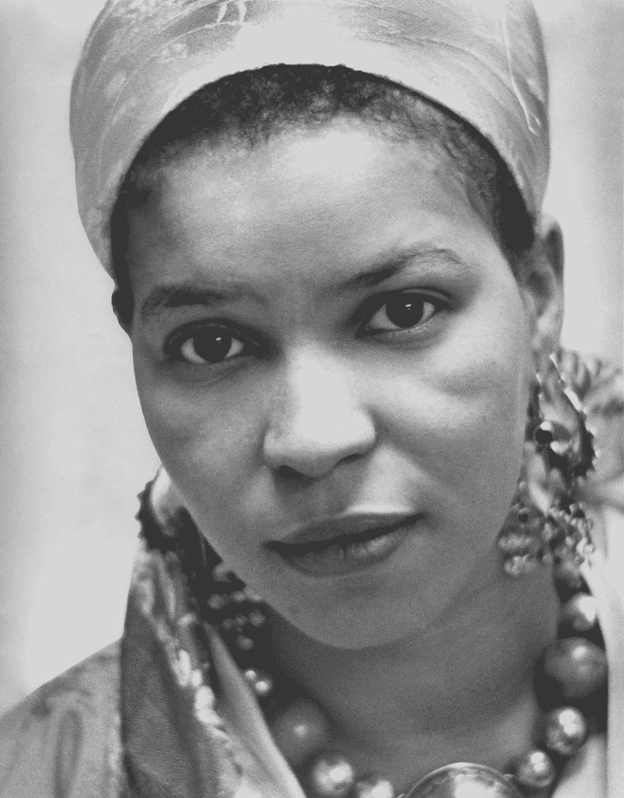

# 作家的疯狂，第 6 名:尼托扎克·尚吉

> 原文：<https://medium.com/swlh/the-madness-of-writers-6-ntozake-shange-5267ceb6700a>

Ntozake Shange/Barnard College; digitally restored by Chris Woodrich [CC BY-SA 3.0 ([https://creativecommons.org/licenses/by-sa/3.0](https://creativecommons.org/licenses/by-sa/3.0))]

我第一次听到尼托扎克·尚吉这个名字是在 1991 年。

我的英语老师 g 女士让我下课后留下来，我记得我在座位上等着，直到所有其他孩子都走了，这样我就不会因为我在一群刻薄的同龄人面前做的事情而被吼了。

其他孩子有很多理由挑我的毛病，我想至少保留一点…