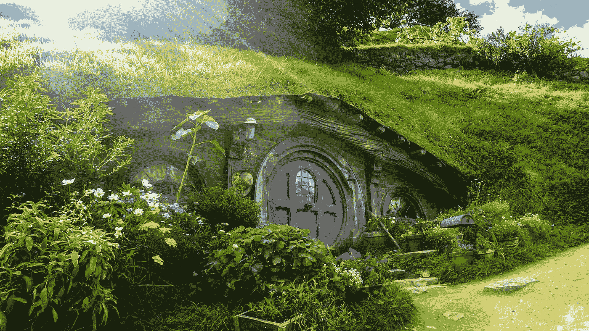

# 作家的疯狂№8: J.R.R .托尔金

> 原文：<https://medium.com/swlh/the-madness-of-writers-8-j-r-r-tolkien-e3bad62b0244>

Photo by [Andres Iga](https://unsplash.com/@andresiga?utm_source=unsplash&utm_medium=referral&utm_content=creditCopyText) on [Unsplash](https://unsplash.com/search/photos/hobbit?utm_source=unsplash&utm_medium=referral&utm_content=creditCopyText)

亚伯一生都热爱树木，当她在家里教儿子良好教育的基础时，她特别关注植物学。

年轻的约翰长大后会知道他们房子周围每一种植物和树的正确拉丁名称。

他也将从他的母亲那里学习古老的拉丁语，并爱上了…