# SaaS CAC 的神奇公式是知道你需要多长时间投保

> 原文：<https://medium.com/swlh/the-magic-formula-to-cac-is-knowing-how-soon-you-need-to-get-it-covered-e17ed834f1f6>

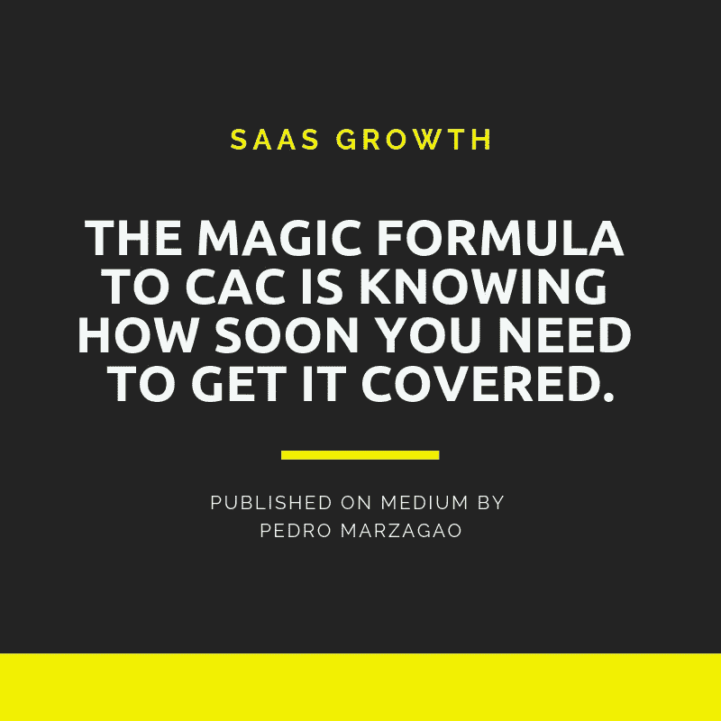

通常，当新的 SaaS 公司开始时，在紧张的几个月准备好产品后，让客户注册他们的产品是他们的首要任务。于是，创始人很容易开始尝试所有已知的收购渠道，在这个过程中花费时间和大量宝贵的资金。

纯粹的客户获取指标是危险的不精确的工具，用来校准和衡量你公司的增长。如果您想以可扩展和盈利的方式发展，您需要超越客户获取，明智地:

*   客户获取成本(CAC)
*   终身价值(LTV)
*   回收期

关于这个话题，有很多优秀的头脑和企业提供了很好的资源。我试图从每一篇文章中收集一些想法，形成我认为的关于这个主题的连贯的基本内容。

目录:

*   [CAC 和 LTV](#2e41)
*   [CAC 怎么算？](#21ec)
*   [CAC 和 CPA 为什么不一样？](#c8a1)
*   [如何真正算出 CAC](#8dc5)
*   [已付 CAC](#d36f)
*   [内容营销的 CAC](#5061)
*   [如何降低 CAC](#5070)
*   [优化定价](#e3c9)
*   [营销自动化](#3045)
*   [转换率优化(CRO)](http://CRO)
*   [撬动口碑](#c4a4)
*   [关注你的信息](http://Focus your message)
*   [减少依赖一个付费广告](#c4eb)
*   [长期赌内容？](http://Bet on content for the long term?)
*   [有什么影响](#e4be)
*   [进入 CAC 回收期(CPP)](#f1dd)
*   [为什么它更重要](#91da)

# CAC 和 LTV

两个好朋友。

SaaS 企业的特殊性告诉我们，获得一个新客户不仅需要考虑获得每个客户的成本，还需要考虑这个客户需要带来多少收入，才能让收购变得有利可图，你才能继续投资增长。

SaaS 所谓的“指标之神”, LTV/CAC 比率，准确地建立了这两个指标之间的关系:CAC 和 LTV，强调了它们之间被认为是正确的比率，以便企业首先盈利，覆盖所有成本，然后有效地实现增长。

在设定你的 CAC 目标时过于保守，会损害你更快增长的机会，过于自由会在相当短的时间内使你的商业财务下降。

因此，CAC，即客户获取成本，是一个你应该时刻记住的指标，有助于塑造营销漏斗，向哪些客户销售，选择什么渠道，自动化什么流程，以及如何考虑你的定价结构。

# CAC 怎么算？

在 SaaS 金融界，这是一个如此重要的指标，也是决定公司商业模式是否可行的决定性因素之一，在扩大规模的同时保持较低的利润，虽然它的计算是最容易解释的，但它也是最容易出错的指标之一:

**CAC 可以定义为获得客户所需的销售和营销努力的总成本:**

> *CAC =营销总额+销售费用/*获得的新客户数量

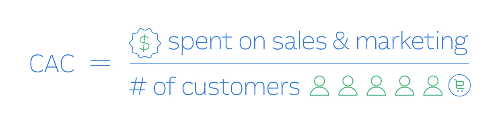

Source: Intercom

等等，但那不是和 CPA 一样吗？不完全是。

# CAC 和 CPA 为什么不一样？

正如布莱恩·巴尔弗正确指出的那样，

> CAC 专门衡量获得客户的成本。相反，CPA(每次获取成本)衡量的是获取非客户的成本，例如，注册、激活用户、试用或销售线索。这两者是相关的，因为 CPA 通常用于衡量成本，而成本是 CAC 的主要指标。

换句话说，获得客户包括一系列不同的计划和活动。这些可以用 CPA 更好地衡量，而最终获得客户的最终回报应该用 CAC 衡量，将导致用户有效成为客户的所有成本都考虑在内。

既然我已经向您展示了如何计算 CAC，那么让我向您展示如何正确地进行计算。

# 如何真正计算 CAC

再一次，布莱恩·巴尔弗在他的著作[“如何实际计算 CAC”](https://andrewchen.co/how-to-actually-calculate-cac/)中，陈楚翔引用了他的话，说得很好:

> 从表面上看，这是正确的，但它缺少等式中每个变量的许多细节和定义。即使是最好的基本计算也可能会产生误导。

并非每个模型都是完美的，在某种程度上，大多数企业都不能有效地准确衡量每个客户的总体购买成本。然而，Brian 的模型考虑了一些相关的调整，这有助于比原始公式更好地包装它:

*   对于大多数客户来说，从销售线索到成为客户平均需要 60 天。
*   不是所有的顾客都是新顾客，但他们中的一些人会再次光顾。
*   这是一个免费增值产品，在用户成为付费用户(客户)之前，在他们免费的时候，支持他们是有成本的。

因此，我们需要向我们的企业提出 3 个问题:

1.  从您的营销/销售接触点到某人成为客户之间有多长时间？
2.  营销+销售包括哪些费用？
3.  关于回头客我该怎么做？

当考虑要计入哪些费用时，以下是你应该注意的常见陷阱:

1.  不包括工资——你应该包括所有营销和销售人员、自由职业者、远程人员等的工资。不要忘记这一点。
2.  不包括开销—租金、设备也应在此考虑。
3.  不包括花在工具上的钱——鉴于市场营销工具的数量，你绝对应该把它包括在成本中。

关于是否应该包括非营销/销售收购成本也存在争议。这是一个棘手的问题，应该根据具体情况来考虑。我不得不同意 Brian 的观点，即必须接受任何与获得新客户相关的成本，包括与产品/工程或支持相关的成本。

因此，考虑到上述所有因素，我们每月计算 CAC 的新公式(从销售线索到客户的平均时间为 60 天)为:

> *CAC =(营销费用(n-u) + [1/(u/30)销售额(n-u-30) + … + 1/(u/30)销售额(n)] /新客户(n)*

n=当前月份

u =从销售线索到客户的平均时间

从销售线索到客户的平均时间为 60 天:

营销费用(n-60)+[1/3 销售额(n-30) + 1/3 销售额(n)] /新客户(n)

与更简单的方法相比，您可以在下面看到第二个模型的结果有多么不同。具体检查一下 3 月份的 CAC，你可以清楚地看出有一大笔营销投资。

如果你采用了简单的方法，你就会落入陷阱，认为 3 月份的投资对你的目标 CAC 来说很糟糕。将从销售线索到客户的时间考虑在内使计算更符合现实。

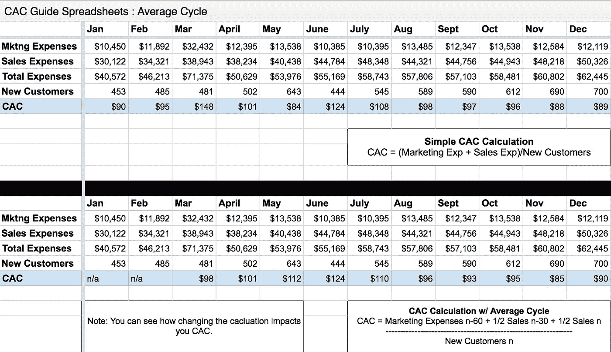

最后，**回头客**。

因为你通常不会将回头客视为新客户，因此首先将其排除在等式之外，你也不应该出于这一特定目的将保留成本视为营销成本的一部分。

理想情况下，您应该能够将获取成本和客户从保留中分离出来，并为每一项计算单独的 CAC。在不可能这样做的情况下，或者在您自己的计算中尽可能考虑假设的情况下，您应该记得将重新激活的客户数量添加到分母中，以便获得更接近现实的值。

现在你可能已经理解了，计算一个真实的 CAC 比它看起来要难，并且异常在每个角落都会出现。

既然我们已经解决了基本公式，是时候更深入地了解这个游戏了，看看一些场景。

*   有偿收购的 CAC
*   内容营销 CAC

注意:对于非 SaaS 企业，计算可能会有所不同。壁虎把它们整齐地排列在这里。

# 已付 CAC

付费收购通常是企业的一种选择，他们可以预见到通过付费渠道，如谷歌广告、脸书广告和 LinkedIn 等，可以获得相当大的受众。通过这种类型的渠道，我们可以极大地扩大我们的固定成本，尽管乍一看，它似乎真的会将您的 CAC 扔出窗外。

考虑以下内容，摘自 Brian Balfour 在 CAC 计算方面的[杰出工作](https://brianbalfour.com/essays/average-cac-mistakes-growth):

*   我们 100%的营销努力都集中在脸书广告上。
*   我们有一个挣 17 万美元的营销副总裁，和一个挣 8 万美元的采购经理。
*   没有销售团队(消费公司)
*   我们正在测试脸书广告作为一个渠道。
*   我们的目标 CAC 是 25 美元

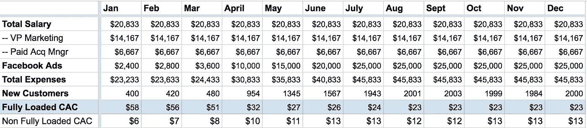

通过查看上面的内容，您可以清楚地看到，在最初的几个月里，CAC 远远超过了 25 美元的目标。然而，根据测试活动提供的早期结果，我们可以预见，当活动实际扩大时，随着我们获得的客户越来越多，固定成本将被稀释。

如果我们想测试这种渠道的限制，我们可以考虑每个付费收购经理可以接受的最大管理预算，并将其考虑在内。

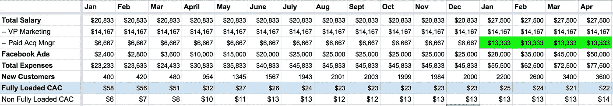

对于这个练习，如果我们认为 25000 美元是一个受薪采购经理可以管理的最大预算(通常可以轻松达到 100 万美元)，在一个简单的方法中，我们可以看到新员工可以扩展到 4400 个新客户的水平，使满载的 CAC 达到远低于目标的水平。要记住的一件事是频道饱和度，这与你的观众规模密切相关，这应该是这些类型的预测所预期的，因为整体效率往往会更差，使 CAC 再次上升。

# 内容营销 CAC

在相反的范围上，我们可以找到内容营销。一个渠道的产出不会随着更多资源的增加而直接增加。

让我们考虑一下这个:

*   我们的营销工作 100%是内容营销。
*   平均销售周期不到 30 天。
*   我们有一个营销副总裁 17 万美元，2 个内容创作者赚 8 万美元。
*   每个内容创建者每月生产 5 件内容。
*   在一个月内，一条新内容获得 2000 次访问。此后每个月获得 1000 次访问，由于搜索引擎优化。
*   我们 2%的流量转化为潜在客户。我们对新客户关闭了⅓的销售线索。

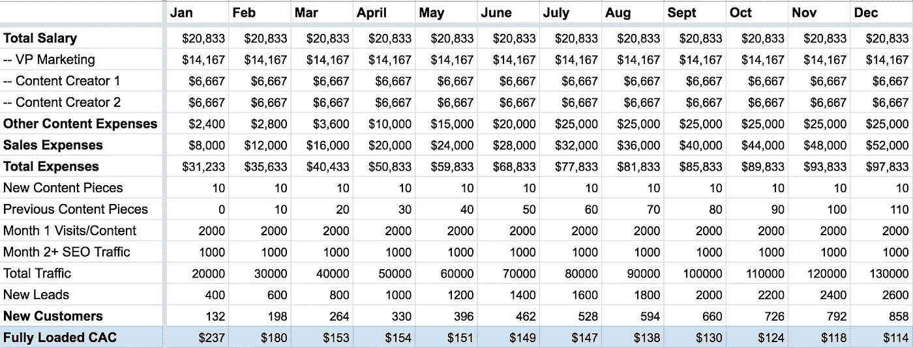

正如我们在这里看到的，从长远来看，我们满载的 CAC 下降的原因是内容输出在时间上占优势，并且在发布后的一个月内仍然产生结果。保持内容新鲜，并确保恢复旧帖子，博客内链接和搜索引擎优化，注意确保您过去的内容不断获得新客户的良好比率。

# 如何减少 CAC

我们已经看到，CAC 在塑造 SaaS 业务增长方面发挥着重要作用，如果没有:

*   衡量 CAC 的清晰方法，尽可能细分，取决于业务的性质。
*   高层管理人员对试验不同渠道的认可，接受偏离目标的 CAC，而该渠道没有双倍下注。
*   提前了解每个频道的受众规模。

话虽如此，我们看到企业处理高 CAC 有几种方法:

*   优化定价
*   营销自动化
*   阴极射线示波器
*   利用口碑
*   集中你的信息
*   减少对付费广告的依赖
*   对内容进行长期投资

## 优化定价:

> 当你不优化你的定价时，你就丢掉了数学，而数学是你业务的基础经济学的动力。另一方面，定价是一个巨大的增长机会，因为优化定价会让公司变得非常高效——智能定价

与这里讨论的大多数主题一样，这里有很多内容要讨论。我将把细节留到另一篇文章中，但是关键的要点是:

*   定价页面是整个网站上最重要的页面
*   定价策略的制定考虑到了:**定位**(调整你的产品以吸引正确的客户)**包装**(在你的计划中有正确的功能组合)和**价格点**(找到代表价值和用户愿意支付的正确价格点。
*   定价策略需要是一个迭代的过程，而不是在产生第一个定价结构后就被抛弃。业务部门应每两个月召开一次定期会议，评估定价、引入新数据、每 4 个月重写一次战略并每年调整 2 次。
*   定价委员会和定价协调员应定期召开会议，并由公司不同领域的人员组成(营销、销售、产品和管理—之后将财务和运营纳入其中)。
*   交付单个帐户的成本可能是最低的。对他们来说，重要的是你的客户将从使用你的产品中获得的价值，而不是你花了多少钱来开发它。
*   大多数 SaaS 企业除了一些概括性的描述外，无法描述他们的买家角色。没有数据驱动的买家角色，公司就无法在 SaaS 取得成功。不管你以前见过什么，买家角色实际上是关于数字，而不是文字。

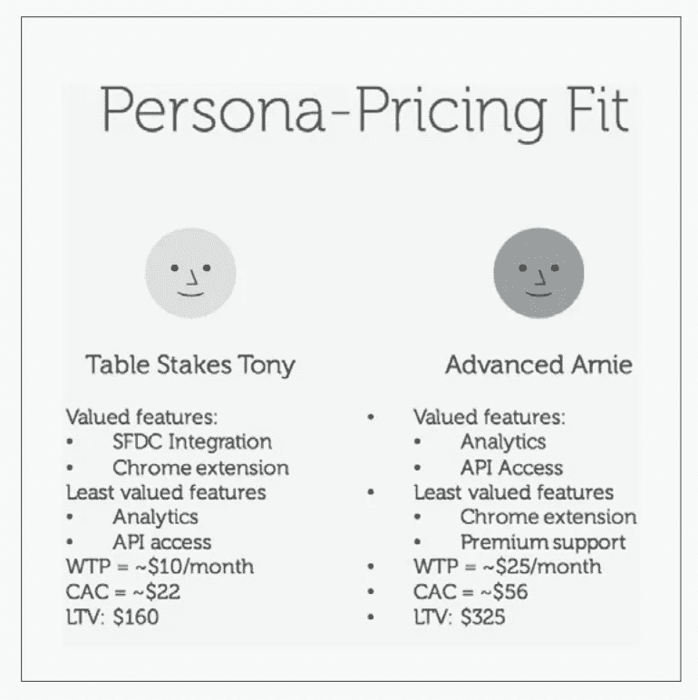

Data-driven buyer personas — Source: PriceIntelligently

优化的定价策略会让我们获得优化的漏斗。如果你能有效地进行定位、包装和定价，那么你的销售和营销工作的很大一部分已经完成了。如果没有这种定价策略，获得客户的成本会更高，因为你会吸引不符合你价值的错误潜在客户。

**你应该做什么:**

*   定价页面设计(远离 A/B 测试定价)
*   本地化您的定价
*   了解你的价值标准——人们实际上对你的产品赋予了什么价值(部件数量，存储容量
*   实施基于价值的定价。如此处所示，基于价值的定价考虑了产品在客户业务所处的特定阶段为客户带来的价值。
*   量化你的购买人物角色——这意味着真正将数据引入你的购买者人物角色，而不是仅仅使用形容词，这些形容词最终不会帮助你制定定价策略，也不会帮助你做出数据驱动的决策。
*   在调查您的购买角色时使用[相对偏好分析](/howtob2bapm/dont-leave-money-on-the-table-price-your-saas-products-right-85d75df872c7)，以了解他们的支付意愿

**你不应该做的事情:**

*   A/B 测试定价(一个会让你的客户恼火的大禁忌)
*   复制竞争对手的定价策略(这是他们的策略，符合他们的目标和财务结构，而不是你的)，这也被称为基于竞争对手的定价
*   选择一种定价方法，在这种方法中，通过评估公司发生的所有可变成本来确定销售价格，并在
    中增加一个加价百分比来确定价格，这也称为成本加成定价。

**这些都很好，但是这和提高我的 CAC 有什么关系呢？**

说得好。嗯，如果你比较一个没有优化定价的场景，也就是说没有基于价值的定价策略，你就在盲目地获取客户，没有最大化他们可能支付的价格，没有专注于探索可以为你带来更多收入的客户群，没有理解当你的客户增长时你的业务也可以增长。

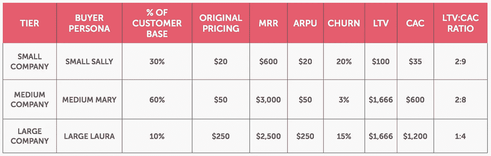

Source: PriceIntelligently

虽然所有这些都不会直接降低你的 CAC，但它给了你一个全新的视角，让你知道为了什么而努力，追求哪些客户，在哪里投入更多或更少的营销资金。

注意:感谢 PriceIntelligently 对他们的文章[“为什么你今天需要审查你的定价策略”](https://www.priceintelligently.com/blog/pricing-strategy)所做的出色工作。你绝对应该让他们关注你，因为他们定期发布关于 SaaS 定价策略的惊人内容。

## 营销自动化

有了大量的工具，没有理由不尽可能地自动化您的过程。一旦你开始思考你每天做的每一项管理任务要花多少时间，然后乘以你做的次数，我的建议是寻找一种自动化的方法。

**什么事**

一些人谈论营销自动化是策略，一些人谈论营销自动化软件，其他人只是把它作为客户关系管理的一个子集。为了简单起见，我们称之为营销自动化，因为它的真正含义是什么，从这个术语本身就可以猜到:你自动完成你的营销。

正如[中枢点](https://www.hubspot.com/marketing-automation-information)所说，

> 在最好的情况下，营销自动化是允许公司像亚马逊一样买卖的软件和策略，也就是说，用高度个性化的有用内容培养潜在客户，帮助将潜在客户转化为客户，并将客户转化为满意的客户。

和 ActiveCampaign，

> 营销自动化是使用软件完成重复性营销任务的过程，这些任务旨在培养销售线索、个性化营销信息和内容，并在此过程中节省营销人员的时间和精力。通过自动化这些任务，用户可以更有效地在正确的时间向正确的用户发送正确的消息

**什么可以自动化？**

从整合你的内部数据库(一开始可以是电子表格)，到你的电子邮件、聊天、CRM 或账单平台，有几种方法可以开始考虑这个问题。Neil Patel 在这里介绍了一些应该自动化的顶级活动。

总的来说，我通常把营销自动化的优势描述如下:

*   帮助您扩展重复性任务
*   改善销售线索管理
*   增强针对性和个性化
*   提高用更少的资源进行多渠道营销的能力
*   提高客户保持率和客户关系
*   提高营销与销售的一致性

**与营销自动化相关的问题**

营销自动化已经成为热门词汇好几年了，不幸的是，它经常被混淆为营销的圣杯，需要一个人来掌握它，以实现类似亚马逊的结果。

事实是，一旦你给自己一个已经被证实的方法来产生高质量的销售线索，营销自动化就会起作用。

一天结束时，自动化您的营销任务有助于提高您带来收入的效率，减少人工干预，加快流程，并在业务扩展时保持流动。然而，对于一个要扩大规模的企业来说，它首先需要高质量的投入，否则，你只是在榨干柠檬的最后一滴。

认为营销自动化将解决你的收入问题是不可取的。

这方面的一些额外资源:

*   [营销技术:如何利用营销自动化赚钱或赔钱——VentureBeat](https://venturebeat.com/2014/04/23/marketing-tech-how-to-make-or-lose-money-with-marketing-automation/)
*   【Relevance.com 线索评分分级:有效线索管理的基础
*   [营销自动化的 5 个关键问题—商业 2 社区](https://www.business2community.com/brandviews/makesbridge/5-key-problems-marketing-automation-01388642)
*   [营销自动化失败的 5 个原因——尼尔·帕特尔](https://neilpatel.com/blog/5-reasons-marketing-automation-fails-avoid/)
*   [营销自动化失败的 4 个原因——Marketo 博客](https://blog.marketo.com/2016/04/4-reasons-why-marketing-automation-fails.html)
*   [10 个可怕的营销自动化失败以及如何避免它们——call box 博客](https://www.callboxinc.com/marketing-automation/marketing-automation-fails/)
*   [营销自动化失败的 6 个常见原因— ActiveCampaign 博客](https://www.activecampaign.com/blog/common-reasons-why-marketing-automation-fails/)

**那么，我应该什么时候投资营销自动化呢？**

*   想想你是否正在创造一个稳定的新的和合格的线索流。
*   您的销售团队对从您这里获得的大量优质线索有多不知所措？
*   您是否已经有了一个高效的内容战略，与您客户的旅程相对应？
*   营销和销售已经就对话的所有权达成一致？在每个具体步骤中，谁应该与客户交谈？
*   您是否在每个接触点和营销渠道(不仅仅是电子邮件)跟踪您的销售线索的数字肢体语言？
*   您是否已经测试了足够多的获取渠道，以便能够说您有一个经过验证的可扩展的潜在客户培育战略？

好吧，概括一下:

*   在冒险进入营销自动化之前，你应该已经有一个清晰的质量线索进入业务的管道。
*   你应该已经在专门为你的受众群体创建内容了。想想如何构建你的集客营销策略。

一旦你做到了这一点，营销自动化将很好地适应优化与客户的关系，并实际上有助于增加他们对你的业务的整体体验的个性化价值。

**如何影响 CAC？**

Act-on 的卡拉·亨德里克斯说:

> 营销人员可以扩展他们的流程和活动，这样他们就可以用更少的努力接触到更多的人。因为它允许您跟踪每一次互动并记录参与度，所以您可以在保持效率的同时，使您的信息更加个性化和有针对性。

营销自动化是关于效率的。如果做得好，它可以真正为您的整体发展带来价值:

*   在获取新用户方面(更少的人力接触，也就是更少的薪水，更高的转换率，更高的每美元投资回报，更快的转换率，也就是缩短销售周期)——**更低的 CAC。**
*   增加您的收入扩张(在通过货币化漏斗的过程中抓住他们，引导他们增加从您的服务中获得的价值，从而提升他们的订阅价值)——**增加来自现有客户和您的整体 ARPU 的收入。**
*   通过降低客户流失率(始终关注客户，更频繁地收集和重复反馈，并不断提高他们对订阅的感知价值)——**降低客户流失率。**
*   从而提高你的 LTV 和 LTV/CAC 比率，带来更高的增长。

## 阴极射线示波器

与营销自动化密切相关，正在通过转化率优化(CRO)改进您的销售线索生成机器。

首先，什么是 CRO？

> 转化率优化(CRO)是使人们在访问网站时采取行动的过程。通过设计和修改网页的某些元素，企业可以增加网站访问者在离开之前“转化”为潜在客户或顾客的机会——Hubspot 博客

您可以从几个资源开始:

*   [转化率优化基础知识 Moz 博客](https://moz.com/learn/seo/conversion-rate-optimization)
*   [转换率优化指南— Hubspot 博客](https://blog.hubspot.com/marketing/conversion-rate-optimization-guide) —在这里，他们进入了自己的营销自动化领域，混淆了这两个概念，但带来了很好的见解。

正如营销自动化所发生的那样，这再次意味着，**提高效率**——这一次是把访问者变成顾客。

SEO 和 CRO 是一样的吗？

徐和 CRO 走在一起，但他们并不相同。搜索引擎优化(SEO)的重点是增加你网站的流量，但一旦发生这种情况，CRO 的工作就是转化用户，并帮助他们采取有利的行动。

整个世界都在进行转换率优化，然而，它所需要的大部分都与实验、A/B 测试密切相关，并确保您向每个潜在客户传达了最重要的信息。

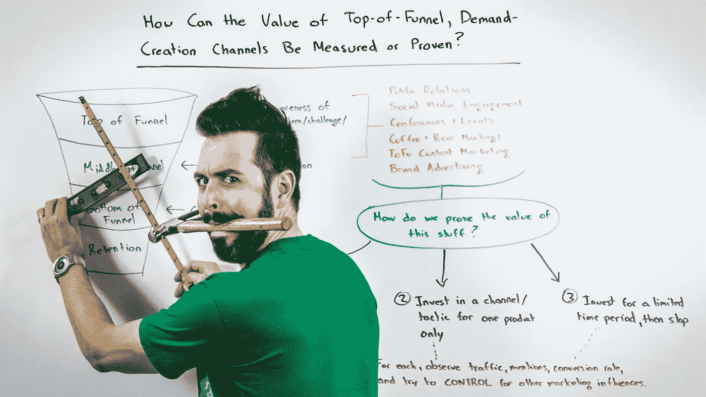

Source: [Baremetrics](https://www.google.com/url?sa=i&source=images&cd=&cad=rja&uact=8&ved=2ahUKEwje4ZCbyrbgAhXByYUKHe58DxwQjhx6BAgBEAM&url=https%3A%2F%2Fbaremetrics.com%2Fblog%2Fthe-importance-of-founder-generated-content&psig=AOvVaw3MbaTmAPQd_nY8LgWP0o_k&ust=1550074094174104)

**转化率优化从何而来？**

人们最容易理解的是，CRO 与漏斗顶端的用户参与度有关——在它变成客户之前。话虽如此，CRO 最佳实践大多数时候都与测试您的营销套件中以下元素的变化有关:

*   广告文案
*   登录页面消息
*   行动号召
*   网站可用性(用户看到了什么，她/他什么时候看到的，以及她/他如何移动)

**如何影响 CAC？**

提高转换率意味着您可以用相同数量的潜在客户获得更多客户，或者从另一个角度来看，用更少的潜在客户获得相同的客户——无论如何，您都可以用更少的资源赢得客户，从而对您的 CAC 产生积极影响。

## 利用口碑

ChartMogul 的 Annie Musgrove 是这样说的:

> 口碑是最古老的营销形式之一。也是最有效的。但在当今世界，当客户是其他公司时，它真正的价值是什么？B2B 企业如何充分利用它？

任何不花一分钱就能带来额外顾客的东西，通常都是 CAC 友好的。找个人来传播你的好消息，带来一个新客户，你就可以在获得他们的成本上给自己一个不错的削减。

口碑可以通过多种可能的方式来实现，事实证明，在购买过程的每个阶段，口碑都是最有影响力的商业倡导者。

在我们的个人生活中，我们都可以找到这样的例子，我们向朋友推荐了一些东西。然而，它对企业也是这样吗？

绝对的。

根据《传染性:为什么事情会流行起来》一书，人们通常会分享 6 件事情:

1.  社会货币
2.  扳机
3.  情感
4.  公共(可观察性)
5.  实际价值
6.  故事

换句话说，B2B 也是如此:

*   他们真的重视你的产品或服务。事实证明，它解决了他们遇到的问题 X，因此他们会直观地与他们的网络分享它。
*   知道在企业内部，事情进行得更顺利——与行业分享商业秘密的动机更少——也有客户喜欢被感知的方式，所以这可能是一种有利于你的策略，以确保你的产品让你的客户以某种方式感受。
*   你给你的顾客带来了惊喜，做了一些他们意想不到的事情。这里有一个建议，不要承诺太多，也不要兑现太多。

那么，你可以在哪里利用这个市场渠道呢？

*   像家人、朋友或同事这样的可靠来源被麦肯锡称为**高影响力参考。**高影响力推荐人引发购买的可能性**是**的 50 倍。
*   激励顾客写关于你的业务的评论。读者知道，评论是由同行业的企业主、熟悉行业或商业模式的人撰写的。所以在 B2B 中，在线评论可能比 B2C 更有分量。
*   保持强大的在线形象会让你处于第一位。
*   为你的网站提供建议、提示或专门页面，解决你的客户关心的一个已知话题。
*   撰写触及用户痛点的客户故事、案例研究和评价。
*   让顶级用户参与产品，让他们参与路线图，收集他们的反馈，让他们有机会相互联系，与产品建立联系，并在网络之外利用产品。
*   启动一个推荐项目，采用注重你的价值指标的双重奖励系统——给推荐人和推荐人一些价值指标。
*   引入一个合作伙伴计划，让你能够利用其他业务受众，让他们推荐你，以便从中分一杯羹。
*   从一开始，就让你的产品真正方便从内部与他人分享。把邀请其他用户作为整个产品体验的一部分。

为了避免在这个话题上纠缠太多，我给你留下了一些有价值的资源:

*   [B2B 的小道消息:口碑如何实际运作——ChartMogul](https://blog.chartmogul.com/b2b-word-of-mouth/)
*   [倡导营销——SaaS 生态系统中新的竞争差异——ambassialize](https://www.ambassify.com/blog/advocacy-marketing-for-saas)

## 集中你的信息

拥有大量的受众似乎对你的业务非常有利，所有这些用户都准备从你这里购买。直到你醒来，意识到你把大部分的钱都花在了那些客户身上，这些客户流失很多，或者根本没有沿着订阅漏斗进入付费计划。

尽可能细分你的 CAC 可以让你把你的信息集中在受众身上，在他们的一生中给你带来更多的收入。

查看 Modcloth 如何接近他们的观众:

> “Modcloth 为每一个寻找复古女装的人提供了一个令人兴奋和迷人的在线购物体验。”

他们已经准确地解释了他们的目标是谁，他们提供什么，你可以从他们那里得到什么。这一信息转化为他们的产品文案、产品照片以及数字营销的方方面面。

当你做到这一点时，你在获取新客户上的花费就会减少，因为你的信息会针对那些对你最有利可图的人进行微调。Modcloth 并不是为了吸引那些追求基本造型的女性，所以推销一条裤子并不一定对她们有用，尽管她们可以这样做。

将您的信息集中在 LTV 较高的客户群上，可以为您增加 CAC 提供腿部空间

了解你的定位，并与他们交流。不要试图吸引那些只会逛商店或者只从你这里购买一次的人。

## 减少对付费广告的依赖

这个很清楚。付费广告可以奇迹般地启动你的收购，如果你的产品的 ARPU 可以处理它，你绝对应该考虑尝试一下(在不同的帖子中有更多的内容)，然而，一旦你关闭了美元水龙头，客户就不会蜂拥而至了。

使用 Qwilr 开发的有趣工具检查您的企业是否可以处理付费广告。

付费广告肯定能起到推动作用，尤其是在早期，如果你有足够的钱的话。我们在上面已经看到，如果您设法获得良好的性能，您可以很好地扩展，同时保持较低的固定成本。

确保优化你的漏斗，这样你就可以通过保持低流失率来最大化你的投资。没有什么比试图用破网捕鱼更糟糕的了。

## 长期押注内容？

听起来是个好建议，对吧？符合你所听到的:建立一个博客，创造新的内容，更新旧的内容，成本在短期内会更高，但 SEO 会给你的内容一个好的生活，并不断带来新的客户。

没那么快。让我们考虑一下。

每天都有成千上万的内容被创建出来，而且内容越来越长。这意味着在这一领域的竞争也越来越难。

在 Profitwell 与 Brian Balfour 就[内容营销模式的衰落所做的一项研究中，](https://www.profitwell.com/blog/content-marketing-customer-acquisition-cost)他们明确表示:

> B2B 和 B2C 的 CAC 整体都在上升

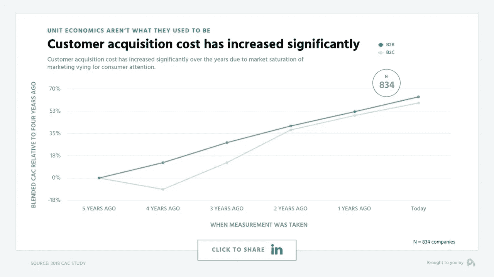

Source: Profitwell

此外，从渠道演变来看，内容营销的 CAC 正在迅速弥补向付费的差距。

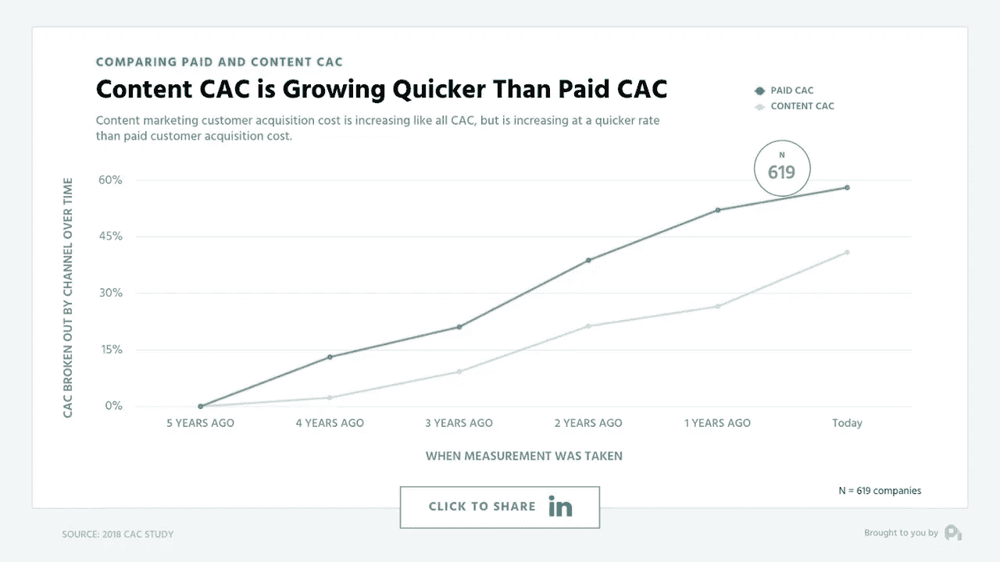

Source: Profitwell

所以，数量在增加，质量也在提高——更多的竞争，更多的选择，更少的关注。与两年前相比，每个帖子的平均分享数实际上下降了近 90%。一本电子书的寿命从 6 个月降到了 3 个月！

这是否意味着内容已死？不完全是。

根据 Hubspot 2018 年的内容营销统计:

> 47%的购买者在与销售代表接触之前仍然会浏览 3-5 条内容，有博客的公司仍然比没有博客的公司多获得 67%的潜在客户，呼入成交率仍然是呼出的 8-10 倍。

虽然内容无疑会增加每个客户的成本，但它带来的价值也一直高于付费。由于内容的复合性质，内容的 CAC 比率仍然比付费端高出大约 30%。

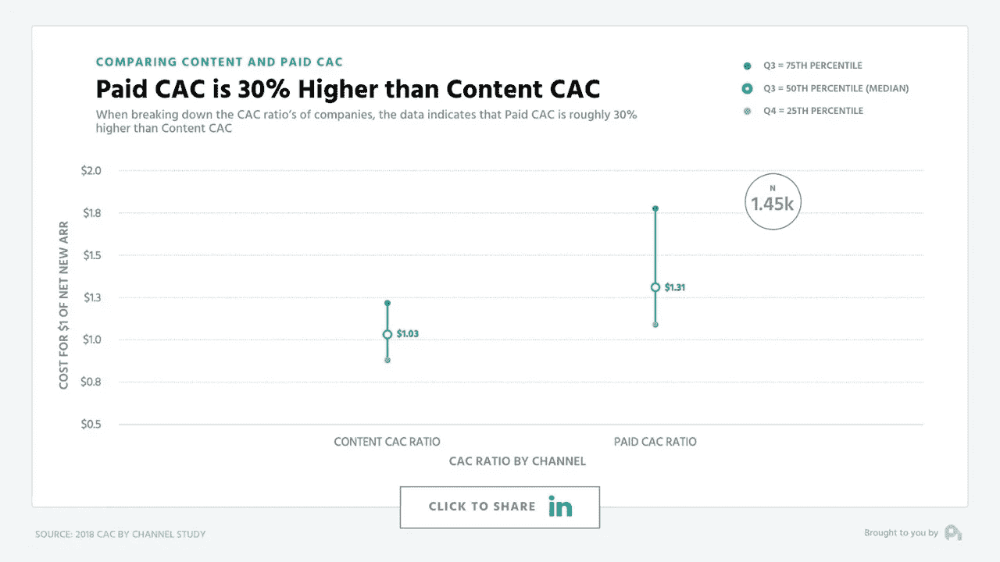

所以，如果你刚开始做一个低 ARPU 的产品，内容很可能不会成为你选择的获取渠道，尤其是当你不得不为它租用资源的时候。然而，这也不意味着你不应该把内容放在那里，以解决漏斗的较低层次——考虑培养你的免费用户的内容，激活你最近的订户的内容，以及保留你现有客户的内容。

如果你已经在全力创作内容，你应该停下来吗？不完全是，可能你的利润比以前低了，但正如我们所看到的，CAC 比率仍然弥补了它。我所看到的一个很有效的方法是用相似的观众来推广你的内容。在脸书广告商中，长相相似的受众风靡一时，他们希望在降低 CAC 的同时提高广告支出回报率(ROAS)。

这是有道理的。最有可能的新客户来源之一就是找到那些和你现有客户相似的人。

# 它会产生什么影响

CAC 和 LTV 是任何企业都应该记住的基本指标。

*   如果你的企业记录的 LTV/CAC 比率超过 3:1，这意味着你正在覆盖你的成本，你正在高速增长。
*   如果你的比率下降到 1:1，你只是在弥补你的成本，而不是增长。简单而意外的成本增加会让你不知所措。
*   高于 5:1 的比率意味着你可能花得太少，错过了市场，给了你的竞争对手这样做的空间。考虑拓展新的受众，让你的付费端覆盖更多的潜在市场，获得更多额外的印象份额和额外的位置。

LTV/CAC 比率是预测企业未来增长的领先指标，但它很容易改变。例如，如果市场上出现新的竞争对手，导致你的客户流失，你的 LTV 可能会下降。或者，如果你做出了真正积极的产品改变，而你的整体流失率下降，你的 LTV 可能会增加。

## 进入 CAC 回收期(CPP)

很有可能，即使知道以上所有情况，在一个场景中，你已经设法获得非常低的流失率和令人难以置信的 LTV/CAC 比率，你的企业可能只有几个月的时间来偿还债务。

> " CAC 的回收期决定了公司需要多少现金来发展."——汤姆·通古兹，红点风险投资公司合伙人

更多的真实世界的例子，你有利润的好处。

> 如果你买了一杯咖啡，你会享受这一刻的温暖和味道，并在几个小时后受益于咖啡因的刺激。如果你支付健康保险，两年后当你需要例行检查时，你会从中受益。如果你为客户付费，在客户的订阅收入超过他们的获取成本之前，你不会从获取中受益。利润井

这时，您需要了解 CAC 回收的概念:

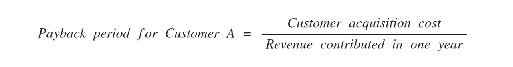

Source: [ProfitWell](https://www.profitwell.com/blog/saas-guide-to-calculating-and-reducing-payback-period)

您可以通过将客户的 CAC 除以他们一年贡献的总收入(他们的月订阅率乘以 12)来计算一个客户的回收期。

一个客户花费 350 美元的销售和营销费用，每月投入 25 美元或每年投入 300 美元，投资回收期为 13.9 个月。

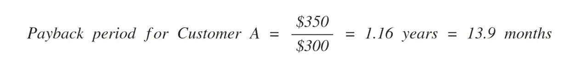

Source: [ProfitWell](https://www.profitwell.com/blog/saas-guide-to-calculating-and-reducing-payback-period)

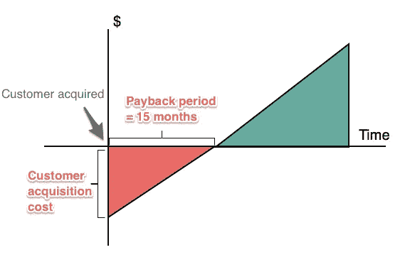

上面的例子显示了收入/支出和时间。随着时间的推移，客户通过他们的增量订购支付来偿还更多的客户获取成本(CAC)。

您还可以将 CPP 转化为我们所说的 CAC 比率，它告诉我们您的销售和营销团队在 12 个月内能够收回多少%的 CAC。

如果你想更深入地了解 CPP，我建议你阅读 Kellblog 上的惊人之作，解释为什么 [CPP 是最被误解的 CAC 指标](https://kellblog.com/2016/03/17/cac-payback-period-the-most-misunderstood-saas-metric/)和 [ProfitWell 关于缩短回收期的完整指南。](https://www.profitwell.com/blog/saas-guide-to-calculating-and-reducing-payback-period)

# 为什么它更重要

了解你的商业 CAC 应该很重要。更重要的是，我仍然看到许多初创公司和小企业使用一般的 CPA 模型来指导他们的日常工作，而不知道他们正在错过让他们的业务更有效地获取和保留客户的机会。

> 从技术上讲，我心目中的 CAC 问题没有绝对“正确”的答案。最终，你花在任何东西上的金额都应该与它的价值相关，这意味着我们需要将客户获取成本与客户终身价值相关联(LTV)。— [凯尔博](https://kellblog.com/2013/12/01/the-customer-acquisition-cost-cac-ratio-another-subtle-saas-metric/)

计算你的整体业务 CAC，并将其分解为客户类型和获取渠道，这让你有所侧重，迫使你停止将资源花费在不会给你的业务带来收入的方面，将这些资源引导到带来收入的细分市场，而是深入提高漏斗中较低阶段的效率，修补桶中的漏洞，从而增加 LTV，给你一些额外的腿部空间来推动你的业务增长。

佩德罗是一个小女孩的父亲，也是一名全面的营销人员，拥有 12 年为谷歌、B2C、B2B 和 SaaS 企业工作的经验。

想伸出手吗？[在 LinkedIn 上取得联系](https://www.linkedin.com/in/pedromarzagao/)。

## 这篇文章发表在 [The Startup](https://medium.com/swlh) 上，这是 Medium 最大的创业刊物，拥有+438，678 读者。

## 在这里订阅接收[我们的头条新闻](https://growthsupply.com/the-startup-newsletter/)。

