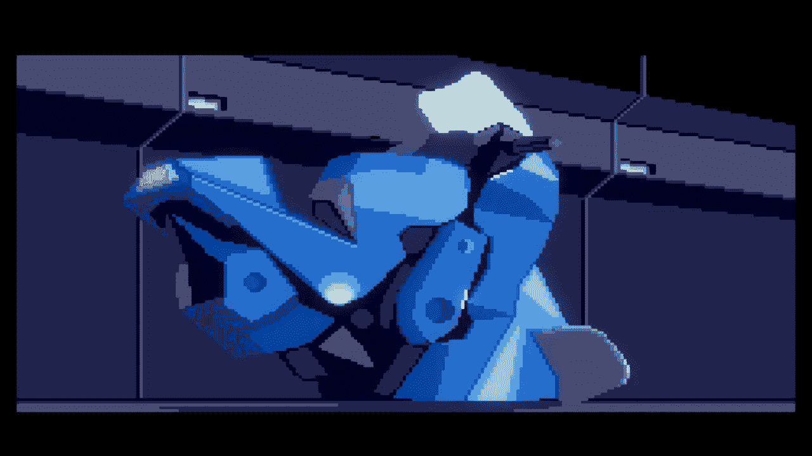

# 闪回尴尬的魔力

> 原文：<https://medium.com/swlh/the-magic-of-flashbacks-awkwardness-5203152d199a>

有时候是一些小事造成了不同。1992 年发布了一款名为*闪回*的游戏，这款游戏在视觉上领先于它的时代，从那以后已经成为了某种狂热的经典。作为一个 12 岁的孩子，我崇拜它丰富的科幻世界建筑和引人注目的故事，并对它的视觉效果感到惊讶。我重复演奏了好几年。