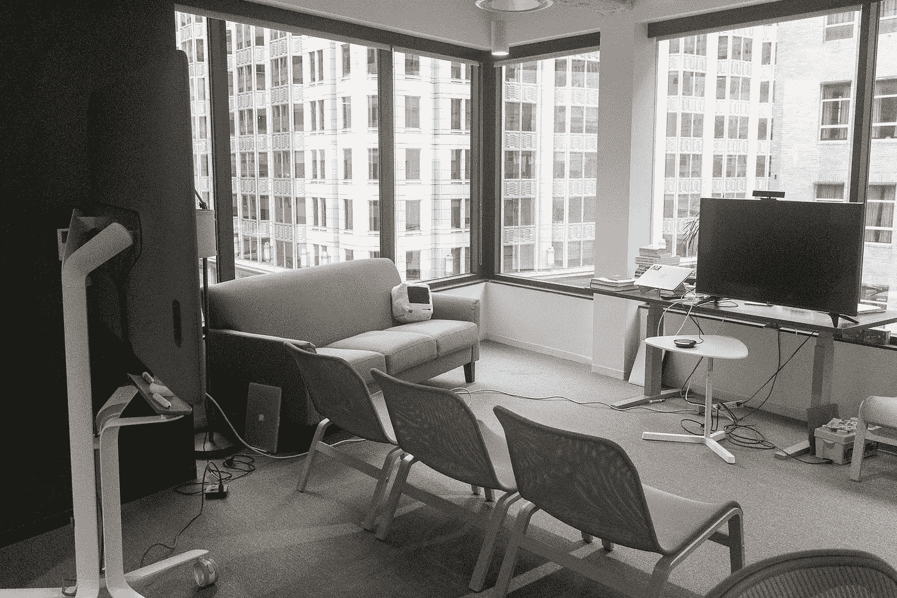

# 每日演示的魔力

> 原文：<https://medium.com/swlh/the-magic-of-the-daily-demo-45773665b256>

This is the area where we do our daily demos. It’s starting to get a bit cramped with upwards of 15 people attending each day, but the couch and comfy chairs help. We have a TV, a laptop, an Apple TV for AirPlay, a Google Jamboard for fancy white boarding, and some other tools to allow us to show off our work, sketch up other ideas, and to make it easy for remote employees to join in.

如果你试图建造一些伟大的东西，你可能会错过一个最重要的仪式——每日演示。

我的团队每天下午 4 点开会，进行每日演示和评论，在那里人们展示他们一直在做的工作。我们给人们一整天的时间来完成工作，然后在一天结束时我们聚在一起，互相给予反馈和帮助。真的就这么简单。