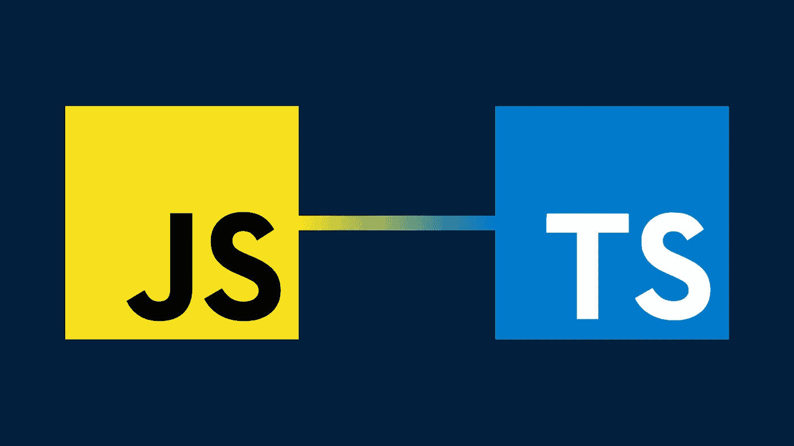

# 使用 Typescript 的主要好处

> 原文：<https://medium.com/swlh/the-major-benefits-of-using-typescript-aa8553f5e2ed>

在最近的几次谈话中，无论是工作面试还是非正式的网络咖啡，我都不断听到有人提到一项技术:Typescript。通常情况下，说这句话的人在提到这句话时会两眼放光。

对于那些不知道的人来说，Typescript 是微软开发的 Javascript 的一个严格的类型化超集。它从相同的 Javascript 代码开始，您可能…