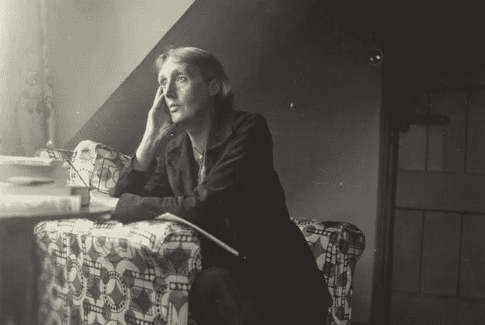
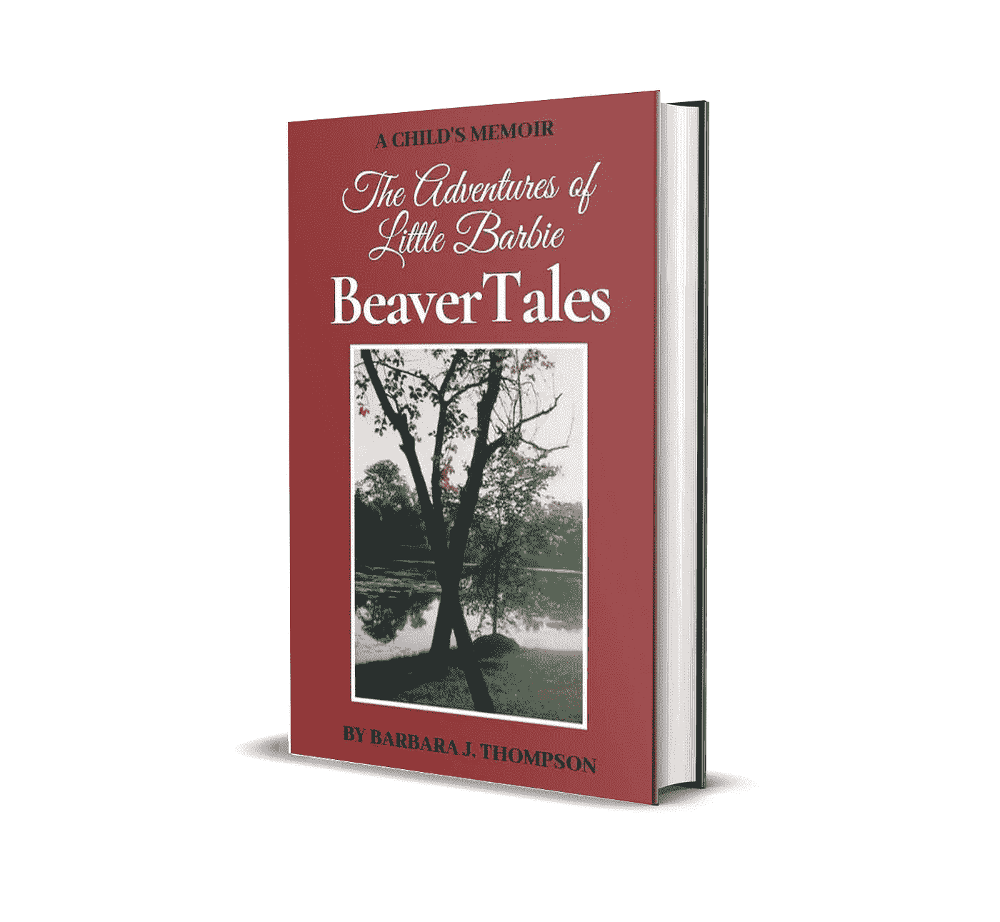

# 回忆录的制作…余波

> 原文：<https://medium.com/swlh/the-making-of-a-memoir-an-aftermath-e12c86af3352>

Virginia Woolf, courtesy Wikimedia

我为母亲写了一本回忆录，这是她一生的愿望，希望我用文字记录下我独一无二的田园诗般的童年，但随着我的生活逐渐展开，田园诗般的童年总是被情感上的恐惧所包裹。我母亲希望我去其精华，去其糟粕，从我生活的角度来写——那些我 5 到 8 岁时记忆犹新的时刻。

科学家会告诉你，蒸馏是一项需要花费大量时间、专业知识和精力的工作。这里没什么不同。每当我开始写一篇关于那个时代的短文时，一段不好的记忆就会浮现出来，我写的东西就会连同我的情感一起，在一个手提篮里化为乌有。

大约五年后，经过几次重新启动，我终于实现了母亲的梦想…在她去世三年后。我没有及时完成作品让她看，这本身就是一个持续的失败的来源，我确信这将在我心中挥之不去，直到我死去。我只能抱着希望，希望命运或因果报应或命中注定或运气或 1-800 直通天堂的号码存在，这样她就可以知道我为她完成了工作。

没人告诉你写回忆录会有多难。

当事情结束时，没有人去收拾那些最终成为你灵魂的情感碎片。

我的回忆录只不过是按照一年中的季节分类的童年冒险片段的集合，所以交付是轻松愉快的，有时很有趣，所以你会认为我在写它的时候会有同样的感觉，在某种程度上，我确实有，但悲伤、损失、愤怒、愤怒、沮丧和失望在下面翻腾。如果一个孩子的生活中发生了困难、可怕的事情，而这个孩子几乎无法控制，那么与这些事情相关的负面情绪永远不会真正消失，即使你凝视着田园诗般的景象并微笑。

作为一个作者，我不会坐在这里指责别人，因为生活中总会发生一些事情，好的或坏的，但是当需要讲述这些故事的时候…嗯…

没人告诉你回忆往事会带来多么严重的情感破坏。

这本书完成了。我上周完成了它。它现在是一个活生生的东西，我花了一周时间从颤抖中恢复过来。

除了你所面对和必须提取的记忆之外，还可以有一种对失去的认识，因为在我的情况下，那时我的世界里所有的成年人都已经死了。每一个。单身。一个。当你写半个世纪前的故事时，你无法忘记这一点。

你在脑海中看到那些健康、快乐和充满活力的成年人，当你放下那些奇妙的愿景后，你会记得那些人和他们最终的结局。这是一种感觉，一种经历，几乎就像把它们全部重新埋葬一样，我只剩下纸上的文字和一颗空虚的心，就像一个高速公路汽车旅馆，那里所有曾经充满欢笑和光明的房间现在都是空的和被遗弃的，我作为主人挂着一个永远不会下来的空缺标志。

没有人警告你这一点。

没人说你会感到多么孤独。

没人告诉你哭没用，和朋友聊天没用。

在你的自暴自弃中，你挣扎着呼吸，挣扎着生活，发现只有多写点东西，对其他任何事情都有帮助。

当我回顾我的文学斗争，我灵魂的情感撕裂，我想这是值得的。我对这个结果很满意，我想其他人也会喜欢这些故事，所以我知道这也会让我妈妈高兴。

但是我累了吗，筋疲力尽了吗，还处于一种挥之不去的恐惧中吗？是的。

“人”说这也是会过去的……我猜。

但我有一种感觉，我穿过了镜子，滑下了兔子洞。

我不确定我会不会像开始写这本书之前那样。

有些东西会弄脏，伙计们。有些东西会永久染色。

现在我的灵魂上有了不可磨灭的印记，那些包裹在它们冰隙般深邃的情感中的文字将永远不会从我的脑海中完全融化。

不管是好是坏，我都变了。

如果你正在考虑写一本回忆录，要非常小心并权衡成本。对我来说，我觉得完成母亲的愿望是义不容辞的。但如果你问我，我真的想“去那里”吗？不。我也说不准，但我想我再也不会走那条路了。