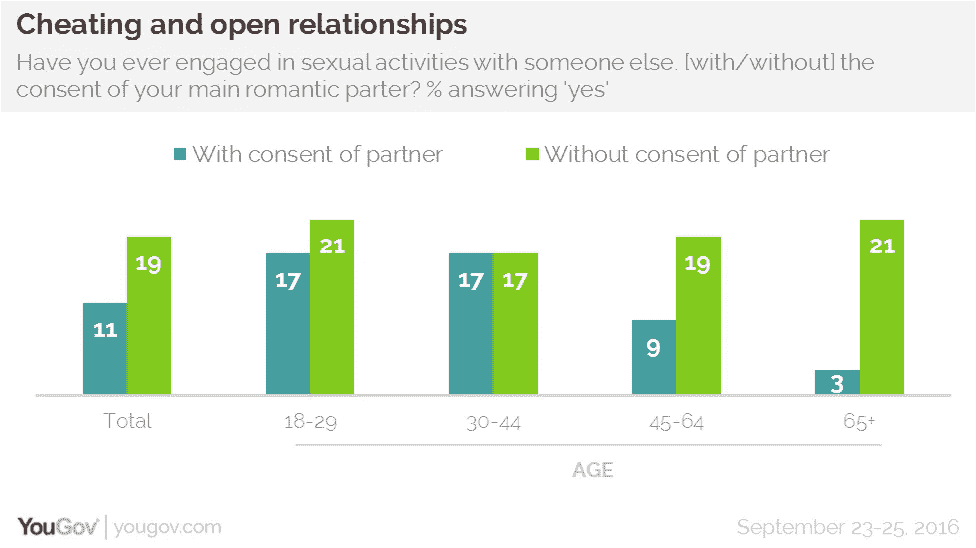

# 现代关系的多面性

> 原文：<https://medium.com/swlh/the-many-faces-of-modern-relationships-cf6b1c073e6d>

*“你谈过恋爱吗？可怕不是吗？这让你变得如此脆弱。它打开了你的胸膛，敞开了你的心扉，这意味着有人可以进入你的内心，把你搞得一团糟。”*

――尼尔·盖曼，善良的人们

17%的 18-44 岁的人在伴侣允许的情况下参与了某种形式的婚外性活动(YouGov 年调查)。这场性革命在我眼皮底下发生，而我却没有察觉，这怎么可能呢？在同一组中，34%的人表示他们不介意(视情况而定)他们的伴侣在一起时勾搭其他人。这是革命性的，如果它是一种趋势而不是一种时尚，它将对我们的生活方式、家庭结构和相互交往产生深远的影响。

所以，虽然很多人似乎认为如果他们以某种方式开放他们的关系，他们会更快乐，但事实真的是这样吗？不一定。大多数人无法准确预测他们在开放关系中的感受。的确，一些人会对双方同意的一夫多妻制更满意，但是他们的伴侣呢？他们会同样乐意分享，还是会因为别无选择而同意？

这是同一调查的另一张图表，显示 19%的人欺骗了他们的伴侣。这个数字在不同年龄组之间几乎没有变化。

那么，开放关系和其他类似的安排只是给过去被称为欺骗的行为贴上新标签从而使其合法化的一种方式吗？

公平地说，一段开放的关系要想幸福，双方都必须格外成熟，在情感上非常有安全感。但是如果一方不是，有不同的界限呢？如果伴侣因为害怕失去所爱之人而屈从于一种让他们感到压力和极度伤害的处境，那该怎么办？

而嫉妒呢？这在大多数关系中并不罕见，但是在开放的关系中，任何一方都愿意让自己处于嫉妒的境地，或者成为嫉妒的接受者。很少有关系强大到足以经受住那种风暴。性是人们可以分享的最私密的事情，知道你爱的人正在和别人分享这种经历会令人心痛。

Reddit 上有一个活跃的论坛，人们在那里讨论开放关系的后果以及这些关系在许多情况下引发的意外感受。很多人同意这样的安排，因为害怕被认为是拘谨和守旧的。其他人很好奇，许多人同意了，因为他们在自己的关系中没有安全感。然而，一旦婚外性成为现实，清晰的模式就出现了。一个有趣的现象是，在每一方可能达到的性接触次数上，双方都处于上风。有意想不到的嫉妒，重新点燃潜伏的性欲，结果往往是关系的死亡。

想象一下这种关系的现实。你爱的男人(或女人)正在为约会(不是和你)穿好衣服，走出门去见另一个人，而你却留下来，一分一秒地想象着约会，并对自己和你爱的人假装这完全没问题。

那些提倡开放关系的人的主要论点是这种安排带来的残酷的诚实。即使这是真的，而且双方都诚实地对待他们的感情，他们也成功地避免了嫉妒、不充分和不安全的感觉，我质疑“残酷的诚实”的目的。即使在最亲密、最相爱的关系中，也有一些事情双方都宁愿保守秘密。这是自然的，有助于避免肆无忌惮的诚实带来的磕磕碰碰。你的伴侣真的需要知道你在遇到他之前和多少人睡过觉或者你真的不喜欢他们的某个家庭成员吗？

那么，开放关系中的“残酷的诚实”是不是一方或双方在比赛中深不可测的自私，看他们在假装不流血的同时能伤害对方多深？。或者这是一个现代的解决方案，解决了一夫一妻制夫妇在长期婚姻和关系中的性生活问题？开放的关系是保持爱情的一种方式，还是不可挽回地扼杀爱情的一种方式？

“我们开车去酒店，然后道别。和一个你不想干的男人上楼，让你干的那个独自坐在那里，然后在极度兴奋的状态下，干你不想干的那个，同时假装他是你干的那个。这就是所谓的忠诚。那叫一夫一妻制。这就是所谓的文明及其不满。”

―埃里卡·琼，害怕飞行

更在【www.loveisagame.net 