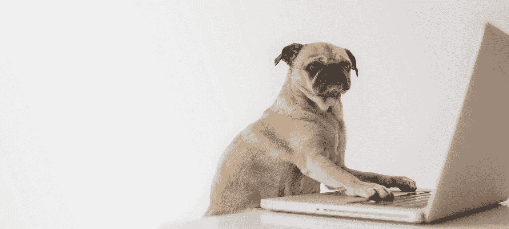
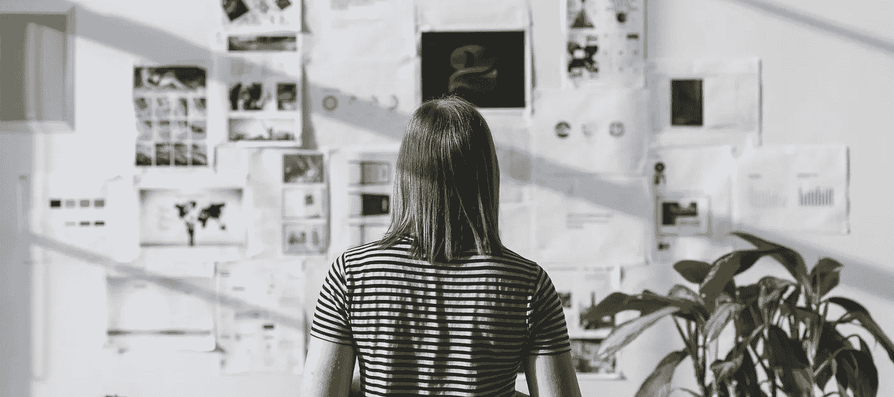

# 为自己工作的精神成本——以及如何生存。

> 原文：<https://medium.com/swlh/the-mental-cost-of-working-for-yourself-and-how-to-survive-it-3905a0666b69>

我六岁了，我在键盘的敲击声中醒来——敲击，敲击，敲击，敲击，敲击，敲击！

透过朦胧的双眼，我看向床脚，他就在那里。我爸爸穿着考究的卡其裤、短袖衬衫、梳得整整齐齐的头发和打得很好的领带，在办公室里度过了富有成效的一天。除了今天不同于其他所有的日子。今天我爸爸不去办公室，或者更好的是，他的办公室就在他坐的地方，在我的床脚，有我所有的填充动物玩具和芭比娃娃作伴。干劲十足的父亲局促地坐在他在我卧室(兼作休息室)搭建的一张小小的临时办公桌上，他的膝盖勉强能放在桌子底下。这就是我爸爸第一天为自己工作的方式。

又过了 27 年，我才真正明白那第一天是什么样的，为什么他穿着得体在家工作，为什么多年后他会把卡其裤换成短裤、人字拖和领带，换成一件简单的 t 恤。

**好吧，让我们快进 27 年。现在是早上 7 点，我一大早就起床，准备轰轰烈烈地开始第一天的工作。已经有六个月了，在远离旧生活的大行动之前，我经历了许多拖延和一些相当古怪的目光，我的第一天终于来了！早上 8 点我坐在休息室的早餐桌旁，现在我的办公桌旁，我满怀热情地打开笔记本电脑，准备震撼世界。**

## 震耳欲聋的沉默。

三杯咖啡，几个小时后，我彻底耗尽了我的待办事项清单。只有一个客户，我坐在那里盯着空空的收件箱，现在是中午，寂静的公寓里震耳欲聋的声音在嘲笑我。在 14 年的大部分时间里，你习惯了早晨的匆忙、例行公事、飞奔出门去上班，听着办公室生活的闲聊和咖啡机的研磨声，当寂静降临时，这似乎有点奇怪。我才工作了几个小时，突然觉得在家工作就像被单独监禁一样。没有人可以交谈，只有分散注意力的想法，没过多久，思想就开始游荡，恶魔也爬了进来。

*别人都在忙，你为什么不忙？他们在外面赚钱，拿着丰厚的养老金，而你却坐在家里，真是个失败者！*

你为什么还没有很多客户？为什么电话没响。如果你不忙，那肯定意味着事情进展不顺利？

下一张工资支票从哪里来？

小贴士:冷静下来。创建一个音乐播放列表，无论是播客、爵士乐还是重摇滚，只要能让你心情愉悦，你就能沉浸在工作中。在你走动的地方定期休息，最好是在户外，这会让你的大脑重新定位，帮助你集中注意力。如果你确实有远程会议，和真实的人，总是使用视频(是的，这意味着你不能穿着睡衣去工作),不，我们不在乎你是否有一个糟糕的发型，让客户看到你的脸是很好的，从生理上对你也有好处！

## 自我强加的分心。

在家工作时，你很快意识到办公室这个干扰工厂会让你分心。无论是倒垃圾、洗碗还是洗衣服……不要被愚弄了，在家里工作也同样艰难。知道你现在在为自己工作的朋友或家人可能会认为这意味着你总是有空，会在一天当中来串门或打电话。

**提示:严格要求自己。**尝试共同工作空间，使用降噪耳机，这可能是我迄今为止独唱生涯中最大的顿悟(是的，真的)。我在阿姆斯特丹的一个合作空间工作，一张可爱的桌子放在一条运河边，那里整天都有船只经过。这是一个充满企业家伙伴的愉快氛围，他们都在努力工作，在这个世界上留下自己的印记。如果我需要一些社交活动，耳机就会掉下来，发出砰的一声，有很多友好的人用噪音包围着我。当我需要集中注意力时，戴上耳机，听着我说过的播放列表，我就离开了，沉浸在数小时的生产力中，没有孤独或寂静的深渊。去合作吧，我怎么推荐都不为过，明智地选择，你会做得很好！

至于家人和朋友，对他们也要强硬一些，礼貌地告诉他们你的工作时间，如果你这样做，他们会认真对待你的。

## 你的社交生活将会改变。

*你有多少客户？你有足够的钱来支付账单吗？你有多忙？睡懒觉一定很爽！*

信不信由你，这些都是在我开始创业的前两周被问到的问题。人们似乎痴迷于发现你有多忙，同时似乎暗地里认为你在中午醒来，穿着内衣工作。**做好准备。人们并不总是能理解。如果你正在从社会规范中节食，并决定不再吹嘘自己有多忙和过度劳累，你有多讨厌周一、你的老板、你的同事或其他任何事情，如果你对自己的薪水负责，这对你有好处——只是不要期望每个人都得到它。**

当这些不可避免的问题出现时，不要放在心上，这很正常。

## 忙碌并不意味着你很重要。

问人们他们一天过得怎么样，你经常会听到，“哦，天哪，我太忙了，事情忙得不可开交，时间都去哪儿了！”！我已经意识到有一个明确的假设…

*忙=重要，因此忙=成功*

**这不是真的。自从为自己工作了三年以来，我明白了许多被认为忙碌的人也可以被比作跑步机，你可以整天跑来跑去，对生活喋喋不休，大惊小怪，大声抱怨，但这并不意味着你完成了任何事情。**

提示:成功的一个关键驱动力是你的产出、你的雄心和你生产的产品的质量。

> 做你喜欢做的事，其余的自然会到来。

人们很容易就认为不匆忙的人没有动力或不成功，但正如任何读过《每周 4 小时工作制》的人可以证明的那样，也许他们只是更有效地利用时间？如果你有空闲时间，用它来进行创造性的思考，不要用“感觉”忙碌来扰乱它。敞开你的心扉，迎接接下来会发生什么，给自己成长的空间，远离噪音。

## 如何生存？

那么，你是如何熬过第一天独自工作的呢？嗯，正如没有一本书是相同的，我们也不一样，所以我的建议是基于对我有帮助的东西，我建议你调整到最适合你的东西。

顶级技巧

*   放轻松，这只是你的第一天，花点时间适应
*   在你有效率的时候工作，而不是在人们认为你应该工作的时候
*   播放激励你的音乐或播客
*   不要让自己或他人分散你的注意力
*   一起去工作，去咖啡店或者任何可以改变风景的地方，这会让你的大脑清醒，让你集中注意力
*   把你工作的地方和放松的地方分开，否则你永远也不会关掉它
*   总是开着视频进行远程会议
*   为当天的任务列一个小清单，当它们完成后，你就可以认为这一天是富有成效的
*   犒劳一下自己富有成效的一天
*   锻炼，它能清理头脑，激发灵魂

但是最重要的是要对你的想法有信心，它很有可能是一个好想法，你完全没有理由不去实现它，去做它，去看它！

**去找他们……**

> **“没有愿景的行动**只是在消磨时间。没有行动的愿景只是白日做梦，但是有愿景有行动的愿景可以改变世界”——纳尔逊·曼德拉

汉娜·科特雷尔

所有者:汉娜·科特雷尔媒体

## 这篇文章发表在 [The Startup](https://medium.com/swlh) 上，这是 Medium 最大的创业刊物，拥有+436，678 名读者。

## 在这里订阅接收[我们的头条新闻](https://growthsupply.com/the-startup-newsletter/)。

