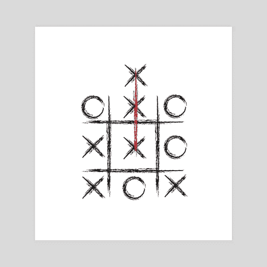

# 解决问题者的心态

> 原文：<https://medium.com/swlh/the-mindset-of-a-problem-solver-1e3b3ae294e3>

Source: [https://www.inprnt.com/gallery/ruifaria/break-the-rules-think-outside-the-box/](https://www.inprnt.com/gallery/ruifaria/break-the-rules-think-outside-the-box/)

我们经常面临问题。

我们经常走捷径或者完全回避问题，从来没有真正解决它们

但正如 25 世纪最有影响力的科学哲学家之一卡尔·波普尔(Karl Popper)所说，“所有的生活都是解决问题”。

总会有挑战，高潮和低谷…好的和坏的。这就是保持生命平衡的原因。