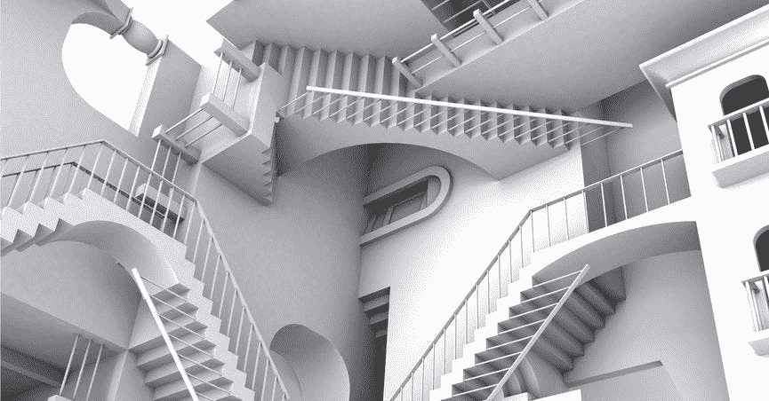
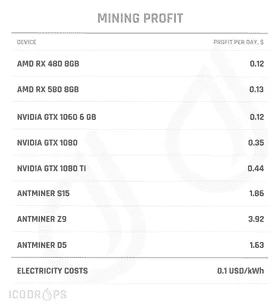
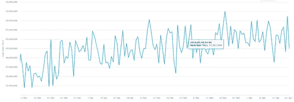
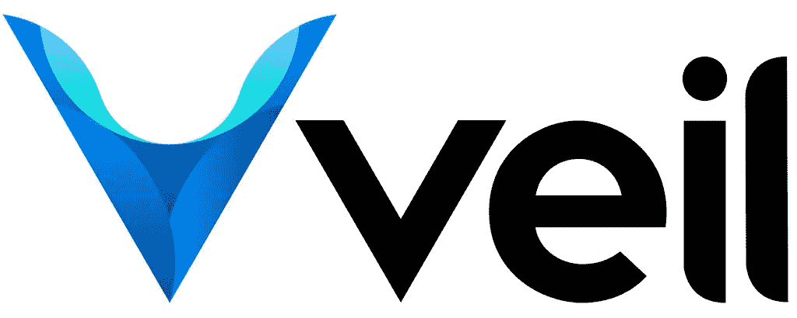

# 采矿悖论

> 原文：<https://medium.com/swlh/the-mining-paradox-4cfd58d1e137>

Escherian Stairwell; Source: Snopes.com

> 最新的[加密货币新闻](https://www.coincurb.com/news/)、[空投清单](https://www.coincurb.com/airdrop/?status=active)、[赏金清单](https://www.coincurb.com/bountyc/?cat_id=188)、 [IEO 清单](https://www.coincurb.com/category/active-ico/)，请访问 CoinCurb.com。

尽管很难从 BTC 采矿中获利，但大多数矿工都专注于在比特币网络上工作。少数偏离 BTC 矿业的公司将自己局限于其他主要网络，如以太坊。与此同时，尽管市场需求依然强劲，但一些规模较小的替代加密货币却很少或根本没有开采兴趣。

这是 80/20 法则中最奇怪也最昂贵的例子之一。

80%的矿工向(相同的)受欢迎的网络添加哈希功能，即使它们无利可图，只有 20%的矿工积极在替代区块链寻找采矿机会，如果它们有利可图的话。即使最近 BTC 价格上涨，BTC 矿业仍处于盈利边缘。

Mining Profitability; Source: ICO Drops

BTC 矿业微薄的利润率可能不会持续太久，因为许多已经关闭钻机的农场又开始活跃起来，以确保他们的设备不会变成纯粹的沉没成本。

事实上，比特币网络的散列率已经从去年 12 月的低点大幅回升。目前挖掘比特币的盈利能力可能是一个短期、短暂的机会，可能很快就会消失，因为网络散列率再次开始攀升。

*BTC Hash Rate; Source: Blockchain.com*

> 最新的[加密货币新闻](https://www.coincurb.com/news/)、[空投清单](https://www.coincurb.com/airdrop/?status=active)、[赏金清单](https://www.coincurb.com/bountyc/?cat_id=188)、 [IEO 清单](https://www.coincurb.com/category/active-ico/)，请访问 CoinCurb.com。

# **一次错过的套利**

由于区块链空间对比特币给予了相当大的关注，新矿工非常倾向于向比特币网络添加散列率。然而，重要的是不要忽视采矿应该是有回报的这一事实。块奖励的存在是为了有一个合理的激励来确保工作网络的证明。

许多新老矿工都声称比特币是积累加密货币的一种方式，以此来证明亏本开采比特币的合理性。然而，如果他们亏本开采，如果他们在二级市场上简单地购买 BTC，钱会花得更好。

事实上，亏本增加杂凑率的矿工们犯的一个更严重的错误是那项工作的机会成本。花在赔本挖掘 BTC 上的每一个小时，都可以用来挖掘一种竞争力较弱的替代加密货币。采矿业务的利润可以满足比特币最大化者积累更多 BTC 的愿望。不同之处在于，通过盈利开采，采矿者将能够积累比亏本开采 BTC 更多的 BTC。

# **有利可图的采矿机会**

有许多区块链集成了工作证明共识机制。这篇文章举例说明了一个有相当高的盈利能力:面纱。

**什么是面纱？**

Veil Project 是由 PIVX 的创始人兼 zDEX 和 Exobit 的联合创始人詹姆斯·伯顿(James Burden)领导的隐私币，由 Veil Labs 开发，这是一个由过去有经验和贡献的开发人员团队，从 Ravencoin 到 HyperStake 不等。许多 PIVX 资深人士，包括其营销人员、内容策略师和业务运营人员也参与了 VEIL。有了这样的全明星团队，Veil Labs 创造了一种隐私币，它集成了各种现有隐私币的最佳技术方面。

VEIL logo

这项开发的关键基础技术是 Zerocoin 协议。该项目使用 Zerocoin 协议有几个原因:

-它可以说是研究最充分的加密技术，可用于匿名交易。

-可以审计根据 Zerocoin 协议发行的硬币的供应。

-有很多密码学专业人士对 Zerocoin 协议的底层技术有很强的掌握；一个集成了 Zerocoin 协议的开源项目可以被开源社区的很多成员审计。

为了使 Zerocoin 协议更进一步，Veil Labs 利用 Monero 中使用的 RingCT 技术使 basecoin 交易匿名。这一决定的关键附加价值是确保所有网络交易都是保密的。

> 最新的[加密货币新闻](https://www.coincurb.com/news/)、[空投清单](https://www.coincurb.com/airdrop/?status=active)、[赏金清单](https://www.coincurb.com/bountyc/?cat_id=188)、 [IEO 清单](https://www.coincurb.com/category/active-ico/)，请访问 CoinCurb.com。

对 Zcoin 区块链(一个使用 Zerocoin 协议的已建立的隐私链)的快速分析表明，大多数交易都是用基础硬币完成的。这是可以理解的，因为大部分人倾向于一时兴起进行交易。任何建立在零硬币协议上的保密硬币都是零硬币的私有硬币；这个过程可能需要一个小时。由于大多数人对这样的操作缺乏耐心，他们跳过了将基础硬币转换成零硬币的重要步骤。由于在 Zerocoin 协议的当前状态下，基础硬币交易不是匿名的，所以 Zcoin 网络上的大多数交易都是可见的。

Veil Labs 打算保留 Zcoin 的可审计性优势，同时拥有 Monero 等主要隐私链的匿名优势。这只能通过将隐私链中使用的主要技术结合在一起来实现。解决方案:Veil Labs 将整合 Monero 的 RingCT 技术，使 basecoins 交易隐形；随后，面纱交易将拥有 Monero 始终匿名的一面，尽管它是建立在 Zerocoin 协议之上的。

**开采面纱有利可图**

面纱项目相对较新，因此尚未吸引大量采矿兴趣。然而，由于硬币的低流通供应量，它已经迅速升值。事实上，在过去的 30 天里，比特币已经上涨了近 125%。由于竞争激烈且价格不断上涨，VEIL 提供了一个极具吸引力的采矿机会。

开采面纱的成本[不超过 25 美分](https://t.me/VEILProject/3999)，能源成本为 0.12 美元/千瓦时；这一数字高于美国 0.1 美元/千瓦时的平均水平，也远高于中国 0.08 美元/千瓦时的平均水平。随着 VEIL 目前的市场价格突破 35 美分大关，VEIL 是市场上最赚钱的加密货币之一，毛利率为 40%。因此，博弈论的基本原理将指示矿工应该合理地将散列率添加到面纱网络，直到采矿面纱或 BTC 之间不存在差异。否则，采矿面纱将会带来套利——相当大的套利。

> 最新的[加密货币新闻](https://www.coincurb.com/news/)、[空投清单](https://www.coincurb.com/airdrop/?status=active)、[赏金清单](https://www.coincurb.com/bountyc/?cat_id=188)、 [IEO 清单](https://www.coincurb.com/category/active-ico/)，请访问 CoinCurb.com。

## 这篇文章发表在 [The Startup](https://medium.com/swlh) 上，这是 Medium 最大的创业刊物，拥有+445，678 名读者。

## 在这里订阅接收[我们的头条新闻](https://growthsupply.com/the-startup-newsletter/)。

