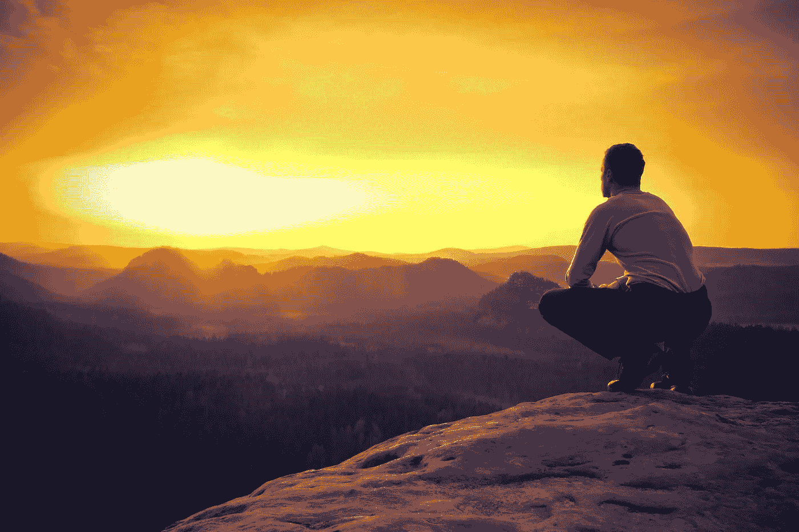

# 当你意识到你必须停下来的时候。

> 原文：<https://medium.com/swlh/the-moment-you-realize-you-have-to-stop-63c5d89a1406>

我的大概是 2014 年。我从一名签约两家唱片公司的音乐制作人，到退出整个行业。

停下来并不容易。音乐是我的身份，每个人都知道我是那个也制作音乐的 Dj。

> 当我发现自己并不好时，我意识到我必须停止音乐。