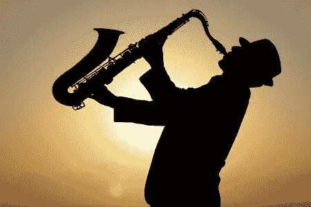

# 创造力最基本的要素:自由

> 原文：<https://medium.com/swlh/the-most-essential-element-for-creativity-freedom-433bc136db50>

image from 123RF

自由是所有形式的艺术创作和创造性活动的重要元素。

没有它，创造力就会被扼杀。

然而，我们常常没有给自己这份至关重要的礼物。

我说的是什么样的自由？为什么这么重要？而我们又是如何培养的呢？

## **艺术家需要的自由种类**