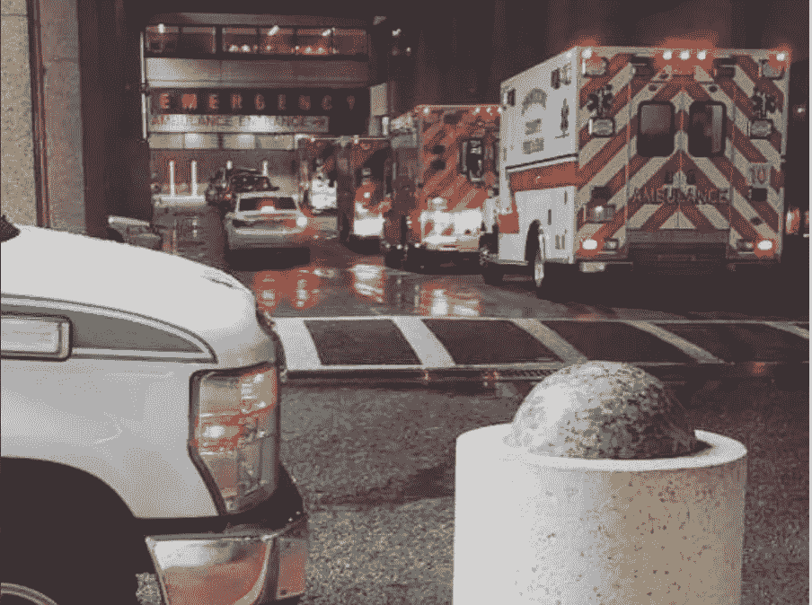
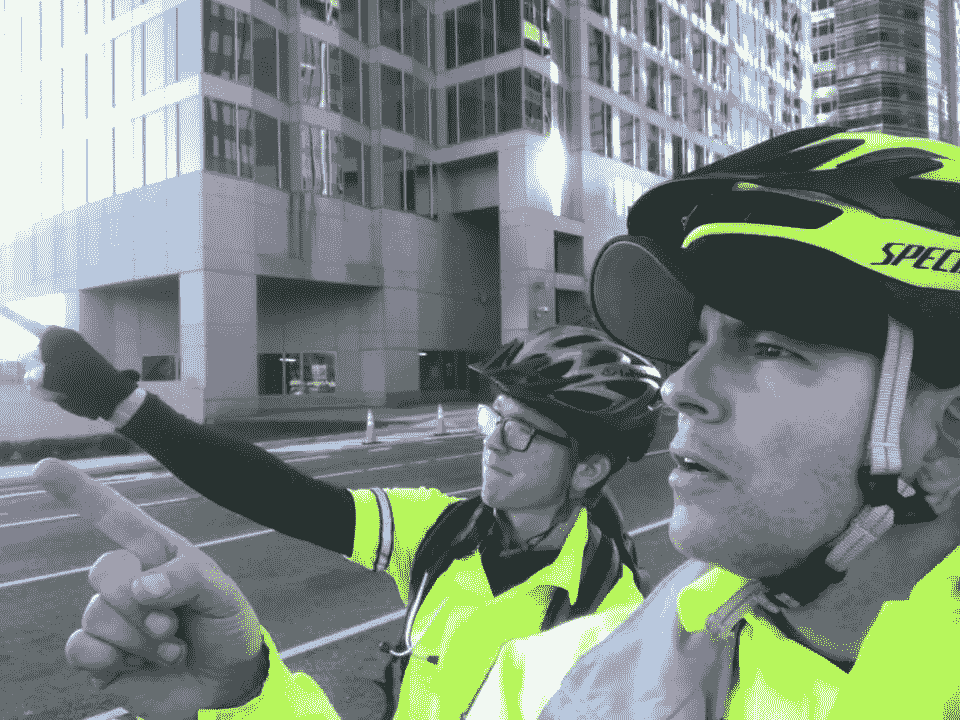
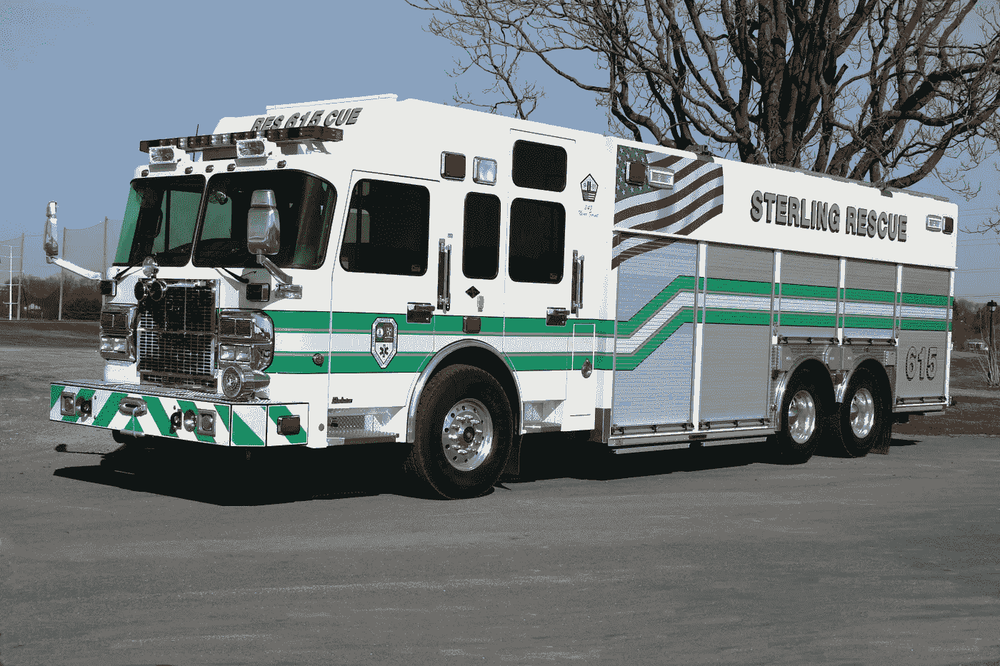
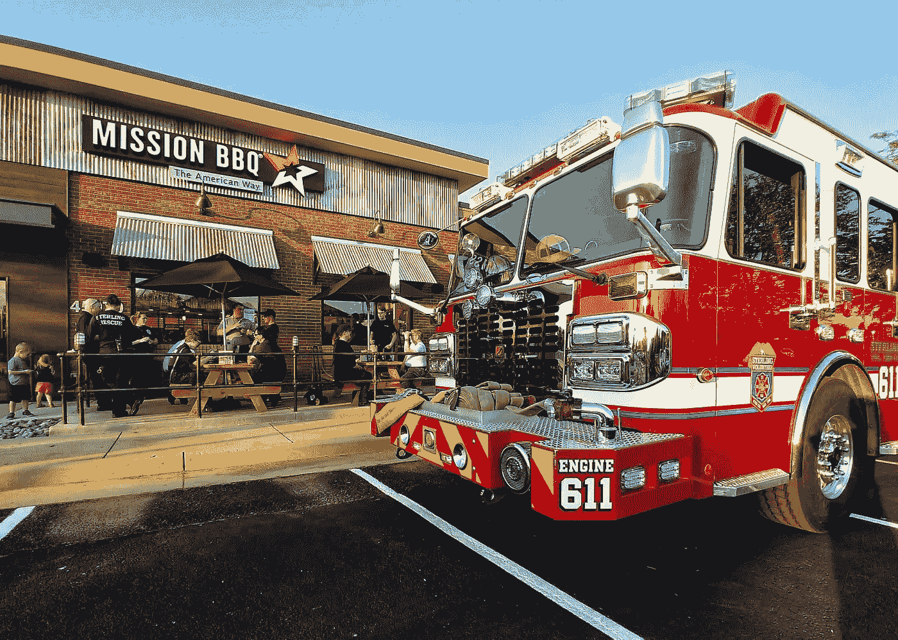
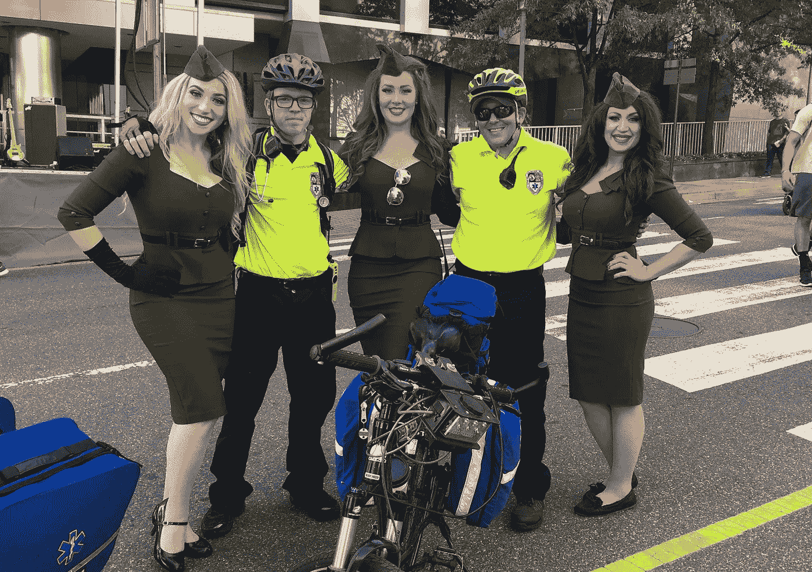

# 我当急诊医生的头两年学到的最重要的经验是

> 原文：<https://medium.com/swlh/the-most-important-lessons-i-learned-in-my-first-two-years-as-an-emt-7b3c84046517>

My current workplace

我走出救护车，来到温暖、春天的空气中。我所在的小组刚刚到达当地的一家疗养院，该疗养院是为一名精神状态改变的病人而派遣的。当护理人员和急救人员从前面出来时，我笨拙地设法把担架抬出救护车。

当我们三个人开始走向前门时，医生看着我问道:“你记得去拿包了吗？”我没有。他轻轻地笑了笑，把我送回了救护车，急救人员抬上了担架。

这是我加入当地志愿急救队的第一个电话。穿过我身体的感觉是兴奋和恐惧的不和谐混合。我不知道在病人的门的另一边会发生什么，但是我既害怕又好奇。

我拖着行李，慢跑着赶上了另外两个人。他们在登上电梯前等我，我们乘电梯到了三楼。你永远不知道疗养院的工作人员会给你带来什么，但是领我们去见病人的那个老女人穿着深蓝色的手术服，所以我们可以有把握地认为她至少是一名护理助理。她慢吞吞、无忧无虑地把我们带到了病房，只说了一句话就走了。“这是 J 夫人，她今天表现得不太正常。”

军医约瑟夫嗤之以鼻，打开了门。一个年轻的保安人员在里面迎接我们，我们的病人 j 夫人坐在他旁边的椅子上。

约瑟夫开始打招呼时，急救人员尼克从我手中接过包，放在地板上。“看着我，”他说，于是我照做了。他从包里取出一个血压袖带(几个月后，我的 EMT 教练坚持要我们用正确的名字来称呼它，血压计)、听诊器和脉搏血氧仪，分别给病人戴上。

尼克记录病人的生命体征时，约瑟夫对他进行了评估。“你好，J 夫人，我是约瑟夫，护理人员。今天有什么问题吗？”

J 夫人回答说了一句含糊不清的话，我们谁也听不懂。约瑟夫加快了脚步。“你能捏捏我的手吗？”他问道，把手放在她的手上。她挤了一下。“干得好，现在你可以笑了吧？”J 夫人瞪了他一眼，然后笑了。她的右脸动得很漂亮，但左脸却一动不动。“好的，非常好，”约瑟夫说。

约瑟夫转向尼克。“我们需要行动，”他说。然后他看着我。"她可能中风了。"

如果我的心脏以前跳得很快，现在它每分钟跳一千次。*我的第一个电话，中风了！这太可怕/太棒了！*就这样，我被迷上了。

当我写这篇文章时，第一个电话是在两年多以前。我不能给这个故事一个好的结局，因为我不知道病人是否还活着。这就是急救人员的生活，问题始于一个 911 电话，终于急诊室工作人员手中的病人。

我现在正准备开始护理学校，所以在过去的几个星期里，我一直在回忆我作为一名急诊医生的时光，并思考我学到的东西。18 岁时，我高中刚毕业，就加入了我的志愿急救队。当时，我需要某种生活方向。我需要纪律和生活经验，并在救护车、急诊室、消防车和紧急情况现场之间找到了它们。

在这篇文章中，我的目标是分享我学到的最重要的课程，以及我从这些课程中学到的经验。

Me and one of my favorite people to work with (I have the glasses).

## 慢就是顺，顺就是快

我和我的工作人员坐在车站里，看着电视，谈论着我们与值班消防人员的一天。我一路倒在皮躺椅上，快要小睡一会儿了。这是我们站在通话间隙的平均时间，前提是家务已经做完，而且主任不在家。

当我第四次闭上眼睛时，整个车站响起了铃声。

“635-Bravo 救护车，请到随机街 123 号接诊一名病人。21:32."

我呻吟着，慢慢走向救护车，后面跟着救护人员。在这一点上，我已经完成了我的培训，并向部门证明了我的能力，我已经获准作为一名 EMT 领导电话。我爬进救护车的乘客座，我的搭档发动了卡车。两名学员爬进后面，我们离开了车站。

作为负责救护车的急救人员，我们接到的电话通常不会直接危及生命。护理人员会对这些电话做出回应，而我们通常会接听调度人员在电话中认为没有生命危险的电话。调度也通过我们的电脑给我们发送信息，对于这个电话来说，它似乎是无生命危险的。老年女性，身体不适。

大约八分钟后，我们在一栋独户住宅前停下。我拿着我的笔记本电脑，而后面的学员拿着担架和行李。我按响门铃，宣布我的存在，“你好！EMS！”

一位中年妇女打开门，向我们打招呼，然后指给我看我们的病人，他瘫坐在餐厅的椅子上。她确实*不*好看。我加快了脚步。“你好，夫人？我叫伊森，我是一名急救人员，你能告诉我你的名字吗？”

没有回应。事实上，她的眼睛是闭着的，她在打呼噜。她的嘴唇有点发青，我戳了又戳，她还是没有反应。我问那个年轻的女人，“她这样多久了？”

“大约半小时，”她说。"她在晚饭后的晚上 8:30 服药。"在我问之前，那个女人递给我药瓶，我看了看。所有这些都是老年妇女的正常药物，但其中一瓶是阿片类药物。答对了。

我抬起病人的眼睑，用手电筒照进每只眼睛。他们反应慢，瞳孔尽可能的窄，就像纸上的一小滴墨水。阿片类药物过量的典型症状。我现在有真正的紧急情况，更不用说有人的生命，所以我做的第一件事就是深呼吸。

在我开始在 EMS 工作之前，我经常想我会如何应对紧急事件。我总是对灾难着迷，小时候熬夜看天气频道的特别节目，请求小学老师带我们去当地消防站实地考察。很自然地，作为一个青少年，我发现我把自己放在这些情况中作为精神练习，但是我知道我可能仍然不知道我将真正做什么。

我非常熟悉我对紧急情况的反应。我喜欢挑战。对我来说，没有什么比应对紧急情况的责任更令人兴奋，也没有什么比解决紧急情况更令人满意。另一方面，我的身体是神经衰弱。我跳跃和抖动，如果我不小心，我最终口吃得很厉害，我不得不重复每一句话。在响应救护车呼叫的头几个月，我感觉每一步都在和自己的身体做斗争。

我第一次听到这句话*慢就是平稳，平稳就是快*是从一位训练我的老护理人员那里听来的。当我看着他进行侵入性手术，把人绑在背板上，甚至从包里拿出设备时，他会大声对我说出来。

后来，我读了塞缪尔·闪的小说*上帝之屋*。对于那些不熟悉这部小说的人，我强烈建议你读一读。我牢记第三条规则。

"心脏骤停时，第一个程序是测自己的脉搏."

我开始意识到为什么护理人员几乎从不跑向病人。我开始意识到为什么在我刚开始的时候，打电话的速度似乎慢得令人痛苦。每一个缓慢的、深思熟虑的、成功的行动都值得采取许多快速的、焦虑的、不成功的行动来把事情做好。

我看着我搭档的眼睛。"呼叫调度中心，让医护人员在路上."

当我的搭档接通无线电时，我检查了病人的呼吸。她呼吸极其缓慢，可能每分钟 6 到 8 次(你通常每分钟呼吸 16 次左右)。随着每一次呼吸，她喉咙里都会发出深深的鼾声，她在椅子上往后倒了一点。

我打开我的包，取出我们的纳坎工具包。Narcan 用于服用阿片类药物过量的患者，因为它可以抵消药物的作用，有效地逆转过量。不幸的是，它没有阿片类药物本身持续的时间长，所以仍然将患者送到急诊室是非常关键的。我通过鼻子给药，每个鼻孔一喷。

“夫人？你能听到我吗？”我问。我得到一个含糊的回答，但她仍然瘫坐在椅子上。在我的两个实习生的帮助下，我们获得了第一组生命体征，并将病人放在担架上。我们上救护车。

当我们把病人抬上救护车的时候，医疗队来了，停在我们身后。军医跳出乘客门，跑着追上我们，跳进我们救护车的后座。“你有什么？”

我让医生跟上进度。我们的病人并不比我发现她的时候更好。她的嘴唇仍然是蓝色的，每次呼吸之间似乎更远。另一名学员跳上车，这位是另一辆救护车的护理学生。我把我的两个实习生送到另一辆救护车上，告诉他们在医院见我们。我们需要一些空间。

我问医生她是否准备好了，她向我点点头。我对坐在驾驶座上的搭档大喊，“我们准备好了！让我们打开警灯和警笛。”警报声响起，医生开始工作。我们把病人放在心脏监视器上观察她的心跳，护理学生开始静脉注射以防我们需要更多的药物。学生和医生都不熟悉我的救护车，所以作为他们专业知识的交换，我提供他们需要的用品。

“十分钟到医院！”我的搭档大叫。将病人运送到医院通常比在现场要平静得多。今晚不行。

“夫人？女士。你能和我谈谈吗？”军医声音中的语气比以前急迫得多。她开始戳病人的肩膀。无反应。

“她没有呼吸了。”呼吸停止。在这种情况下，我会心如刀割。我又深吸了一口气。

医生决定给病人插管。幸运的是我们还有心跳，所以我们还有时间。我把插管工具从柜子里拿出来，放在医生面前。她拿着她需要的东西，站在病人的头后面，把头向后倾斜。我看着她熟练地将导管滑入病人的气道，而我的搭档在并入州际公路时尽最大努力不去挤她。医生在管子的末端系上一个袋子，我把袋子和氧气连接起来并打开它。所有这些，我们甚至还没给医院打电话。

“两分钟后到！”我的搭档大叫。医生把包递给我，这样她就可以给医院打电话了。我知道这里该做什么。每六秒钟呼吸一次。简单。

当我们驶进医院的救护车站时，我们还有脉搏。我的搭档停好车，下了车，差点跑到后门让我们出去。医生和护理学生卸下担架，我尽最大努力从他们身后爬出来，一只手扶着栏杆保持平衡，另一只手记得每六秒钟给我们的病人挤出一口气。

The only truck I worked on that wasn’t an ambulance.

## 团队合作让梦想成真

当我在救护车上的时候，我经常 24 小时轮班。一个 24 小时的轮班从早上 5:30 开始，尽管你并没有被安排在 6:00 之前值班。这种做法在任何急救服务中都是毋庸置疑的。早点到，这样值班的工作人员就知道他们不会被换班前打来的电话耽误了。

正式值班后，你和你的组员检查救护车。每一件设备都必须到场并清点，准备好迎接可能向你扔来的任何挑战。这是一天中最重要的部分之一，因为你第一次问候你的船员，询问你的搭档过得怎么样，也许还可以为新人做一点培训。

接下来是一天中最重要的部分:早餐。具体情况每天都有变化。你可能会在车站做饭，从家里带些东西，或者去餐馆吃饭，但不管怎样，一个好的船员总是会一起吃早餐。

这一天的前三个动作；提前到达，检查救护车，一起吃早餐最好是作为一个团队来完成，因为 EMS 中的一切都是作为一个团队来完成的。最好从三个正常的活动开始，而不是在你一天的第一个电话中问你的伴侣他的孩子在胸外按压之间怎么样。

我高中毕业后几个月就开始了 EMS 工作。在高中，我花了一些时间在团队合作上，主要是在行进乐队中演奏，但我从未发现自己处于必须绝对依靠别人来做正确的事情的境地。成为一名急诊医生后，我发现自己身处一个必须依靠和被依靠的世界，如果你的一天过得够糟糕，就有失败、受伤甚至死亡的风险。

在人们知道他们可以依靠你之前，你必须做很多事情。作为一个骨瘦如柴、留着长长卷发的 18 岁女孩，我第一次走进消防站的大门时，肯定没有赢得信任。随着时间的推移，老而咸的医务人员和整洁的消防队长给我上了许多小课，我现在把这些课归为“团队合作让梦想成真”一类

在你负责电话之前…

早点出现。说早上好。知道对你的期望是什么。永远做别人期望你做的事。不知道就问。让你做什么就做什么。注意了。

在你负责通话后…

早点出现。说早上好。有计划。知道自己的极限。听别人说。做决定。要有主见。永远不要等着呼救。

Eating together. One of the most important parts of the day!

## 身体是坚韧的，生命是脆弱的

作为一名健康的高中生，我从未被迫面对死亡、疾病或伤害。一旦我成为一名急救人员，我就必须面对现实。

一天晚上，当我和我的搭档吃完晚饭开车回车站时，我们被叫去处理附近高速公路上的一起交通事故。现场就在附近，所以我们打开灯和警笛，在三分钟内赶到了汽车旁，第一个到达现场。

当我们在车前停下时，我清楚地看到了事故。一辆小轿车撞上了左肩，地面上的痕迹显示这辆车已经侧翻了大约 100 英尺。我的搭档把救护车停在停车场，我尽快穿上安全背心，跳下出租车，从后面拿出我的包。

我尽可能快地向汽车走去，但当我越走越近时，我开始听到“砰”的一声！砰！砰！驾驶员车门上。我的心在狂跳，不知道我会在车内发现什么，它倒挂在肩膀上，尾部指向天空，前部撞上了沥青。

我离驾驶座的门只有十英尺远，门突然开了，两条腿伸向空中。我难以置信地看着司机小心翼翼地从车里钻出来。当他站起来时，两辆警车停在了我们身后，一辆消防车堵住了我们旁边的车道。

我面无表情地问那个人“你没事吧？”

“是啊，我很好。我只是最近运气不好。”

说完，我和他就开始大笑。我笑得眼泪顺着脸颊流下来，我竖起大拇指指着一名非常困惑的消防车警官和两名警察，他们放慢了速度，显然怀疑一名急救人员和司机在公路边撞车。

这是我作为 EMT 短短两年里学到的最重要的一课的前半部分。身体*强悍*。说到受伤，人们几乎可以在任何情况下生存。这个故事是我最喜欢讲的，因为它以超现实的方式给我上了一课，但这个主题贯穿了我工作的每一天。

我见过一个年轻人在他的生日聚会上被枪击，赶走了枪手，然后在他等待我们到达那里的时候安抚他的家人和朋友。我必须说服几乎所有受伤最重的病人去医院。一个特别暴躁的女人减轻了自己的复合骨折，这样她就可以回到自己的房子里拨打 911。

当我第一次被迫处理伤病时，我感到很害怕。在我成为急救人员之前，我从未见过有人伤得如此严重以至于需要打电话给急救人员，但是有了一些经验之后，我知道身体是很坚韧的*。*

*在救护车上工作了大约 18 个月后，我开始在急诊室工作，接收我曾经带到医院的病人。在这个职位上，我学到了一个教训，那就是你只有花更多的时间和病人在一起，而不是在救护车上。*

*我在急诊室学到的教训是生命是脆弱的。尽管身体可能很强壮，但生命中有比心脏保持跳动的能力更多的东西。*

*这对我来说是很难学会的一课，因为我经常看不到好的结局。在急诊室，我们接收来自任何可以想象的地方，任何可以想象的条件下的病人，我们只照顾他们，直到可以安全地把他们送到其他地方。这意味着我经常看不到全貌。病入膏肓需要认真治疗的病人不会离开我的健康护理。*

*这一课也迫使许多令人不舒服的问题，如什么是可接受的生活质量？有没有人死了会更好的情况？应该通过任何必要的手段来延长生命吗？*

*仅仅因为有人可能在严重受伤后幸存，或者可能在心脏停止跳动后复苏，或者可能通过现代医学的奇迹延长了他们的生命，并不意味着他们的生活会回到从前。我照顾过许多发现自己生活质量下降到无法接受的病人。我和一些家庭谈过，他们觉得自己在照顾一个永远不会像以前一样的爱人，但他们还没有接受这个事实。*

*这是我在医疗行业短暂的时间里学到的最重要的一课的后半部分，因为它给了我继续下去的理由。*

*这一课让我在忍不住觉得教育毫无意义的时候，有了继续教育的理由。当我最不想做的事就是关心时，它给了我一个富有同情心的理由。它提醒我，无论我在两年的急救医疗和二十年的人类生活中学到了多少，我对活着意味着什么，死亡意味着什么，以及照顾他人意味着什么，都只是皮毛。*

**

*It’s not all death, disease, and injury!*