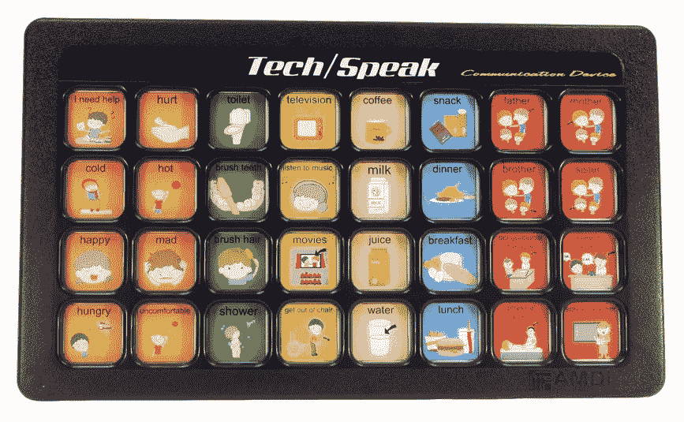

# 硅谷不知道的最重要的词

> 原文：<https://medium.com/swlh/the-most-important-word-silicon-valley-doesnt-know-1477d12ffcd0>

Photo Credit: AMDi, [https://www.amdi.net/products/aac-devices/tech-speak-12-levels/F](https://www.amdi.net/products/aac-devices/tech-speak-12-levels/)

## 每个人都知道出了问题——他们只是无法就问题所在达成一致。

如果你在寻找一句话来总结 2019 年科技巨头的状况——谷歌、脸书、推特、亚马逊、苹果——你可能会比以上更糟糕。