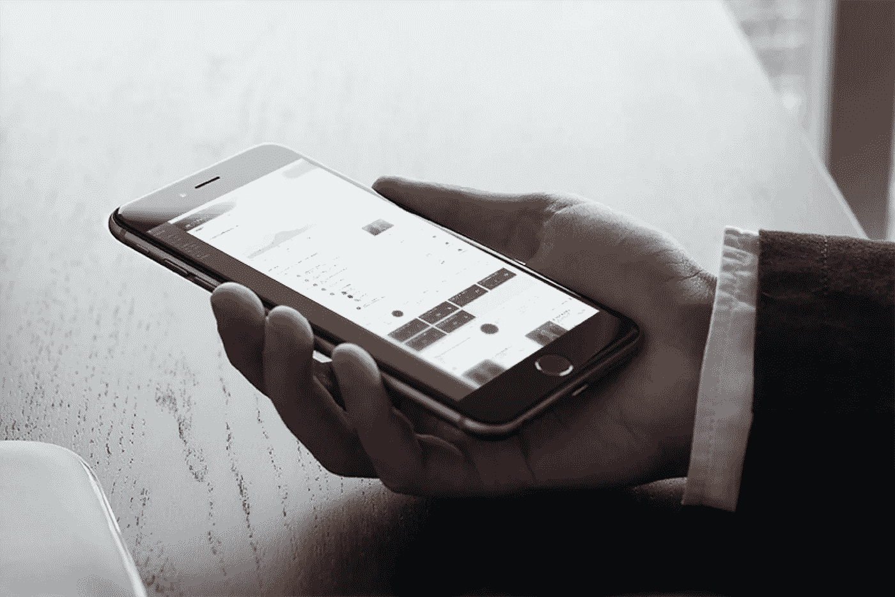
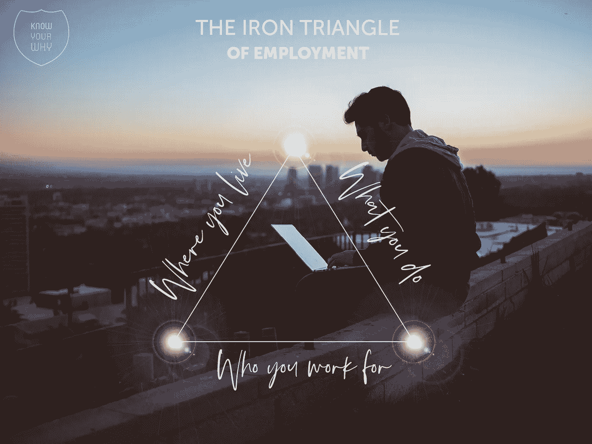
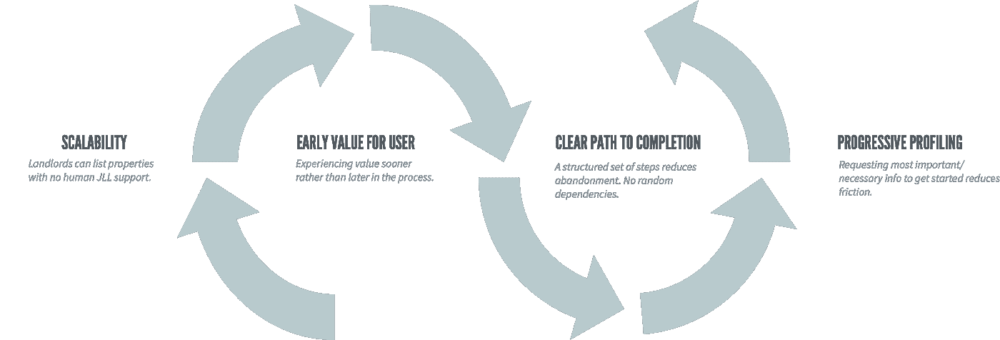
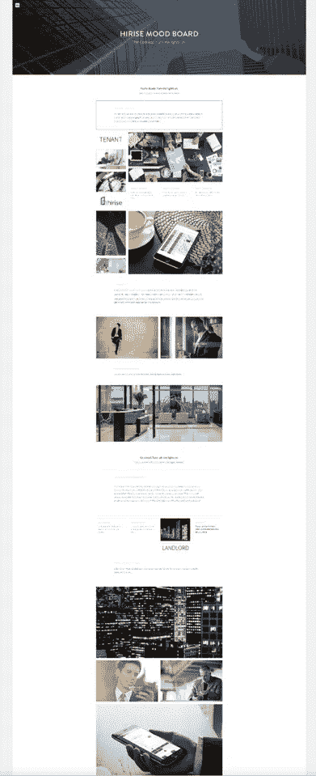
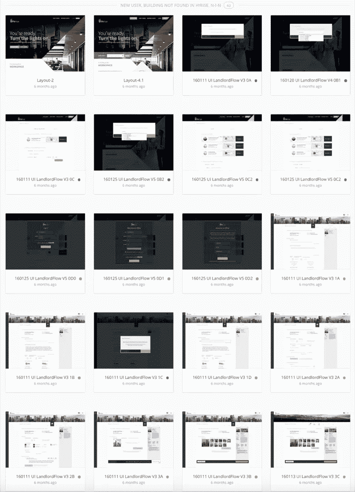
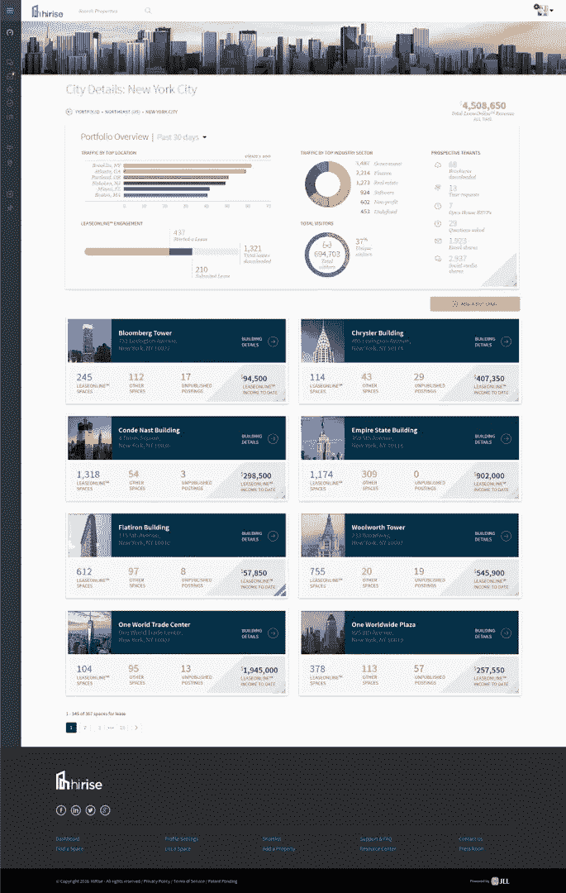

# 远程工作最明智的理由——以及我们建立虚拟设计工作室的原因

> 原文：<https://medium.com/swlh/the-most-intellectual-justification-for-remote-work-and-why-we-built-a-virtual-design-studio-f59c8bc3f19>

Designing North Studios

去远程！用两个词来解决你所有与工作相关的问题，对吗？好吧…不要这么快。但是这种心态有一定的道理；你肯定听过这个短语。也许你已经对一个需要快速精神激励的朋友或家人说过了。因为远程工作的想法足以克服“周日”的情况——你知道，你从周一去办公室的想法中感受到的恐惧。

公平地说，很多人不介意面对周日之后的第二天(嘘，不要说出它的名字)，但这并不意味着他们不重视远程工作的选择。事实上，拥有选择权是打造忠诚、快乐、高效团队成员的秘诀；这对每个人都有好处，并培养了贯穿整个企业的灵活性。

# 就业铁三角

在题为[远程工作革命](https://www.youtube.com/watch?reload=9&v=wUTd35A7I6c)的 TedxRichland 演讲中，贾斯汀·琼斯介绍了一个人在接受传统工作之前必须做出的三个决定，使用 [*产品开发的铁三角*](https://www.endian.com/blog/good-fast-cheap-pick-any-2-the-iron-triangle-of-product-development/) 。这一设计原则表明，你可以优先考虑以下三个结果中的任何两个(且只能是两个),而牺牲另一个:质量、时间和成本。

贾斯汀的例子“就业铁三角”是一个产品开发原则的衍生，反映了受传统工作影响的三个因素:你住在哪里，你在哪里工作，你做什么工作。很少有人能在这三个因素中找到一致。

在他看来，远程工作使一个人能够选择他们的位置、雇主和工作类型，消除了在这三者之间进行选择的需要。当你可以选择所有的因素时，生活是美好的。(*尽管在 DN，我们也总是在这个等式中插入第四个选项，员工和雇主也必须知道他们的“为什么”——但那是另一个话题了。*)

The Iron Triangle of Employment — reimagined

# 理查德·布兰森和大卫·科普林讨论远程工作

自 2012 年创建 Designing North Studios 以来，该团队已经为全国各地的满意客户提供了许多解决方案，所有这些都没有一个中央实体办公室。我们发现，远程工作结构——或虚拟概念——增加了我们团队的效率。最重要的是，远程工作的选择吸引了独特的人，他们展示了对设计工作室的成功至关重要的特征，即创造力、韧性、自力更生和责任感。

这一发现与行业领导者代表其团队分享的观点相一致。例如，[理查德·布兰森](https://www.linkedin.com/in/rbranson/)从来没有坚持在办公室工作过——他看起来也不是一个糟糕的执行者。我们不可能都成为理查德·布兰森，但我们可以接受他对[绩效驱动型工作的方法](https://www.inc.com/logan-chierotti/richard-branson-says-work-smarter-not-longer.html):

> “我们喜欢给人们在他们想去的地方工作的自由([不再有朝九晚五的心态](http://www.futureofbusinessandtech.com/workplace-wellness/sir-richard-branson-reap-the-rewards-of-workplace-flexibility))，确信他们有动力和专业知识来出色地工作，无论他们是在办公桌前还是在厨房里。你的工作从来没有在办公室完成过，也永远不会。”

同样，也许更令人印象深刻的是，微软英国公司的首席展望官大卫·科普林这样评价远程工作:

> “我们需要对工作场所和我们所做的工作采取更灵活的方法；它为我们提供了物理和认知空间，以利用我们提供的难以置信的能力、洞察力和经验，但不是专注于单个过程，而是专注于我们的组织寻求实现的整体结果。”

让他的话深入人心。它们构成了我们所听到的对远程工作最理性的辩护。他的思维模式与我们在提供灵活性和为复杂的设计挑战寻找专业人员之间建立的关联相交叉。也就是说，当使用得当时，远程环境使设计师能够充分利用他们的物理和认知空间来驾驭不可思议的力量——准确地说是创造力。

在其他策略中，这种创造力通过[合作、交流和学习](/swlh/for-long-term-success-as-a-remote-worker-seek-joy-d2b55f296312)得到进一步发展，因为远程环境对个人来说是高度可定制的。优化的环境提高了认知，从而对绩效、质量、生产和快乐产生积极影响——这一切都是为了[找到你的心流](/swlh/finding-your-flow-like-a-designer-with-advice-from-an-executive-creative-director-97617d0bbf9b):

> 当你全神贯注、精力充沛时，创造性的大脑就会活跃起来。随着压力和紧张消耗的思维能力减少，你会有更多的创造力用于自我表达和创造性生产。当然，这都是有科学依据的。

# 远程工作和流程之间的关联

以[米哈里·契克森米哈对流量](https://www.ted.com/talks/mihaly_csikszentmihalyi_on_flow#t-294744)的研究为例。他为我们理解幸福、创造力、人类成就和*流*的概念做出了开创性的贡献——这是一种高度专注和沉浸在艺术、娱乐和工作等活动中的状态。这里最重要的是——米哈里决定把他的研究建立在有创造力的人身上——艺术家、科学家、设计师等等。因为这些人中的大多数人把他们的一生都奉献给了不受名利驱使的项目和想法。

相反，他们重视意义和成就，这是影响幸福的两个概念。米哈里发现，这些创意者倾向于找到他们的心流状态——与他们的工艺有着难以想象的紧密联系，这种联系可以被描述为欣喜若狂。

所以，问你一个问题:

你以前遇到过能让你的商业挑战达到狂喜的设计工作室吗？它需要特殊的一群人才能到达那里，但我们已经找到了公式。

我们的经验表明，好的工作是认知力和创造力的结果。在一个完美的世界里，每个项目体验都需要一种*流*的感觉。然而，当我们缩小这两个因素时，很明显它们源于远程工作的基础。

因此，下次你需要证明你在办公室外工作的请求是正当的，或者支持同事寻求远程机会的决定，与他们分享这个项目，并重复这句话，“一个远程设计团队制作了这个作品；“我只是要求一天——或者两天，”并提醒您的经理

## 认知力项目概述:

在线工作流、商务、统计算法、状态管理、财务管理，以及与企业单点登录系统的集成—一切尽在此处。

一个由 26 名 DN 专业人员(远程团队成员)组成的团队为这个为期两年的项目注入了活力。着火了。当它实现时，仲量联行的 HiRise 商业房地产租赁平台拥有重新想象的用户体验、精致的客户旅程、重新设计的用户界面和可扩展的架构。简而言之，这个 2.0 版本为 JLL 团队开创了一个新的战略方向。想想看，一个虚拟团体有能力执行这一任务…记住，邮政编码不是墙。这不是一个位置，而是一种心态。

沟通和工作流程(即流程)构成了这个长期项目的基础。我们了解到，认知能力受到整个团队战略性和创造性“买入”的支配，但这正是分布式劳动力大放异彩的地方。我们的设计负责人从北方设计网络中挑选合适的战略家、创意人员、项目负责人和程序员，而不是将实践者塑造成项目环境。他们的想法、关注点和经验的累积导致了以下测量方法的产生:

Measures for success

随着目标的设定，创意策略成为 UI 情绪板的焦点:

Mood board — the brand

当然，观感很关键。但是用户体验仍然是至高无上的:

Wireframe

建立了最初的度量标准，选择了 UI 元素，开发过程开始了:

Prototype

我们是否过度简化了复杂的设计和开发过程？可能…重点是我们的虚拟团队(二十六人！)完成了必要的要求——并通过利用现有的认知能力增加了我们的额外接触——这是我们的环境和心态的结果。

我们希望与您分享我们的方法和理念。来吧，把你的设计挑战抛给我们。我们相信，我们的虚拟行善者网络能够打造出一个一次性的解决方案。

## 这篇文章发表在 [The Startup](https://medium.com/swlh) 上，这是 Medium 最大的创业刊物，拥有+444，678 名读者。

## 订阅接收[我们的头条](https://growthsupply.com/the-startup-newsletter/)。

