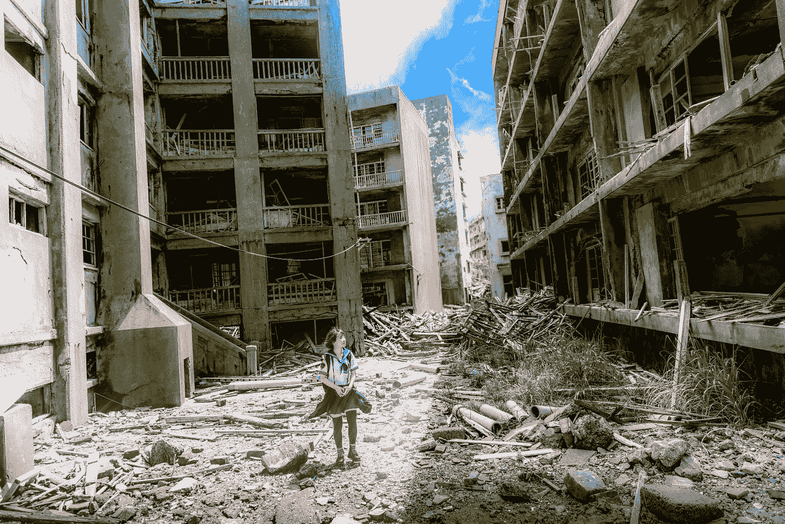

# 穆勒报告很重要，但这个令人不寒而栗的历史教训更重要

> 原文：<https://medium.com/swlh/the-mueller-report-is-important-but-this-chilling-lesson-from-history-is-more-important-1af4a765a771>

一个强大的民主国家被渗透到其政治进程中的俄罗斯特工拖垮了。这个头条事件发生在 18 世纪。

Photo by [Jordy Meow](https://unsplash.com/@jordymeow?utm_source=medium&utm_medium=referral) on [Unsplash](https://unsplash.com?utm_source=medium&utm_medium=referral)

这个国家是欧洲最强大的国家之一。正是这个国家在 1683 年奥斯曼帝国围困维也纳期间向维也纳派遣了军队。这个国家的军队…