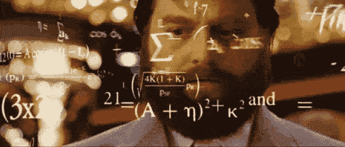

# 远见领导的神话

> 原文：<https://medium.com/swlh/the-myth-of-visionary-leadership-75ae26eca59d>

非常成功的人往往出奇的普通。

毫无疑问，你遇到的百万富翁企业家一般都非常能干，而且在某些方面也相当有天赋。然而，它们很少能与人们脑海中的某个异常有洞察力或才华横溢的人的形象相匹配。一般来说，他们都很正常，不会比下一个人更聪明，而且会成为…