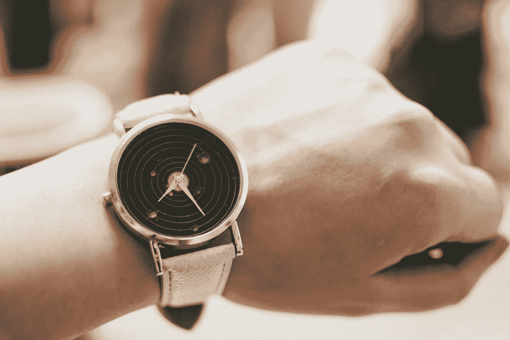

# “时机就是一切”的神话

> 原文：<https://medium.com/swlh/the-myth-that-timing-is-everything-3d3478a62b9b>

## 这是借口。

Photo by [Lisa Fotios](https://www.pexels.com/@fotios-photos?utm_content=attributionCopyText&utm_medium=referral&utm_source=pexels) from [Pexels](https://www.pexels.com/photo/round-gold-colored-black-analog-watch-with-grey-leather-band-705868/?utm_content=attributionCopyText&utm_medium=referral&utm_source=pexels)

有如此多的人基于他们所知道的内容来创造内容，所以一定会有一些建议对一些人来说是可怕的。我知道我犯了把我经历过的事情一概而论并当作建议的错误。我试图保持某种程度的自我意识，并总是透露，只是因为有些事情对我来说以某种方式进行…