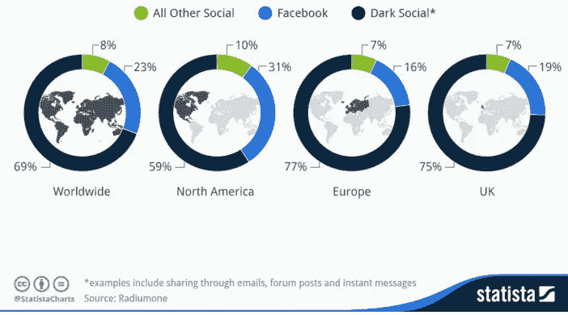

# 电报信使和搜索引擎和解的必要性

> 原文：<https://medium.com/swlh/the-necessity-of-reconciliation-between-telegram-messenger-and-search-engines-8faf495b0387>

## 成为电报社交网络的最后一步

对 Telegram 公共频道的海量内容进行专题研究和适当利用，而不使用 Google 和其他搜索引擎，是非常复杂的，几乎是不可能的。与此同时，点击了数百万次的内容和帖子在谷歌的页面上没有一席之地，并且在短时间内完全被 Telegram 的频道淹没，这是不公平的。这就是为什么电报公司必须考虑这个问题。当然，在目前，Telegram 不仅仅是一个典型的信使，另一方面，为了成为一个完整的社交网络，搜索引擎访问公共频道的内容是必不可少的。

这篇文章的作者是索马耶赫·戈拉米女士和迈赫兰·卡泽米尼亚先生，文章于 2019 年 1 月以波斯语和英语写成。

[*波斯文*](https://www.soliset.com/telegram)

Telegram 在五年多前推出，一直在稳步提高质量，增加这款信使的用户数量。电报的优势和创造性可以通过应用程序的简单性、具有人工智能的机器人以及创建新频道的可能性来解释。最近，Telegram 成功推出了使用区块链技术的 ICO，并成功筹集了超过 15 亿美元的私人销售资金。这绝对是 Telegram 的一大成就，Telegram 的创始人帕维尔·杜罗夫在最近的采访中宣布，Telegram 区块链项目已经完成了 70%。

与电报在各个领域的成功相反，一个关键问题被完全遗忘了。不幸的是，到目前为止，搜索引擎访问还没有为 telegram 平台的任何部分设计，也许是因为 Telegram 最初将自己定义为一个信使！通常，信使、邮件和私人浏览是黑暗的社交渠道。

然而，多年来，数以万计的活跃电报频道的创建和…带来了电报内部的大型平台和社交网络。正因如此，Telegram 需要为其用户提供最低限度的社交网络工具。在本文中，我们将讨论它并表明，当然，Telegram 中最重要且被遗忘的工具是允许搜索引擎访问公共频道的内容。

# 电报信使，迈向社交网络的一步

为了清楚地了解电报信使的状态，我们先来看看 [*电报分析通道*](https://t.me/tg_analytics) 。2018 年 9 月，在该网站上注册的电报频道总数为 84，743 个，其中约有五万个波斯语频道和两万个俄语频道。在撰写本报告时，30 多个波斯语频道拥有 100 多万会员；六个英语频道的会员数量已经超过了 50 万。同时，拥有超过 10 万会员的俄语频道超过 80 个。你可以在 [https://tgstat.ru](https://tgstat.ru) 找到更多信息和最新更新的统计数据。

[Telegram Analytics Channel](https://t.me/tg_analytics)

与伊朗人惊人地使用电报有关，2017 年伊朗政府官员之一 [*发表了*](https://www.mehrnews.com/news/4056549/%D9%87%D8%B1-%D8%A7%DB%8C%D8%B1%D8%A7%D9%86%DB%8C-%D8%B9%D8%B6%D9%88-%DB%B1%DB%B8-%DA%A9%D8%A7%D9%86%D8%A7%D9%84-%D8%AA%D9%84%DA%AF%D8%B1%D8%A7%D9%85%DB%8C-%DB%B7%DB%B2%DB%B0-%D9%85%DB%8C%D9%84%DB%8C%D9%88%D9%86-%D8%B9%D8%B6%D9%88%DB%8C%D8%AA-%D8%AF%D8%B1-%DA%A9%D8%A7%D9%86%D8%A7%D9%84%D9%87%D8%A7%DB%8C-%D9%81%D8%A7%D8%B1%D8%B3%DB%8C) 一个有趣的统计数据。报道称，电报的公共频道以波斯语发布的内容数量几乎等于所有波斯语网站制作的所有内容。换句话说，波斯语制作的内容有一半是在互联网的黑暗部分发布的，这意味着在 Telegram 的渠道中，没有一个搜索引擎可以访问这些内容。不幸的是，电报内部的搜索能力也非常有限，所有这些内容、照片、视频等。通常不存在于任何网站上，实际上没有机会在此后不久被再次查看。

根据这份报告，20，000 多个波斯语公共频道拥有 5，000 多名成员。同时，在这些频道上发布的 88%的内容(消息)是内容创建，12%是其他频道的内容共享。频道上的内容(消息)平均有 1125 次浏览，波斯语频道的总内容已增长到 1.2 万亿。这份报告的数字清楚地表明，讲波斯语的人学习的一个主要部分是电报公共频道上张贴的内容。

[Telegram Analytics Channel](https://t.me/tg_analytics)

近年来，我们已经看到，与世界上的社交网络相比，信使的重要性和使用越来越多。甚至有人说，messenger 的用户数量将很快超过世界人口的一半。或许正因如此，脸书除了推出自己的 messenger，还斥资 190 亿美元收购了 WhatsApp，以扩大 messenger 用户的份额。电报信使使用的增加也不例外，但这只是电报成功的一部分。正如你可能已经注意到的那样，应该考虑到拥有数百万个频道和非常拥挤的群体的 Telegram 目前不仅仅是一个信使。海量内容制作，照片，图表，视频等。在公共渠道中，将这些资产转发给朋友和家庭团体，成千上万 Telegram 的机器人的活动，商业渠道的问题，渠道内的广告……在 Telegram 旁边，我们看到了一个巨大的社交网络。

[Telegram Chans TOP | 4 Aug 2016](https://twitter.com/chans_top?lang=en)

许多公司、综合制造企业和服务企业都有电报频道，有时他们还成立电报组与客户沟通。这些公司在他们的渠道中介绍他们的产品和服务，通常有可能在相同的渠道和团体中订购产品和服务，因为许多小企业没有网站和在线商店可供订购。与此同时，订户最多的电报频道上的广告相当普遍。例如，一些受欢迎的渠道，每 20 个职位，他们每天在该渠道，他们有 5 个广告和广告，他们将直接从广告商支付。你可能会感到奇怪，但电报中的广告已经成为数百万美元的生意，正如所描述的那样。

电报渠道的内容非常多样。一些最受欢迎的频道是音乐、娱乐、社会和政治新闻。一些频道的主题是社会分析、文化、历史、文学、电影、技术等等。区块链社区、加密货币和人工智能有很多渠道。大学教师、不同领域的大学教授、诗人和作家通常都有他们自己的专用频道……不幸的是，这些频道中的许多都没有任何网站支持。通常只有那些意识到搜索引擎的重要性，并且拥有创建和更新网站的必要设施的频道，才会在其网站上存储其主要内容的副本，但是大多数频道的内容实际上没有机会存活，并且只有频道的订户在有限的时间内使用这些内容。

即使对于物理学这样的科学学科来说，找到所有关于物理学的电报频道也一点都不容易。许多频道无法在 Telegram 之外和网络环境中介绍其地址和内容主题。这就是为什么搜索引擎甚至不能帮助找到频道的地址。电报内的搜索也非常有限。起初，Telegram 采取了有限的措施来介绍频道的主题并对其进行评级。一些网站也采取行动来分类和列出电报频道，但这些行动实际上都没有必要的效率，如果没有准确的频道地址和直接访问，你就无法找到和了解频道的内容。

如你所见，没有谷歌和其他搜索引擎，很难利用公共频道的大量内容。不幸的是，通过继续现有的情况，除了对频道及其内容的非常有限的搜索之外，大量的重要内容在短时间之后将无法到达和看到。所以 Telegram 才需要思考这个问题。当然，Telegram 不仅仅是一个信使，Telegram 成为一个完整的社交网络的最后一步是让搜索引擎到达公共渠道的内容。它最好能为公共频道的管理员提供一个快速完成这项工作的选择。

# 引起电报主管的注意

当脸书推出其 Messenger 时，该 Messenger 的内容被放在了脸书社交媒体的黑暗面，谷歌爬虫和其他搜索引擎无法访问。现在 Telegram Messenger 需要做的恰恰相反，向谷歌爬虫和其余搜索引擎公开其公共频道的部分内容。因为拥有数百万会员的频道被认为是社交网络，而不是信使的一部分。

[Behind closed doors: the new social media](https://blog.bufferapp.com/messaging-apps)

这不公平的内容，照片，视频等。，被数百万人浏览，在谷歌的页面上没有位置，并且在很短的时间内就完全被 Telegram 的频道所淹没。Telegram 的搜索弱点很明显，比不上谷歌这样的搜索引擎。

如果 Telegram 公共频道的管理员可以在当前情况和搜索引擎可访问之间做出选择，当然，大多数频道选择了搜索引擎可访问性。因为他们的内容会活得更久，会一直在谷歌搜索上。当然，对于俄语、波斯语和其他语言来说，这是一个伟大的成就。因为这些语言的有价值内容的数量将在网上增加。

此外，它还可以为 Telegram 公共频道内的整合广告提供机会。Telegram 和脸书一样，可以使用渠道内直接广告的收入，或者把这个机会给谷歌广告，甚至像现在这样，只由渠道的管理员管理。

我们很高兴与您分享这个话题，我们希望我们的建议将很快得到执行。同时，我们很高兴知道你的意见。

## 2019 年 1 月 14 日
索马耶赫·戈拉米
迈赫兰·卡泽米尼亚

[网站](https://www.soliset.com/)
推特
[电报](https://t.me/soli_set)

## 这篇文章发表在 [The Startup](https://medium.com/swlh) 上，这是 Medium 最大的创业刊物，拥有+411，714 名读者。

## 在此订阅接收[我们的头条新闻](http://growthsupply.com/the-startup-newsletter/)。

