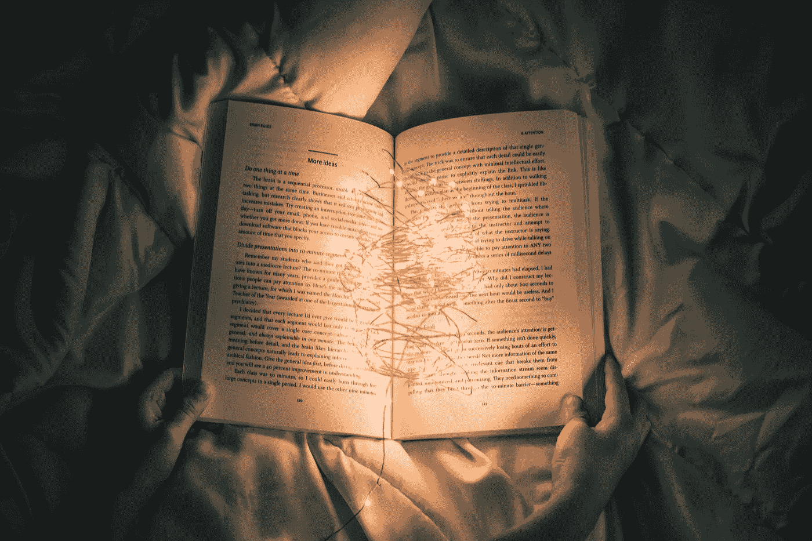

# 阅读的需要:你应该专心读书的五个理由

> 原文：<https://medium.com/swlh/the-need-to-read-five-reasons-you-should-have-your-nose-in-a-book-5a8e0e06acca>

## 阅读减少

阅读一本书的行为往往会让人想起这样的画面:用毯子和温暖的杯子温暖炉边，在夏日的阳光下懒洋洋地躺在游泳池边，或者靠在明亮草坪中央的一棵遮荫树旁。我们想到蜷缩在腿上的猫，想到巨大而布满灰尘的图书馆，想到有深色木书架的温暖书店，想到咖啡和茶。这些是充实的图像，因为阅读本身就是充实。但是越来越少的人沉迷于这种治疗性的消遣。根据皮尤研究中心的一项研究，2018 年，24%的美国成年人没有读过一本书。我们热心的读者看到这样的统计数据，会觉得我们的晚餐在我们的喉咙里涌出来，但去年美国售出了 6.95 亿本书(大约每人 2 本书)，这个故事可能还有更多。

统计数据还显示，白人、年收入超过 7.5 万美元的个人以及大学毕业生是最有可能的读者。乍看起来，阅读似乎是特权阶层更典型的消遣，但在 2018 年，[纽约客](https://www.newyorker.com/culture/cultural-comment/why-we-dont-read-revisited)报道称，事实上，美国的读者人数在所有人口统计中都在下降。你可能认为获取书籍造成了这种差距，但皮尤在 2016 年的另一项研究显示，48%的美国人参观图书馆，一半的美国人生活在贫困线以下。这是怎么回事？好吧，关键在于:美国看电视的人口是阅读人口的四倍。

## 有什么大不了的？

事情是这样的:被动地盯着屏幕不需要任何技能或智力，可能会让你的大脑变成燕麦片。神经科学家汐宫光·竹内 2013 年的一项研究表明，花太多时间在屏幕前的孩子大脑额叶会增厚，降低语言智商和语言技能。然而，在硬币的另一面，CMU 大学的研究人员表明，100 小时的阅读实际上增加了大脑中的白质，这是负责正常认知功能的组织。惊喜！阅读对你有好处。但是有无数的理由说明为什么拿起一本书是比拿起遥控器更好的选择。以下是你应该去最近的书店或图书馆的五大理由，马上去*。*

1.  ****提高自己的专注力*** 。没有别的办法:阅读迫使你集中注意力。如果你不把全部注意力集中在这一页上，你就无法读完一章。因为大脑就像你的肌肉一样需要锻炼，阅读是提高你注意力的最好方法之一。*
2.  ****增强记忆力*** 。如果你想看完一本书，你需要记住一些细节，比如第三章中的情节点、人物、场景以及谁有左轮手枪。如果你要解释接下来发生的事情，你需要记住之前的场景。你翻开的每一页都是对你记忆技能的又一次提升。*
3.  ****变聪明*** 。阅读非小说自然会教给你新的信息，但即使是阅读小说也可以通过向你展示如何处理冲突来告知情绪化的自我。冲突是所有小说的根源，冲突是我们每天都必须面对的事情。所以不管你读什么，你都增强了你的智力。*
4.  ****转义*** 。面对现实吧，生活会充满压力。在我们这个不断充斥着信息、需求和快节奏多任务处理的世界里，蜷缩着读一本好书、喝杯咖啡是一种受欢迎的休息。一旦你在书中迷失了自己，这个世界的压力就消失了。甚至心理学家也推荐阅读来帮助你消化压力。*
5.  ****为自己写*** 。很有可能，你需要在学校、工作甚至社交中运用你的写作技巧。如果你想写好，你必须阅读。句号。就连我们这个时代最多产的作家之一斯蒂芬·金也说:“大量阅读，大量写作是伟大的戒律。”阅读不仅能提高作者的声音，还能扩大你的词汇量和复杂思维的能力。*

**

## *你应该读什么？*

*你猜怎么着你读什么不重要。如果它召唤你，读它。非小说是扩展你的世界观的一个很好的方式，尤其是如果你拿起一本关于一个不熟悉的话题的书或者一个让你着迷的人的传记。小说世界有着多种多样的风格。文学小说教会你语言之美，增强你的移情能力。科幻和幻想会拓展你的想象力。浪漫会影响你对人际关系的感受。神秘将有助于你的逻辑推理能力。青少年读物会帮助你与生活中的青少年建立联系(也许会让你对自己的过去有所了解)。童书会唱出你青春的一面。如果你觉得阅读是一项孤独的努力，大声给孩子或老人朗读，或者去当地的扫盲小组做志愿者。重要的是努力拓展你的思维，增加你的脑力，享受在一本好书中迷失自我的过程。*

**

## *养成习惯*

*许多人避免阅读，原因很简单，那会使他们厌烦。他们舒服地坐在椅子上睡着了，他们发现自己在走神，不得不把同一个句子重读一百遍。*

*如果你属于这一类，你并不孤单。养成阅读习惯需要时间，强迫自己做任何事情最有可能让你感觉像打了一个大呼噜。从小处着手。如果你不能在大量的文字上集中注意力，那就试试图画小说。在这种媒介中有许多伟大的故事，它们并不都涉及超级英雄(如果那不是你的事情)。当你准备看小说时，找一本轻松的读物，比如轻松的推理小说或短篇经典。儿童书籍也是阅读的一个重要途径。《哈利·波特》系列已经在全球售出了 5 亿多本书，这使它们成为与其他读者分享你的快乐并让你继续阅读的理想方式。*

*如果这些都不能激发你的兴趣，那就开创自己的事业。去书店或图书馆，花时间去浏览。向朋友、书商或图书馆员寻求建议。最重要的是，保持开放的心态。我们这些热心的读者都知道，有时候书会找到*你*。*

*关键是，如果我们不集中时间阅读，我们就有失去智力、文化和移情能力的风险。没人想这样。拜托，阅读一本书是度过一个下午的绝佳方式。*

***需要帮忙找一本好书吗？查看 Business Insider 的“每个人都应该读的 100 本书”(由 Goodreads 用户选择):***

* [## 每个人都应该读的 100 本书(由 Goodreads 的用户排名！)-你读过几本？

### 由 Goodreads 的用户投票和排名的一生中要读的 100 本书，Goodreads 是…

www.listchallenges.com](https://www.listchallenges.com/business-insider-100-books-everyone-should) 

## 参考

佩兰，A. (2018 年 3 月 23 日)。在美国谁不看书？检索于 2019 年 1 月 17 日，来自[http://www . pewresearch . org/fact-tank/2018/03/23/who-donts-read-books-in-America/](http://www.pewresearch.org/fact-tank/2018/03/23/who-doesnt-read-books-in-america/)

霍里根，J. B. (2016 年 9 月 09 日)。美国人对图书馆的使用和参与。检索于 2019 年 1 月 17 日，来自[http://www . pewinternet . org/2016/09/09/library-usage-and-engagement/](http://www.pewinternet.org/2016/09/09/library-usage-and-engagement/)

c .克雷恩(2018 年 6 月 14 日)。为什么我们不读，重温。检索于 2019 年 1 月 17 日，来自[https://www . new Yorker . com/culture/cultural-comment/why-we-not-read-revisited](https://www.newyorker.com/culture/cultural-comment/why-we-dont-read-revisited)

Fields，R. D. (2016 年 1 月 1 日)。电视会腐蚀你的大脑吗？检索自[https://www . scientific American . com/article/does-TV-rot-your-brain/](https://www.scientificamerican.com/article/does-tv-rot-your-brain/)

CMU 卡耐基梅隆大学。(未注明)。12 月 9 日:卡内基梅隆大学的科学家首次发现儿童大脑重新布线的证据。检索自[https://www . CMU . edu/news/archive/2009/December/dec 9 _ brainrewiringevidence . shtml](https://www.cmu.edu/news/archive/2009/December/dec9_brainrewiringevidence.shtml)

为什么阅读很重要。(未注明)。检索于 2019 年 1 月 17 日，来自[https://www . oneworldliteracyfoundation . org/index . PHP/why-reading-is-important . html](https://www.oneworldliteracyfoundation.org/index.php/why-reading-is-important.html)*