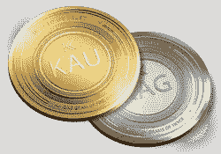

# 新金本位制

> 原文：<https://medium.com/swlh/the-new-gold-standard-f7dff01c858f>

# 问题是:人们倾向于持有大量资金。

货币是转移价值的手段。现代货币，即法定货币，是最糟糕的价值储存手段之一，因此人们倾向于花掉它。菲亚特价值的短暂性促使人们消费它，这为菲亚特提供了维持其突出地位所需的速度。

货币流通速度是指货币从一个持有者流向另一个持有者的速度。

价值不断贬值的法币很容易被人们花掉，因为他们不担心明天会有更大的价值。这就把菲亚特变成了容易消费的东西:一种转移价值的手段。如果某种有价值的东西作为货币被引入，它将不会被消费，而是天生成为纯粹的价值储存手段，而不是价值转移。

人们天生希望持有升值的资产，而不是花掉它们，这使得这些资产成为价值转移的拙劣手段。

一家新的金融科技初创公司 Kinesis 正在设计一种新的货币系统，这是金本位制的演变。Kinesis 想出了一种方法来确保黄金被花掉，尽管黄金是一种强大的价值储存手段，明天可能会更值钱。

这一发展解决了人们持有优质货币的内在欲望的困境，从而重新确立了黄金作为货币的效用。

> 最新的[加密货币新闻](https://www.coincurb.com/news/)、[空投清单](https://www.coincurb.com/airdrop/?status=active)、[赏金清单](https://www.coincurb.com/bountyc/?cat_id=188)、 [IEO 清单](https://www.coincurb.com/category/active-ico/)，请访问 CoinCurb.com。

# 激励良币流通速度

黄金是历史上被证实的最强的价值储存手段之一。然而，它的重量和缺乏可分性使它成为一种不方便的货币。此外，在这个数字时代，纯实物货币的效用极其有限。

因此，一个新的协议，建立在一个恒星分叉的顶部，已经被创建来标记黄金和白银。

*Kinesis 协议发行金银支持的货币。*

Kinesis 利用区块链技术，允许任何人使用法定货币或加密货币直接在公开市场上购买实物黄金，将其存储在一个可信的保管库网络中，然后铸造黄金支持的硬币。Kinesis 不是一个控制货币创造的中央实体，而是允许大众铸造货币，只要他们拥有支持它的黄金。

然而，人们已经习惯于购买黄金并将其作为价值储存手段持有。如果 Kinesis 为世界提供了一种黄金支持的货币，人们只会继续持有它。因此，为了让代币化的黄金真正作为货币使用，有必要激励它的使用。

> 最新的[加密货币新闻](https://www.coincurb.com/news/)、[空投清单](https://www.coincurb.com/airdrop/?status=active)、[赏金清单](https://www.coincurb.com/bountyc/?cat_id=188)、 [IEO 清单](https://www.coincurb.com/category/active-ico/)，请访问 CoinCurb.com。

# 运动速度令牌

人们有持有黄金的动机，因为他们认为黄金会升值。因此，Kinesis 创造了 Kinesis 速度令牌(KVT ),这为人们提供了一个既将实物黄金令牌化，然后花费它的激励。

目前，仅 Visa 每年就完成 2 万亿美元的交易。无现金支付正在增长，虽然加密是市场的颠覆性解决方案，但支付卡是人们越来越频繁使用的一种便利。因此，Kinesis 为其黄金和白银支持的加密货币开发了一个支付渠道，从而允许它们通过支付卡兼容消费。因此，Kinesis 利用了两种领先的支付技术:加密货币和支付卡。

*kine sis 支付卡是同类产品中的第一张，是一种在全球范围内使用代币化黄金进行交易的方式。*

由于通过 Kinesis 协议创建的贵金属支持的硬币可以在任何销售点系统使用，采用将大大简化。支付卡上的交易将面临费用，就像目前支付卡一样。这笔费用将用于推动项目增长。

Kinesis 协议产生的费用将用于激励 Kinesis 生态系统和用户群的增长。

所有 kvt 持有者将获得高达 20%的费用。因此，kvt 是一种象征，确保 Kinesis 协议的成功对社区是终身有益的。可以获得的净回报没有限制；奖励不会过期；奖励没有停止的日期。

> 最新的[加密货币新闻](https://www.coincurb.com/news/)、[空投清单](https://www.coincurb.com/airdrop/?status=active)、[赏金清单](https://www.coincurb.com/bountyc/?cat_id=188)、 [IEO 清单](https://www.coincurb.com/category/active-ico/)，请访问 CoinCurb.com。

# 启动事物

仅仅让人们轻松消费象征性的黄金和白银是不够的。必须有一个活跃的社区来处理过程的令牌化，否则系统会面临集中化的风险。

为了鼓励 p2p 生态系统创造黄金支持的货币，对金属支持的加密货币的创造者、启动货币流通速度的人以及吸引用户进入生态系统的人都有激励措施。

*   Kinesis 激励铸造象征性的金银。Kinesis 不会控制金属支持货币的流动；人们会的。如果市场觉得对代币化黄金和/或白银的需求在增长，他们将能够通过加密或法定方式购买黄金和白银，然后进行代币化。这个过程将被称为铸造；造币者将从收取的费用中获得 5%的奖励。
*   社区成员购买金银支持的货币，然后通过第一个与它们进行交易，将它们存入个人钱包，启动其流通速度，将有权获得存款人的收益。这种收益将在投入运行的硬币的生命周期内获得；奖励会是网费的 5%。
*   在 Kinesis 生态系统的增长中，最关键的作用将是吸引接受金属支持货币的商人和使用金属支持货币的人。因此，那些发展生态系统的人将从他们增加的网络用户所产生的费用中获得 7.5%的回报。

# 人民的金本位制

传统的金本位制，虽然有黄金作为后盾，但也有其局限性。金本位货币是政府创造的。因此，大众对货币的创造和流通几乎没有控制。

Kinesis 正在推动金本位的发展，它不仅仅涉及贵金属的象征化。

相反，Kinesis 不仅赋予大众创造黄金支持货币的权力，还奖励他们这样做。此外，Kinesis 鼓励人们充当储户，将黄金支持的资金投入流动，而不是依赖银行来推动资金流动。

现代金本位将以黄金为后盾，通过令牌化与数字时代的需求并驾齐驱，由大众创造和分配。

> 最新的[加密货币新闻](https://www.coincurb.com/news/)、[空投清单](https://www.coincurb.com/airdrop/?status=active)、[赏金清单](https://www.coincurb.com/bountyc/?cat_id=188)、 [IEO 清单](https://www.coincurb.com/category/active-ico/)，请访问 CoinCurb.com。

