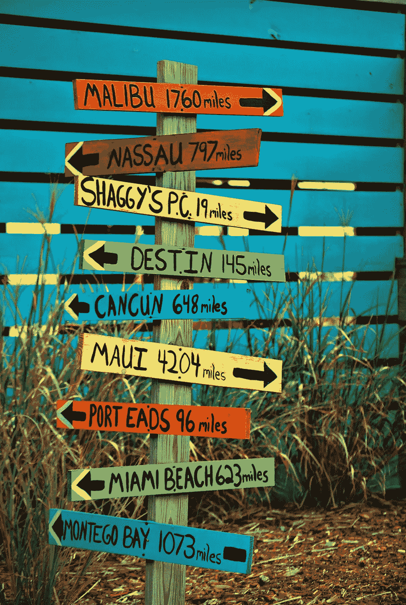

# 来自谷歌地图的增强现实导航

> 原文：<https://medium.com/swlh/the-new-google-maps-in-ar-587285a5d523>

Photo credit: Pixabay

谷歌地图的新增强现实(AR)导航最近推出，但并不是每个人都可以使用。

对于不知道什么是 AR 导航的人，这里有一个来自 Google IO 2017 的链接。

[https://youtu.be/OChF7NNYyq8](https://youtu.be/OChF7NNYyq8)

简而言之，它是叠加在摄像机视图上的方向。而不是必须低头看…