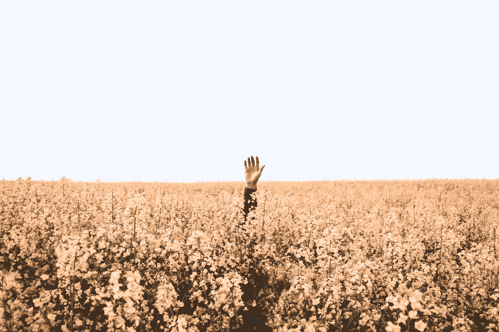

# 成瘾的新法律

> 原文：<https://medium.com/swlh/the-new-laws-of-addiction-c93d765158ac>

Photo by [Daniel Jensen](https://unsplash.com/photos/UDleHDOhBZ8?utm_source=unsplash&utm_medium=referral&utm_content=creditCopyText) on [Unsplash](https://unsplash.com/search/photos/lost?utm_source=unsplash&utm_medium=referral&utm_content=creditCopyText)

## 趁还来得及，调整你的生活

比尔·盖茨每年都要独自在森林里度过两周。

没有朋友。

没有家人。

没有分心的事。

是的，这位亿万富翁慈善家每年两次离开电网，参加他所谓的“思考周”。