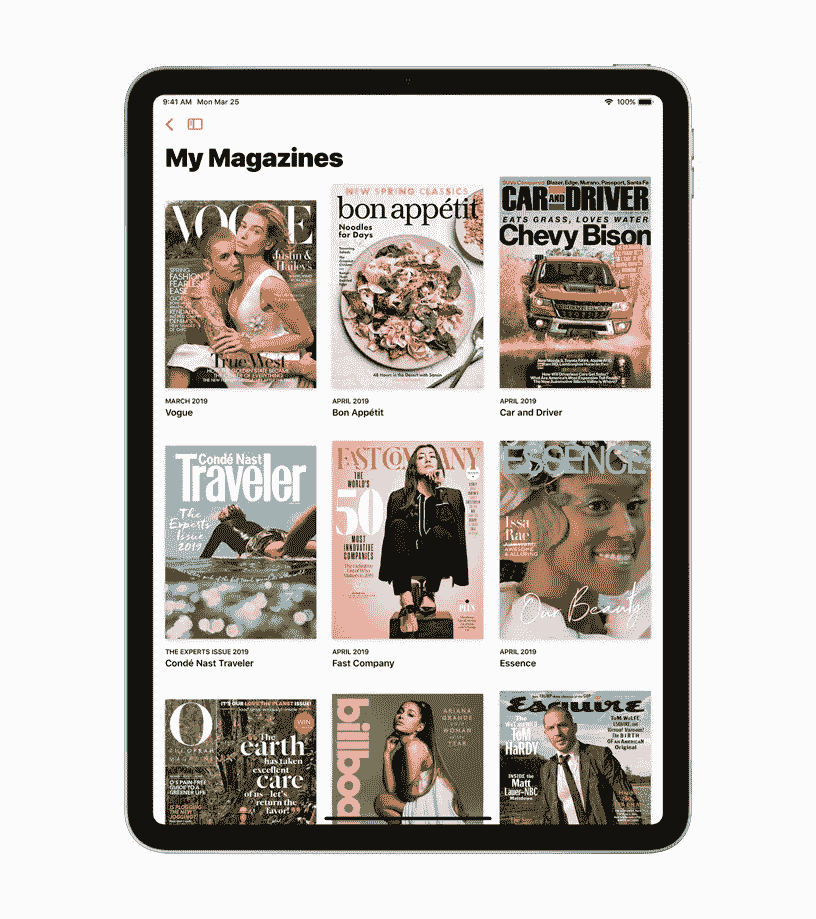

# 关于苹果新闻+的新闻。宣传的内容是什么，对你来说意味着什么

> 原文：<https://medium.com/swlh/the-news-about-apple-news-whats-the-hype-all-about-and-what-it-means-for-you-404b246b7856>

Source: [Apple](https://www.apple.com/newsroom/2019/03/apple-launches-apple-news-plus-an-immersive-magazine-and-news-reading-experience/)

本周一，世界再次受到震动。当然是好的方面。至少对我们中的一些人来说。蒂姆·库克(也被称为[蒂姆·苹果](https://www.youtube.com/watch?v=XHVxm12NbrY))宣布了苹果团队正在进行的一些重大变革和项目，结果是 Apple Card、Apple TV+、Apple Arcade 和 Apple News+。作为一名狂热的读者，我对 Apple News+及其提供的内容特别感兴趣，尤其是因为它已经在隐私、广告和出版物收入等热门话题上引发了一些争议和谣言。这篇文章旨在批判性地审视 Apple News+试图成为什么，以及它可能成为什么。

2019 年三月事件我可能看了好几遍。我喜欢那种在空旷的舞台上黑暗的阴影降临的刺激和感觉，来自期待的观众的欢呼和掌声，以及当屏幕被彩虹色照亮时的寂静。假设演示开始时的确切主题是什么，我会非常大胆，但我仍然试图猜测:音乐听起来像是塔伦蒂诺的电影，开场的主题颜色和角色像是从连环漫画中流淌出来的。这种展示形式对苹果来说是新事物，但同时对洛杉矶的观众来说却是非常熟悉的，明星们走下来站在聚光灯下，根据剧本开玩笑。有斯皮尔伯格先生、威瑟斯彭女士、安妮斯顿女士，当然还有温弗瑞女士。蒂姆·库克(Tim Cook)在台上走来走去，叫他的同事们展示苹果一直在开发的相关功能和应用。特别是，蒂姆站在布满新闻出版物的大屏幕前的画面让我非常兴奋。想象一下，以不到 10 美元的价格把所有 300 个放在你的口袋里。我已经订阅了几份出版物，我无法想象没有它们我会怎样，比如《纽约客》,我过去最喜欢的《连线》、《大西洋》和《国家地理》。所有这些都在一个地方？听起来很划算。至少一开始是这样认为的。让我们深入研究一下。

# 概观

苹果去年收购的应用程序 taking Texture，并将其与苹果新闻整合在一起。结果是新闻+。这个新应用程序带来了 300 种出版物，否则读者每年的访问费用将超过 8000 美元，最低只需 9.99 美元。应用程序的本质是它提供编辑内容，这意味着它被编辑认为最有趣和最相关的内容所精心策划。此外，通过机器学习，你最终会得到专门迎合你的个性化故事。一些出版物的封面是活的，这意味着你看到封面的动画图像，感觉非常真实。现在，你很可能看不到出版物从中赚钱的核心订阅产品，但你最终肯定会找到足以抑制日常阅读欲望的东西。

问题是现在只适用于美国，后来适用于加拿大、英国、欧洲和澳大利亚。它是否会到达我们的基地俄罗斯，是一个大辩论的主题，我几乎可以肯定它永远不会发生。但这不是重点。

让我们看看应用程序如何影响两个参与方。

# 如果你是出版商，这意味着什么

看起来出版物首先是为了扩大他们的读者群，其他一些人可能会因为害怕错过而加入进来。但是，潜在的新读者群会愿意为新闻+无法提供的顶级或优质内容支付额外费用吗？这现在仍然是一个谜。

苹果公司[称](https://www.youtube.com/watch?v=TZmBoMZFC8g&t=1415s)主要关注隐私；广告商将无法跟踪读者，苹果自己也不会有这些数据。但这不仅对广告商本身来说是坏消息，对出版商来说也是坏消息，因为他们不会与读者有直接的关系:没有跟进的电子邮件，没有 cookies，没有信用卡，没有商品和门票等。

此外，想象一下，在新闻+应用程序的 iPhone 屏幕上，来自竞争出版物的报道同一主题的两篇报道并排出现，读者会选择什么？照片更好的那个？更吸引人或点击诱饵的标题？老实说，这对新闻业来说听起来不太好。

这给我们带来了另一个问题，一个平台变成了一个愚蠢内容的管道，这发生在脸书身上。我真的不得不删除这个应用程序，因为每次我登录时，都会有大量关于烹饪巧克力饼干的尴尬视频，漂亮的猫玩纱线，狗随着荣继敏的歌曲嚎叫，“20 个成功秘诀”类型的视频。我是说…说真的吗？了解苹果和苹果产品，我没有看到同样的命运在这里发生，但你永远不知道，对不对？

同样，机器学习算法。想象一下，苹果对其进行调整，以显示不太严肃的新闻或基于图片或视频的内容，出版商就只能任由这种算法摆布了。

# 如果你是一个读者，这意味着什么

你可能会被“完全访问”这样的名字误导，然而，事实上，没有任何地方公开披露苹果这个名字的意思。例如，每月访问费用略低于 40 美元的《华尔街日报》正试图“两全其美”，并已开始专门雇佣新人为该应用程序创作内容。然而，该应用程序的内容可能不同于专门为《华尔街日报》网站受众定制的内容，正如卢卡斯·阿尔珀特[所说](https://www.wsj.com/articles/wall-street-journals-partnership-with-apple-marks-shift-in-strategy-11553556819)发布的故事将是普通读者感兴趣的。根据 [Tech Crunch](https://techcrunch.com/2019/03/26/apple-news-is-a-great-deal-but-what-does-full-access-really-mean/) 的说法，事实上，读者将可以完全获得报纸的每日内容，尽管它只能在有限的时间内获得。

在这篇[帖子](https://twitter.com/michaelluo/status/1110552622975631360)中，《纽约客》的编辑迈克尔·罗(Michael Luo)向该杂志的读者保证，阅读《纽约客》所有内容的最佳方式是仍然订阅该杂志，而不是订阅该应用。News+包括《纽约客》的印刷版，不包括其定期撰稿人和专栏作家的在线内容，如玛莎·盖森、约翰·卡西迪、杰拉尼·科布等。

但与此同时，好消息是不道德的广告商不会跟踪你，没有人会使用你的浏览或阅读行为，分析它，并将其出售给任何第三方。

现在，苹果承诺将 300 种出版物引入该应用程序。但是想象一下，如果在未来的某个时候，一些不知名的文学或独立出版物也能获得苹果的读者份额。这可以拯救许多濒临死亡的小出版商，使其免于消失在深渊中。我当然希望能接触到有很多有趣故事的小刊物。

# 结论

这个概述可能有点偏颇，因为我是苹果和他们产品的超级粉丝:我认为没有人像苹果那样接近优雅、设计和梦幻般的用户体验。我希望苹果正在努力做的事情能够改变我们对媒体的看法。我希望苹果比脸书更聪明，在传播好消息(而不是“假消息”)方面做得更好。

*我是***的文案，一家招聘网页开发者的中介:* [*招聘*](https://soshace.com/for-clients) *一个开发者或者* [*应聘*](https://soshace.com/for-developers) *远程工作。我的文章可以在这里查看和阅读***。***

****

## **这篇文章发表在 [The Startup](https://medium.com/swlh) 上，这是 Medium 最大的创业刊物，拥有+438，678 读者。**

## **在这里订阅接收[我们的头条新闻](https://growthsupply.com/the-startup-newsletter/)。**

****