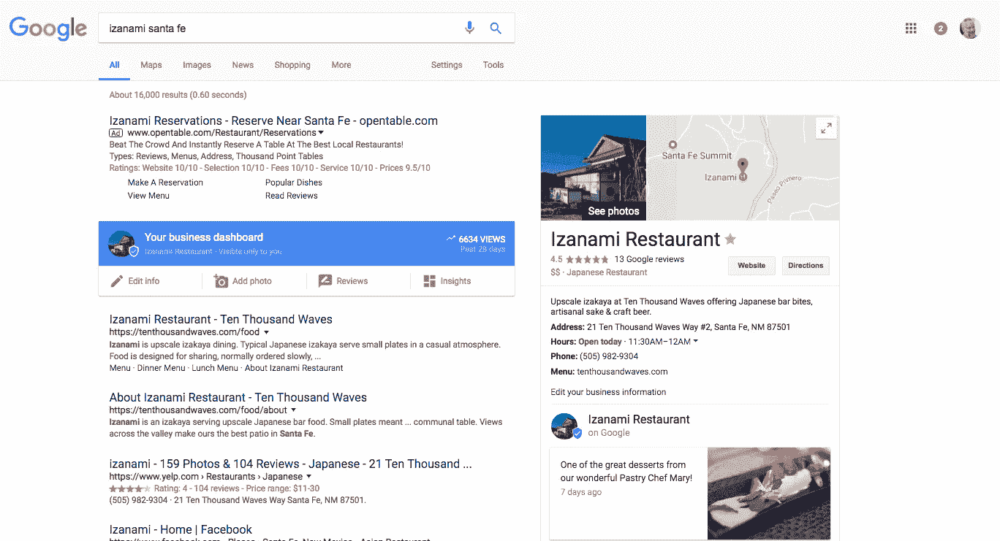

# “顶级”房地产社交媒体销售线索来源对比。

> 原文：<https://medium.com/swlh/the-no-bullshit-comparison-of-the-top-real-estate-social-media-lead-generation-sources-9f96c7ff11e9>

厌倦了像“**产生房地产销售线索的 47 种方法**”或“**从专业人士那里产生房地产销售线索的提示**”这样的文章？

这是一个有 20 年行业经验的软件工程师(不是房地产专家)写的博客，他知道搜索引擎是如何工作的。脸书、推特和谷歌广告如何运作(或不运作)。如果你是一名房地产经纪人，并且在这些方面取得了成功，请在下面留下你的评论。

# **1。脸书广告(2 颗星，共 5 颗星)**

你参加了脸书广告公司的课程(或者更糟，雇佣了一家数字/社交媒体营销机构，爱上了那个 21 岁大学毕业生的推销/外表)。然后，当你看到脸书如何让你创造并缩小你的广告受众范围到*年龄范围、收入水平、*生活事件，如生*孩子*或*离婚*等，你真的开始流口水了。然后你在脸书的广告上花了几百甚至几千美元。广告投放了两周，你得到了成千上万的点击量，甚至在你的帖子或脸书页面上获得了一些赞。

但是你猜怎么着？你的页面上可以有一百万个赞，但是如果它没有转化，那它就是没有价值的。

问一个朋友，任何一个朋友。当他们想买或卖房子时，他们去找过脸书吗？如果答案是否定的，你需要离开脸书。如果你的目标是获得品牌认知度的点赞，你可以每月花 100 美元，仅此而已。另外，记住脸书是一家广告公司，如果你给它钱，它会很乐意从你这里拿走。此外，不要忘记隐性成本。当你决定花 100 美元在脸书做广告时，你很可能需要再花几百美元来制作一个足够吸引人喜欢或参与的广告。

# 2.insta gram(5 颗星中的 1 颗)

我在 Instagram 上看到很多代理，因为加里·维纳查克告诉他们，这是未来的平台。我喜欢加里，他是一个非常鼓舞人心的人。Instagram 是一个社交网络，而不是买卖房屋的地方。如果你精通技术，并希望与其他代理人建立联系，请尽一切可能使用它。这是补充你的社交媒体策略的好方法。但不要指望 Instagram 会有成交或线索。

# 3.Twitter(5 颗星中的 1 颗)

我摆弄 Twitter 已经很多年了(至少 10 年了)。这是一个很好的平台，可以跟踪企业或个人，了解最新动态。但 Twitter 多年来一直在努力尝试将他们的平台货币化，这是有充分理由的。Twitter 广告不起作用。在写这篇文章之前，我们甚至尝试了 Twitter 推出的最新功能，名为“**推广模式**”。所做的一切都是为了固定的订阅费**$ 99/月**，它会更频繁地推广你所有的推文。你所要做的就是“发推”，你的推文开始更频繁地出现在人们的推特上。但是在一个测试账户上运行了一个月之后，我们注意到甚至没有一个追随者(记住，追随者只是追随者，他们甚至不是皈依者)

# 4.Google Adwords(5 颗星中的 4 颗)

让我们来谈谈 700 磅的大猩猩。从第一个问题开始。当有人在寻找房屋或房地产经纪人时，他们会去哪里找呢？他们总是从谷歌开始。即使它们可能会出现在 Zillow 或其他网站上。所以，这是你得到一些线索的真正机会。但是在你兴奋之前，这也是一把双刃剑，因为这里有一个秘密。这不是秘密！当有人在寻找待售房屋或只是寻找当地的房地产经纪人时，有很多财大气粗的公司会花大价钱把他们的广告放在最上面。所以，虽然我们给 Adwords 4 评分，但对于财大气粗的人来说，它真的是个 4。因为你永远不会到达顶峰。

# 那你注定要失败了吗？绝对不行！事实上，有一些你可能没有意识到的免费选项。

这篇文章不是要告诉你吸引潜在客户的 10 种方法，但是在劝阻了你所有的广告公司之后，我想如果我以积极的方式结束这篇文章会很好。

好消息是你一点也没死。你有多种选择，它们不需要任何费用，或者很便宜。但是这里没有所谓的“即时满足”。你必须努力工作，但这一点也不难。因此，这里有一些简单的方法让你的名字在那里。

## 1.谷歌我的生意

你有没有注意到谷歌中类似这样的搜索结果？它们不仅限于餐馆。当有人寻找“房地产经纪人”或“我附近的房地产经纪人”时，这是你主宰搜索结果的机会。最棒的是，它是免费的。只要在这里注册你的企业，输入所有相关信息，它就会在搜索结果的右边弹出如下所示= >【https://www.google.com/business/ 

## 2.尝试代理新-房地产语音技术

让我给[代理人尼奥](https://neolocalagent.com)一个荣誉奖——我们最前沿(几乎是最前沿)的房地产工具。你所要做的就是和我们签约，然后你就可以拥有自己的亚马逊 Alexa 应用了。就是这样！你现在只是一个语音命令远离你的客户的所有房地产需求。你的客户可以和 Alexa 交流，看他们是想买房子、卖房子还是预订一个家庭展览。他们所有的询问都通过短信/电子邮件发给你。

你是上市代理人吗？我们的技术可以帮助你克隆自己，虚拟地出现在你的列表中，并在买家来看你的上市房屋时回答他们的所有问题。看看下面的视频。

在这里注册你的 7 天免费试用= >【https://neolocalagent.com/Account/Register 

首页:【https://neolocalagent.com 

# 3.广告超级本地

如果你想使用 Google Adwords 或者脸书的广告，那就做 hyper local 的广告。当人们想买房时，他们已经在头脑中缩小了社区范围。所以，如果他们在达拉斯，他们不会在达拉斯寻找房子。他们很可能会搜索“科佩尔的房子”或“高地公园的房子”或“山谷牧场的房主出售的房子”。如果你想明智地花费你的广告费，确保你告诉脸书、谷歌或任何你正在使用的广告平台，只在利基市场的超级本地社区展示你的广告。你最终会花更少的钱，更多的人会找到你。

## 4.开始写博客

当购房者想买房时，他们会搜索什么？如果你对你的领域有所了解，开始写一些有意义的内容。要么在 wordpress 上创建自己的博客，要么为别人写博客。看看这些购房者/卖家在谷歌上寻找的搜索

1.  首次置业者的最佳居所
2.  首次置业指南
3.  购房流程
4.  一个月内卖出的技巧
5.  卖空你的房子
6.  列出业主出售的物业

如果你能写出回答真实问题的令人信服的文章，人们会看的。你甚至可以在你所在的地方/社区宣传这些文章，并在末尾添加一个插件来联系你。

底线是成功没有捷径。有很多有据可查的方法可以达到这个目的，但是所有的方法都需要你付出合理的努力。