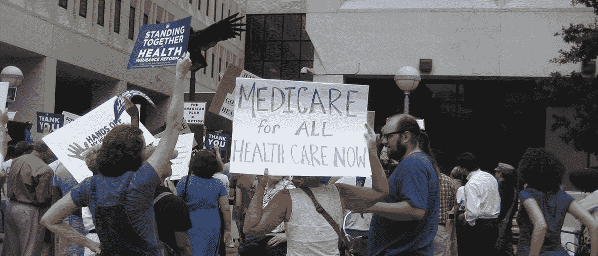

# 伯尼·桑德斯全民医疗保险的不合理之处

> 原文：<https://medium.com/swlh/the-non-sequitur-in-bernie-sanders-case-for-medicare-for-all-a38dbf4686f1>

在上周的民主党辩论中，主持人莱斯特·赫特问了伯尼·桑德斯一个关于全民医保的问题。桑德斯回答道:

> 莱斯特，我很难相信地球上的其他主要国家，包括我北面 50 英里处的邻居加拿大，都以某种方式找到了为每个男人、女人和孩子提供医疗保健的方法，而且在大多数情况下…