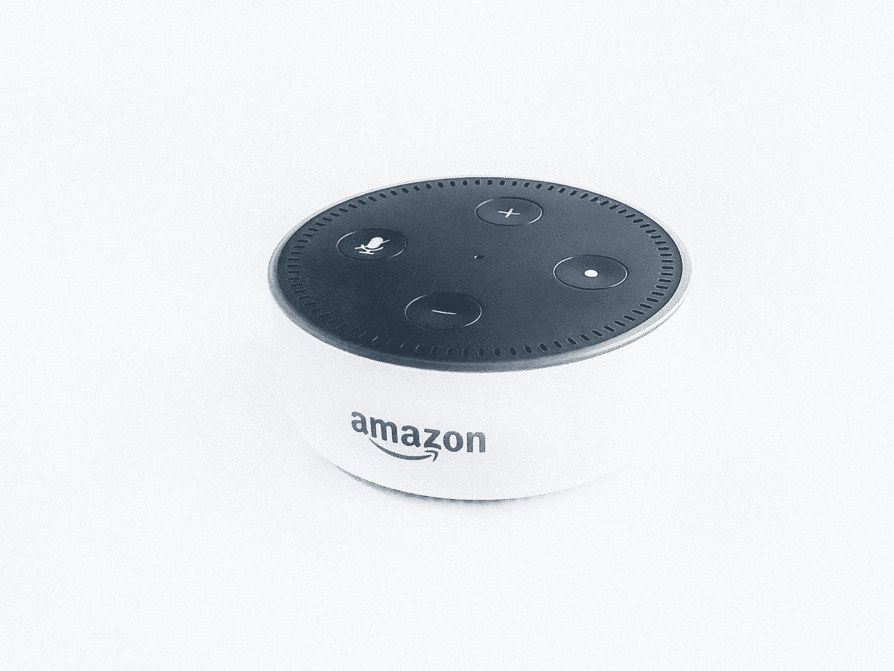

# 亚马逊并不惊人的故事

> 原文：<https://medium.com/swlh/the-not-so-amazing-story-of-amazon-300cb2a71879>

Photo by [Rahul Chakraborty](https://unsplash.com/@hckmstrrahul?utm_source=medium&utm_medium=referral) on [Unsplash](https://unsplash.com?utm_source=medium&utm_medium=referral)

今天，杰夫·贝索斯在北美是一个家喻户晓的名字，但亚马逊在世界上却是一个家喻户晓的名字。亚马逊将于 2019 年 7 月 5 日迎来 25 岁生日。但正如所有大公司的故事一样，亚马逊一开始并不成功。事实上，它在很长一段时间内都没有获得任何重大利润。

尽管如此，是什么让亚马逊成为今天的庞然大物呢？首先，这里有一个剧透:“这主要是一个…