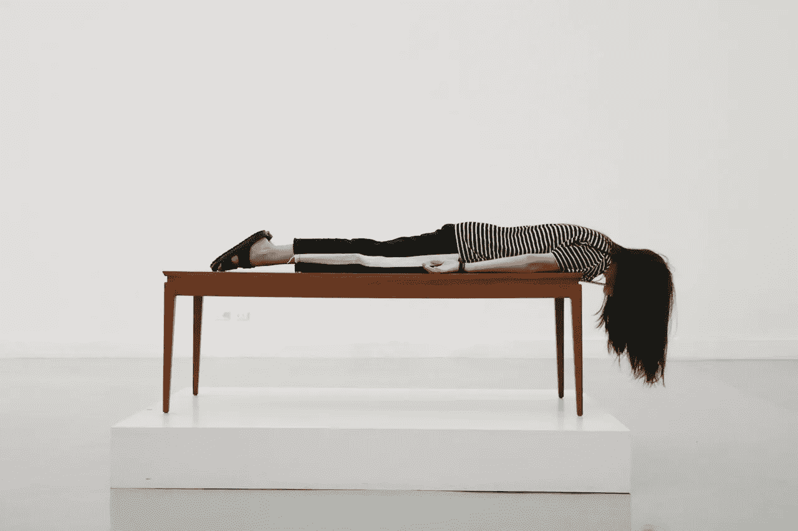
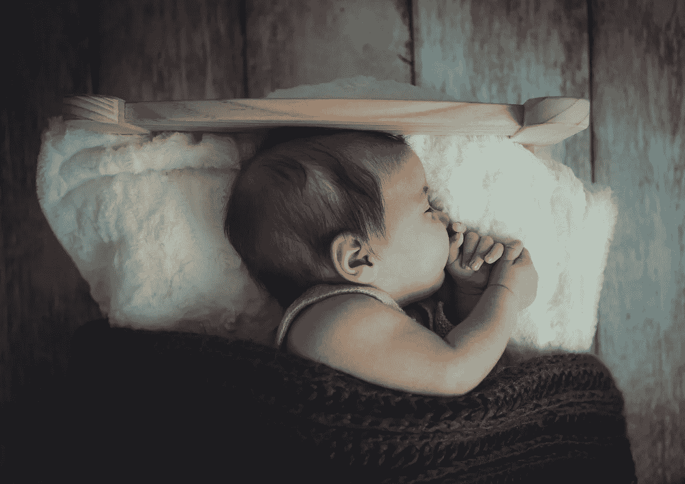
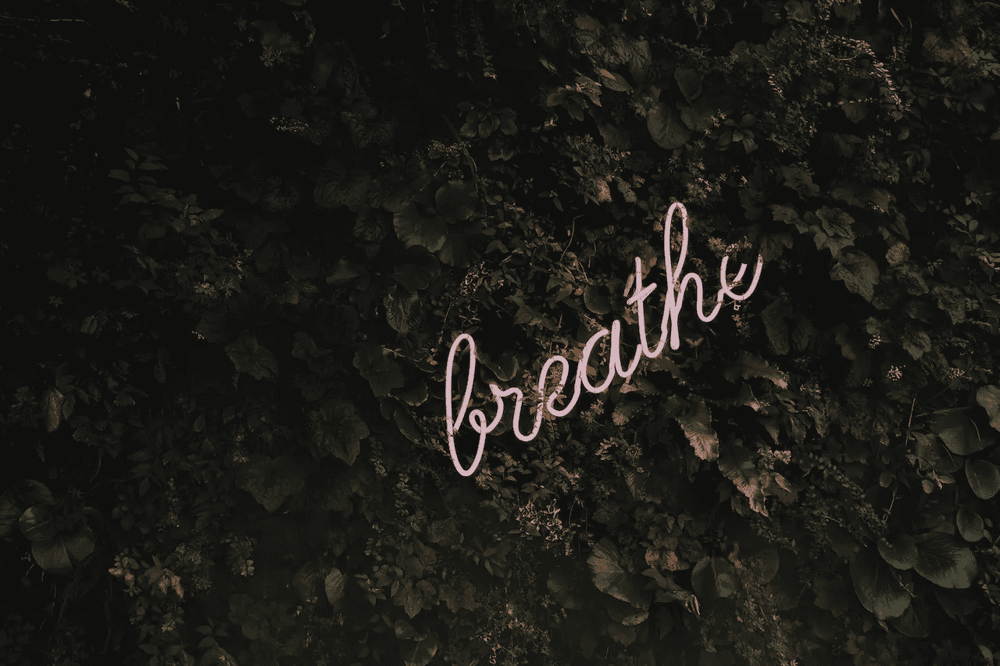

# 你健康和人际关系的头号敌人

> 原文：<https://medium.com/swlh/the-number-1-enemy-for-your-health-and-relationship-4ea3f1d77d17>

## 因为有时候得到提醒是件好事

我们中的许多人花了大量的钱来确保在我们的身体中引入正确的营养物质；我们擦洗西红柿的每一寸来去除所有讨厌的化学物质，我们订购一切有机食品来获得内心的平静，我们喝成吨的泥浆果汁和粘土药水来寻找答案。

维生素、矿物质、pre 和益生菌充斥着我们的厨房；我们下载了最新的应用程序，订阅了 10 种不同的健康杂志，我们无法简单地跟上食品和营养的最新趋势。

我们中的一些人变得不知所措；其他人碰巧在一夜之间成为大师。

> 与此同时，我们不断衰老，体重增加，我们不断被淘汰的皮肤和随机疾病。因此，我们不顾一切地试图摆脱我们所知道的东西，成为最健康的自己；首先是糖，然后是麸质，坚果，谷物，奶制品，甚至是一些蔬菜，最后…我们的精神健全。

令人悲伤的消息是，尽管食物非常重要，平衡的饮食也是最重要的，但是还有很多其他的“事情”在起作用。

艾米·韦克斯勒说:“炎症(因此衰老得不那么优雅)的最大罪魁祸首不是饮食，而是压力”。

压力是人口老龄化背后的罪魁祸首，当我提到压力这个词时，80%的人会想到工作和财务稳定。我们陷入了“我太忙了”的例行公事中，我们倾向于花费我们的日子——如果不是我们的生活——去幻想我们最后一次享受放纵的假日。

*不幸的是，压力远不止这些。*

当你正在读这几行的时候，检查一下你的脖子和肩膀；他们放松吗？你的呼吸来自哪里？在你的腹部深处，随着长时间吸气和更长时间呼气的舒缓舞蹈，或者从你的胸部上方，好像你是一条离开水的鱼？你患有偏头痛或头痛吗？*你是在专注于这些单词，还是在分神，跳过一行行寻找答案，以便继续下一篇文章？*

很高兴知道压力不是一个实体，不是我们遇到的生物，而是来自我们对某些情况的反应，不管这些情况有多紧张。

想想堵车；很可怕，对吧？但是，如果这是一个检查自己的机会，或者听完每个人都赞不绝口的超级有趣的播客呢？

让我们在这里包括运动。锻炼对你有好处，但如果你在受伤时继续运动，或者如果你剥夺了自己急需的睡眠去参加早上 6 点的健身课，锻炼很容易变成压力源。一周吃三次苹果怎么样？你明白了，对吗？

> 总而言之，压力(精神上的、身体上的等等)会导致我们的荷尔蒙失调，它会提高我们的肾上腺素和皮质醇水平，还会导致疲劳和疲惫。

但是你可以遵循一些建议，在几天内提高你的幸福感:

**睡眠。**请不要翻白眼，听我说完。如果你必须做一件事，把睡眠放在首位；我们的身体需要 7-8 小时连续无噩梦的睡眠来放松、休息和康复。这就像在我们的电脑上按下重启键。每一个夜晚。

如果你属于“躁动不安”——睡眠类别，那就在睡觉前至少 1 小时关掉任何一种科技设备，并在睡觉前开始练习平静呼吸。

**演习**。我们的身体是要运动的，但运动并不一定意味着像老鼠一样在跑步机上跑 1 个多小时。如果你感到烦躁、疲倦、压力大，把 HIIT 的硬核课程换成瑜伽和普拉提……至少每周一次。休息一天不锻炼。永远，永远，永远不要在受伤的时候运动。这就像从一个刚刚愈合的伤口上抓伤一个伤疤；这不是个好主意。

**给自己补充水分。**回到过去的好消息，每天喝 8 杯水。我们的身体大约有 70%是由水组成的，我们的血液和细胞都是由水组成的，可悲但却是事实，没有水我们无法长久生存。

最重要的是，我们喜欢在饮食中加入利尿的东西，如酒精和咸的食物，这意味着我们需要更多心爱的 H2O 来维持体内平衡(这是我们体内的一种平衡状态)。所以，从你醒来的那一刻起，到睡觉前的那一秒钟，尽可能多喝水。试着在早上第一件事就是饮用加了柠檬的过滤温水，避免在午餐和晚餐时咀嚼食物时大口大口地喝满满一杯，仅仅是因为你不想你重要的酶被削弱，或者在你最需要它们的时候被冲走。

Xavier Rudd 唱道:**呼吸，冥想，漫步到最近的瀑布。被自然包围，与自然融为一体，只要开始注意那些微小的事情，比如寒冷的冬天早晨阳光轻抚你的脸庞。从庆祝最小的成就和最小的日常快乐开始(想想:第一口咖啡…现在就流口水)**

谈论咖啡和其他所谓的**‘醉人’，**限制它们！茶、咖啡(每天 1-2 杯即可，除非患有严重的焦虑、心动过速等)、酒精、香烟、药物；即使是大麻……放松效果不会永远持续，它不仅会影响你的免疫系统和反应能力，而且零食也不会帮助你控制情绪。

而当涉及到**控制**…试着放手。和自己说话，给自己写信，成为自己最好的朋友。有时我们在小事上想得太多，我们对每一种情况都想得太多，我们倾向于做最坏的打算。如果我们开始相信积极的结果会怎样？生活不是更有趣吗？

> “如果我摔倒了怎么办？
> 
> 亲爱的，如果你飞呢？"

有趣的是，我们确实有能力做出改变，并开始相信一切都会好起来。

最后但同样重要的是，**尝试新事物**！对我们许多人来说，这可能是一个有趣的概念，但在我们的日常生活中加入一些新的东西可以让我们保持正轨。选择一些你从未尝试过的简单、可行的事情。可以是每天早上冥想 2 分钟，对每一个和你打交道的人说谢谢和请不要客气，或者加入一个新的育儿班，结交新朋友。

这些是一个非常容易的起点，让你开始一个非常有益的个人旅程。记录你的成就总是被推荐的，也许通过使用一个应用程序或者一张老式的纸。

*只要有效，只要能让你微笑*