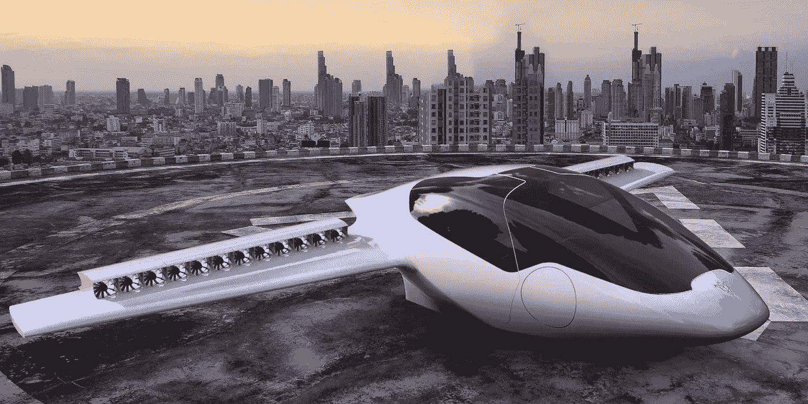

# 无人机的地面现实

> 原文：<https://medium.com/swlh/the-on-the-ground-reality-of-drones-ec2ecad43c9e>

人们很容易关注令人印象深刻的技术成就，这些成就可能使无人驾驶客机或垂直起降(VTOL)车辆能够在城市内部或城市之间安全、快速、零排放地运送人员。从希思罗机场到市区仅需五分钟。按下按钮，从剑桥到牛津只需公路或铁路一半的时间。车辆本身，复杂的和自主的…