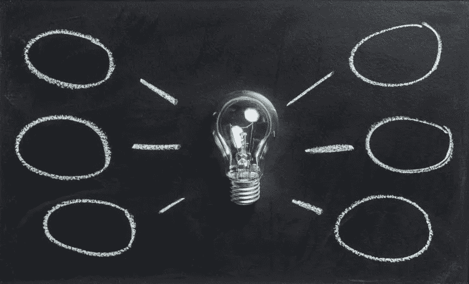
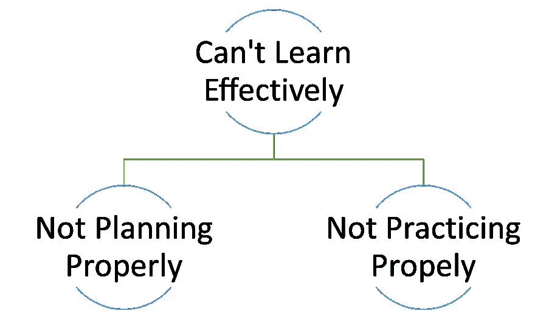
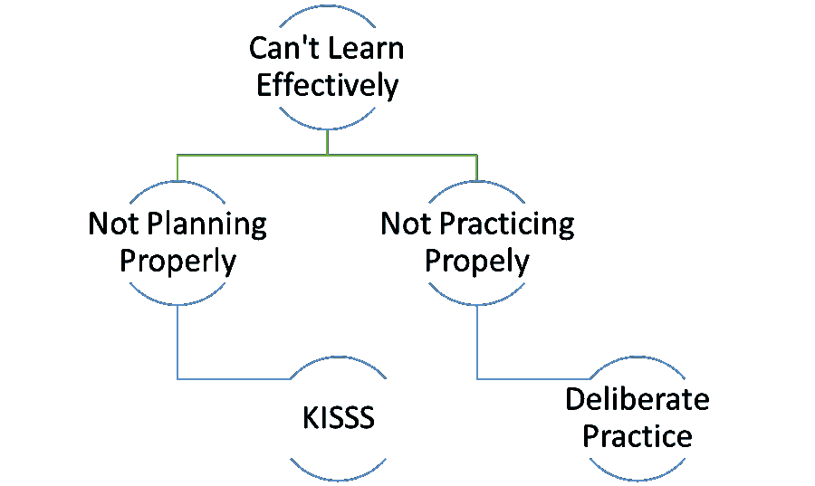
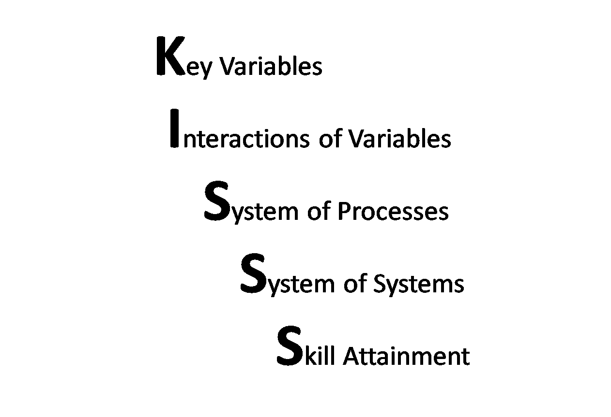
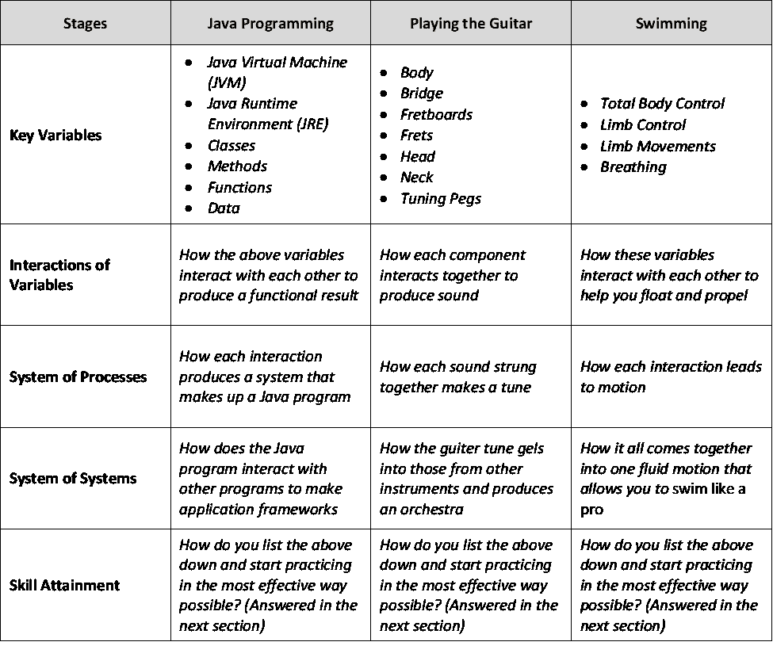
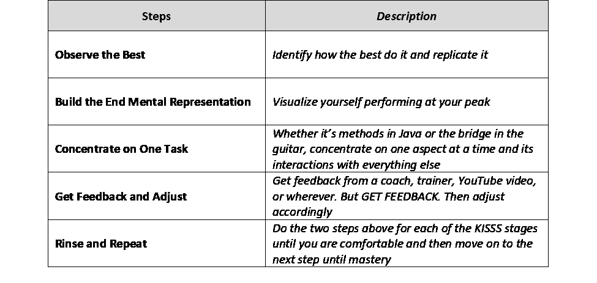
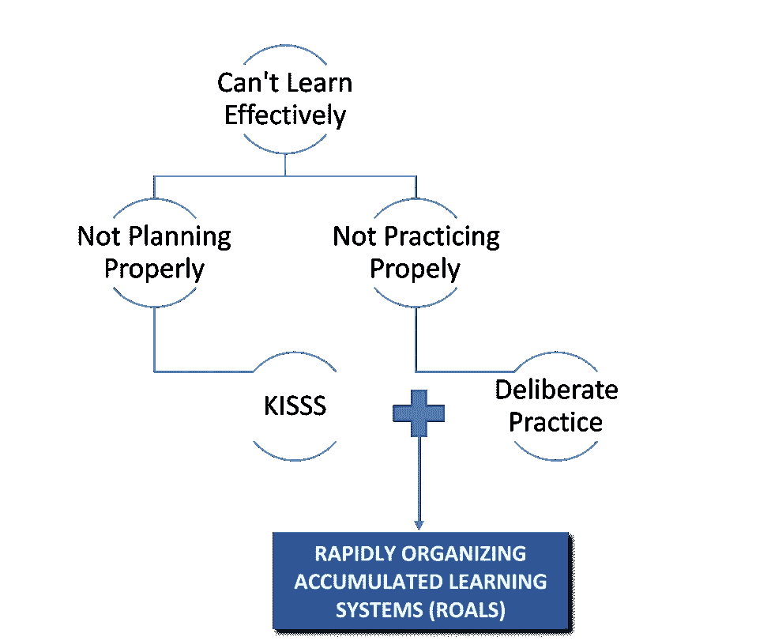
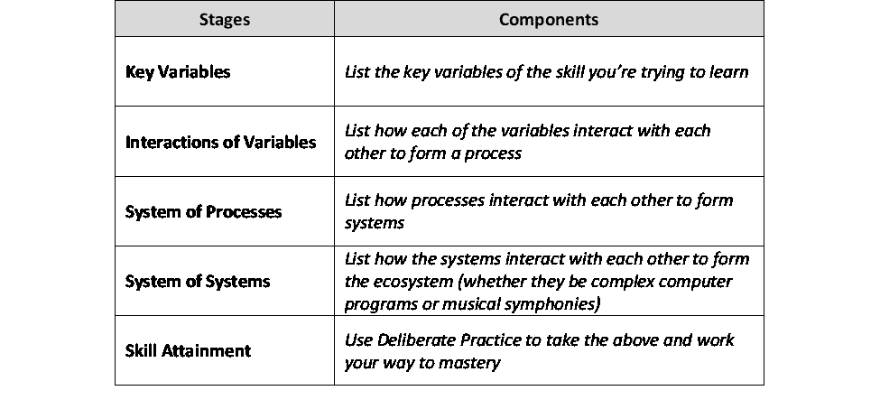
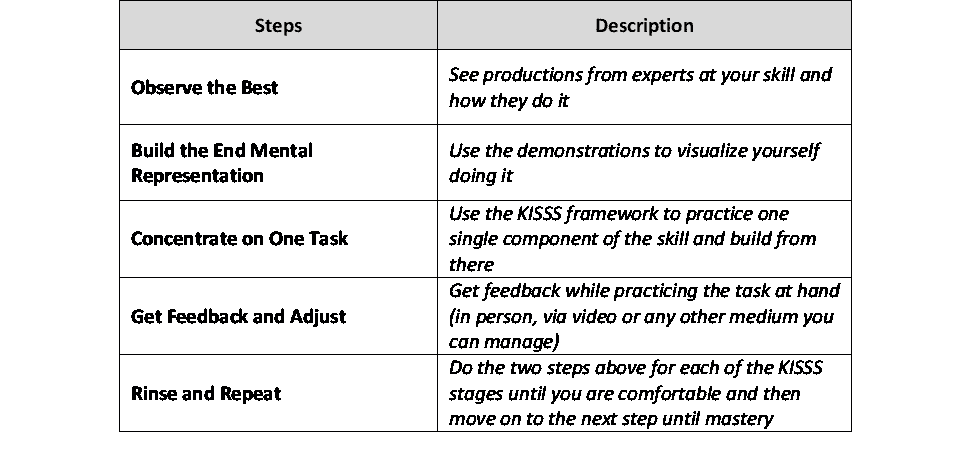

# 学习任何东西的框架。快的

> 原文：<https://medium.com/swlh/the-one-framework-to-learn-anything-fast-c9e1392fc5a9>

有什么是你一直想学的吗？游泳？电脑编程？唱歌？打领带？

我们都有一些一直想学但找不到时间学的东西——或者认为太难而放弃了。但是你看，你总是在学习。一直如此，永远如此。学习让我们走出洞穴，进入摩天大楼。这是唯一能让一切都不变得无关紧要的东西；包括你。

但是，我们中的许多人没有正确地学习这种元技能，仍然在与它斗争，这对我们的职业生涯、业务和最终对我们的生活造成了损害。面对每天不断发展的新技术，学校给我们的工具似乎不起作用。如果我们不迅速适应它，我们将面临在工作、业务和所有努力中步渡渡鸟后尘的风险。

# 为什么我们不能有效地学习

我们大多数人在学习新事物时遇到的问题可以归结为以下几点:

# 计划不周

当你开始学习一些东西时，例如游泳，有如此多的活动部件和事情要做，以至于你不知所措。你觉得要精通这一项技能需要掌握的东西太多了。

你看到游泳者首先跃入水中，控制身体动作，开始漂浮，以完美的泳姿开始在水中移动，并以头、手、脚和躯干的协调动作随意改变方向；他面带微笑，让你觉得他是个天才。

你不能这么做！！你不是天才。还是你？(我们很快就会知道了)。

# 练习不当

然后，即使我们克服了对尝试的恐惧，勇敢地面对困难(双关语)，我们还是会陷入下一个更危险的陷阱。玩忽职守。不，不是医生做的那些；从幼儿园学生到中层管理人员的每个人都这样做。

渎职，或不当的做法导致我们走进死胡同，不公平地结束了我们的梦想。让我们认为“我们一开始就不是为此而生的”。

问题是我们在学校一直被教导的练习方法围绕着死记硬背。你在脑子里反复练习一件事或者做一件事的时间足够长，你就会学会它。暴力破解法。攻城锤。但是这种方法有严重的缺陷。你六年级的数学成绩可以证明。

但是你能对这些问题做些什么呢？

这是…..

# 我们如何有效地学习

既然知道了问题，那怎么解决呢？你如何以最好的方式有效地学习？

好吧，科学支持你。这是它说的，

# 第一阶段:接吻

对第一个计划不当的问题的回答是接吻。请保留判断，让我解释。

KISSS 代表，

你看，任何技能，从游泳到飞行，都只有几个关键部分。掌握了这些，你就能快速掌握整个技能。这就是 [80/20 法则](https://www.forbes.com/sites/kevinkruse/2016/03/07/80-20-rule/#2dcadba33814)在起作用。

这是它的工作原理，

关键变量:确定技能背后的关键变量。构成整体的技能的几个要素是什么？把它们列出来。

变量的相互作用:你列出的变量是如何一起工作以产生期望的结果的？列出互动。

过程系统:个人互动如何导致系统使技能开花结果？把它们列出来。

系统的系统:技能中的每个系统如何相互作用以产生最终结果？

技能获得:你如何以最大化你的学习效率的方式实践上述方面？各位，这是刻意练习。这将在下一节中详细介绍。

因此，如果你将这种技术应用于以下三种技能，它们看起来会像这样

如果使用得当，这些技术可以在很短的时间内产生惊人的效果。

*这里有证据:*

# 第二阶段:刻意练习

既然你已经用 KISSS 把这项技能分解成了几个部分，是时候开始练习了。刻意练习是由佛罗里达大学教授 T4·k·安德斯·埃里克森在他关于这个主题的开创性论文 T7 中提出的一个概念。它被广泛认为是导致专家表现的有效实践的主要理论之一。

步骤如下(有关每个步骤的更详细描述，请阅读此[文章](https://sivers.org/book/LittleBookOfTalent))。

*以下是奥运纪录保持者迈克尔·菲尔普斯如何运用刻意练习的:*

# 将这一切结合在一起

这个使用 KISSS 框架规划学习时间表并朝着你的目标刻意练习的过程可以总结为一个名为 ROALS(快速组织累积学习系统)的中心框架。

# 如何着手实施 ROALS

现在你已经有了框架，这里有一个快速的清单，让你开始使用 KISSS 规划你的学习之旅，并通过深思熟虑的练习来执行。

# 建立你自己的 KISSS 框架

# 建立你自己的练习框架

你现在可以走了！！快乐学习:)

# 接下来你可以去哪里

**书籍**

[巅峰:专业知识新科学的秘密](https://www.goodreads.com/book/show/26312997-peak?from_search=true):*k . Anders ericsso n 关于高绩效科学的书*

[天才小书:提高技能的 52 个技巧](https://www.goodreads.com/book/show/13330702-the-little-book-of-talent) : *使用 ROALS 成为任何技能专家的可怕实用指南*

[精通](https://www.goodreads.com/book/show/13330702-the-little-book-of-talent):*《48 法则》的作者概述了历代大师是如何做到的*

[习惯的力量](https://www.goodreads.com/book/show/12609433-the-power-of-habit?from_search=true) : *解释了习惯如何通过基底神经节开发大脑并导致成功*

**视频**

[4 和弦歌曲由 Axis of Awesome](https://www.youtube.com/watch?v=5pidokakU4I) : *乐队演示如何只用 4 个和弦就能演奏每一首流行歌曲*

[如何在 20 个小时内学会任何东西](https://ed.ted.com/on/Imq14bHp#watch) : *一个人如何在 20 个小时内学会演奏尤克里里琴，学会演奏每一首歌(灵感来自“棒极了”轴心)*

[Sugata Mitra 的《云中学校》](https://www.ted.com/talks/sugata_mitra_build_a_school_in_the_cloud):*2013 年 TED 大奖得主，ROALS 首字母缩略词背后的灵感描述了翻转教室是教育的未来*

[Tim Ferriss 分享如何通过解构掌握任何技能](https://www.youtube.com/watch?v=DSq9uGs_z0E) : *大师讲述如何使用解构你的方式实现有效的学习和技能习得*

**条**

[Tim Ferriss 的 DiSSS 框架](http://www.kevinhabits.com/disss-and-cafe-tim-ferriss-approach-to-quick-mastery-of-any-topic/) : *大师亲自带你通过 DiSS 框架学习任何东西——kiss 框架的灵感之一*

**研究论文**

[刻意练习在获得专家表现中的作用](https://graphics8.nytimes.com/images/blogs/freakonomics/pdf/DeliberatePractice(PsychologicalReview).pdf):*k . Anders ericsso n 的学术论文，该论文认为刻意练习具有科学可信度*

**免费电子书**

Tim Ferriss 的 12 条快速学习语言的规则

*本文原载于*[***Techonomics***](http://techonomics.io/)*。一个关于职业和商业策略的博客。更多战略善良，* [***订阅***](http://techonomics.io/the-strategy-pill/) *我们即将发布的简讯，* ***战略药丸。***

## 这篇文章发表在 [The Startup](https://medium.com/swlh) 上，这是 Medium 最大的创业刊物，拥有+409，714 名读者。

## 在这里订阅接收[我们的头条新闻](http://growthsupply.com/the-startup-newsletter/)。

