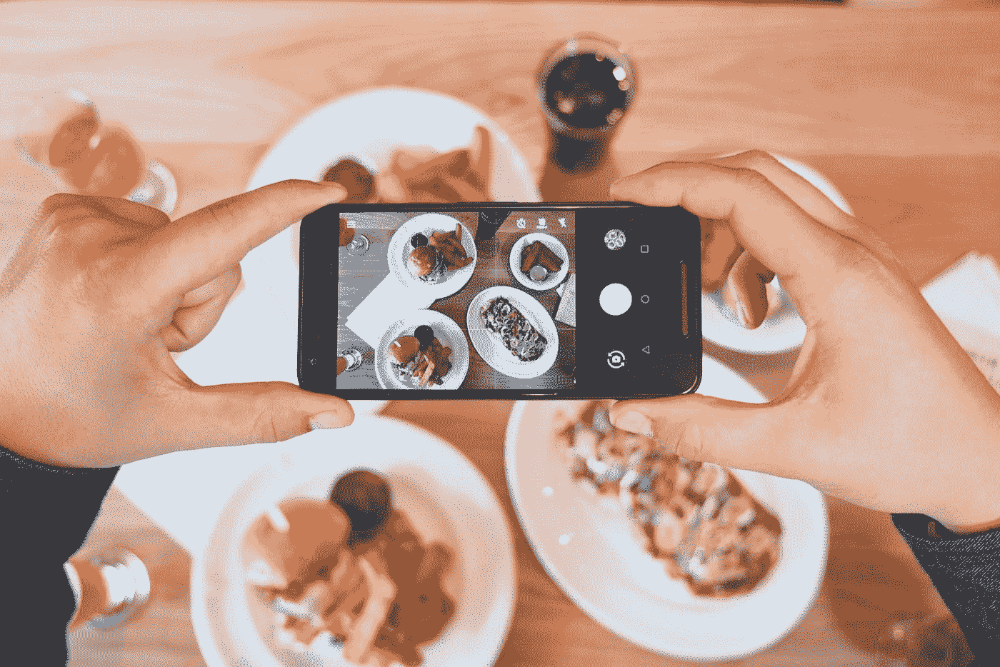

# 在社交媒体上发帖之前要问自己的一个问题

> 原文：<https://medium.com/swlh/the-one-question-to-ask-yourself-before-posting-on-social-media-4b5bf3b61aa9>

## 我们把它变得比需要的复杂得多

Photo by [Eaters Collective](https://unsplash.com/@eaterscollective?utm_source=medium&utm_medium=referral) on [Unsplash](https://unsplash.com?utm_source=medium&utm_medium=referral)

社交媒体的意图是多方面的。明智地使用，它是一个与他人联系、分享激情和建立品牌的无价工具。

然而，众所周知，社交媒体有一些明显的缺点。对于小型企业…