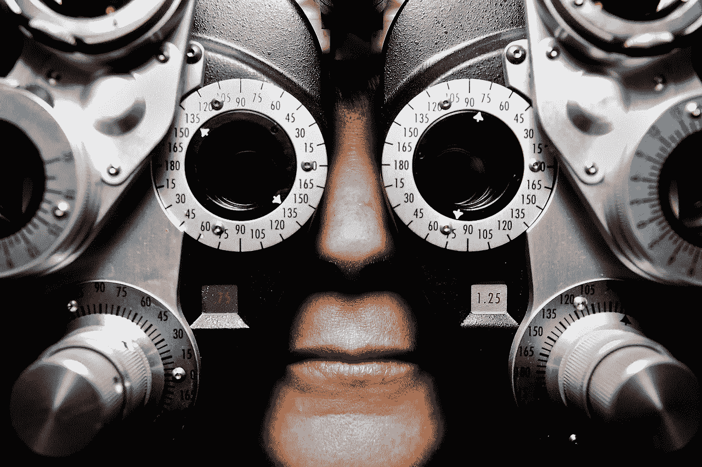

# 在制造任何新产品之前，你必须问的一个问题是

> 原文：<https://medium.com/swlh/the-one-question-you-must-ask-before-building-any-new-product-13204feb9b3c>

这是对所有创造者的试金石，不管你创造了什么

The one test for any creative project

你是创造者、企业家或小企业主。也许你写作、编码、绘画、构建或思考。你的职业不重要。无论你做什么，测试都是一样的。