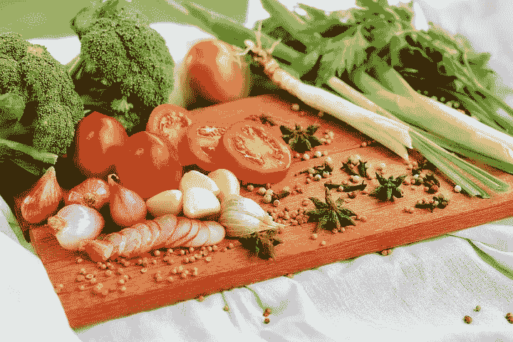

# 你需要的唯一饮食:为生活而吃

> 原文：<https://medium.com/swlh/the-only-diet-youll-ever-need-eating-for-life-f037edf36515>

几年前，我和妻子回到了我们的犯罪现场——法国。20 岁出头的时候，我们第一次见面是在一所法语浸入式语言学校，然后在巴黎“同居”了一年。啊，青春！40 年后，我们最近一次旅行的主要目的之一是重新联系我们亲爱的朋友亨利·让和戴安娜。1978 年，亨利·让在巴黎“马莱”区他的教区偶然相遇后，收养了我们，把我们当成他的英国兄弟姐妹。他后来娶了戴安娜，一个了不起的墨西哥女人，两人成了同样珍贵的朋友。我们想在年龄伤害我们之前再见到他们。

就在我们出发前，宝拉和我同意把谨慎抛到九霄云外。法国文化理所当然地以其葡萄酒、奶酪、糕点、面包和黄油酱而自豪。我们决定忽略体重和清醒度。“尽情享受吧！”事实证明这是一次壮观的旅行，放弃谨慎是一个极好的决定。我的最大体重是 155 磅，比正常体重增加了 10 磅以上。

一年后，就在得知我得了癌症之前，我告诉宝拉，那些杏仁羊角面包和卡门贝干酪正在神奇地融化。我毫不费力就神秘地减掉了 10 磅。“那就奇怪了！”她哀叹道，“我们吃着同样的饭菜，但我没有减肥。”当我开始接受癌症治疗时，我已经减掉了将近 30 磅——降到了 125 磅。那是一个饥饿的肿瘤。

接下来是化疗，它可以明显地破坏和摧毁快速分裂的癌细胞。不幸的是，胃的内层也迅速分裂，使恶心、呕吐和厌恶食物成为常见的副作用。医生称之为 CINV(化疗引起的恶心和呕吐)。呸！因此，即使我想在治疗期间保持甚至增加体重，这也是一个严峻的挑战。

此外，我几乎放弃了烹饪。我喜欢烹饪，但它让我疲惫不堪，坦率地说，我失去了所有的兴趣。可怜的宝拉不得不肩负起这一重任，她英勇无畏，毫无怨言。

对我们俩来说幸运的是，一个解决方案神奇地出现了。面对癌症和化疗，一股强大的反作用力成功地将他们击倒。一种秘密的香料，当加入食物中时，会使每一道菜变得不可抗拒和难以置信的美味。这个秘密香料就是——爱。

从圣诞节前后开始，我们的菜单上出现了意想不到的项目，神秘而又亲切地出现在我们的前门。首先是来自默里和黛安的皇家里维埃拉梨子。这些生长在南俄勒冈的巨型水果又甜又多汁，你不得不戴上围兜来保护你的衬衫。

接下来是一个野餐篮子，装满了丹尼斯和朱迪的有机花园里的好吃的、新鲜的和当地的美食。接下来的一周，他们送来了鹰嘴豆。之后，出现了有机素食辣椒和玉米面包。你饿了吗？

然后是 Shelagh 的《哦，她会发光》素食食谱中的 10 种香料蔬菜汤。这种长生不老药富含蔬菜，看起来更像炖菜而不是汤。奶油腰果酱诱惑了我们俩。

接下来，汤姆和玛格丽特的奶油胡桃南瓜汤，配上一条自制的全麦面包。万一我需要一些娱乐性的缓解疼痛的甜点，我的朋友杰伊的非常特别的布朗尼出现了。然后是马里恩和马克满怀爱心准备的扁豆椰子炖肉！这样的例子不胜枚举。

我永远不会忘记安迪——为了我榨汁的“乐趣”,他一直在种植麦草。他来了，不是带着晚餐，而是带着准备纯素烧烤三明治、纯素凉拌卷心菜和纯素杏仁椰子馅饼所需的所有材料！我们一起出去玩了几个小时，一起做饭——两个疯子在厨房里玩。太棒了。

虽然直到化疗结束将近一年后，我才恢复了失去的体重，但我肯定立即恢复了食欲。原来，用爱准备的食物有一种特殊的、难以形容的味道。比无名快餐好得多的是，这些神奇的爱的营养物用厨师几乎听得见的声音呼唤出来。它以一种可能性召唤着人们——“这里有你的身体、心灵和灵魂最需要的东西。”爱滋养、治愈并启发幸运的接受者。正如这首儿歌所教导的，就像神奇的便士一样，爱是这样一种东西，当它被给予时，会在给予者和接受者的心中留下更多。

希波克拉底有一个著名的建议:“让食物成为你的良药。”

我对他古老的智慧补充道:“让爱成为你的厨师。”

