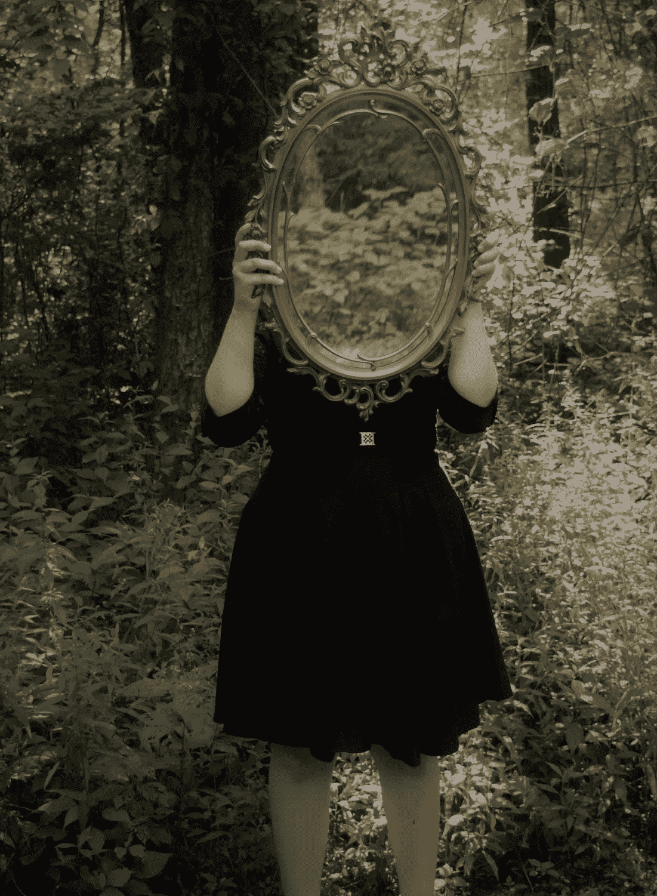

# 你唯一能改变的思想是你自己的

> 原文：<https://medium.com/swlh/the-only-mind-you-can-change-is-your-own-5d703f9f0864>

Who do you see in the mirror?

## 应对冒名顶替综合症

从我记事起，我就想成为一名作家。

当同学们梦想像他们的父母一样成为警察、教师和律师时，我梦想着只靠我的想象力创造世界和人物。那些日子里，我不断地在笔记本上涂鸦，坐在长椅上写场景而不是在课间休息时玩，恳求父母再熬夜一会儿，这样我就可以在餐厅里固定的古老家庭电脑上再打一章。

毫无疑问，在我 11 岁的时候，我就知道我注定要成为一名小说家，生活中没有任何东西能像把文字写在纸上那样满足我的灵魂。学生们嘲笑我，老师们建议我放下书，和我的同学们交往——一位老师甚至告诉我，在六年级时阅读莎士比亚将确保我永远交不到朋友——但我从未想过我应该成为一名作家。

那么是什么改变了呢？我什么时候开始觉得自己像一个穿了一辈子的骗子了？什么时候写作从一种快乐的经历变成了一种带着怀疑、恐惧和自我厌恶的经历？

我不确定这是什么时候发生的，但在某个时候，所有那些关于我的爱好有多奇怪的评论开始像霉菌一样渗入我的脑海角落。我长大了一点，把我小小的小学教室换成了一所拥有 2000 多名学生的高中，在可预见的未来，这种转变因需要使用拐杖而变得更加糟糕。由于笨重的助行器，我经常被展示。当我蹒跚走过时，人们会停下来盯着我看，突然我觉得自己就像幼儿园教室碗里的一条孤独的鱼。

我更加意识到我周围的喋喋不休，因为我的手一直在推动我前进，而不是抓着一本书，里面有我可以逃避的整个世界。每个人都在开发自己的品牌。运动员，艺术儿童，哥特儿童，各种各样的继续下去。但是我没有找到其他作家。没有一个热爱文学的人能点燃他们的创作之火，让他们除了整天敲敲电脑键盘或讨论如何建设世界之外，什么也不想做。

我开始扭曲自己的自我意识来迎合周围的环境。我开始改变自己的想法，越来越不相信自己注定要成为一名作家。我也是一个聪明的孩子，来自一个充满动力的家庭，因此我期望在所有的学业上取得成功。因此，当我找不到其他作家时，我就被贴上了“聪明孩子”的标签，并一直呆在那里，直到感觉有点像我很久以前穿的第一件衣服。

我在学校表现很好，我检查了所有的箱子。我成绩很好，总是被要求参加最先进的项目，并尽我所能争取最好的大学。在某个时候，我改变了自己对成为作家的想法，大声说:“我会成为一名编辑。很明显，我不是作家，但至少我会用我的职业生涯开始真正的作家生涯。”

我说了一遍又一遍。“我是编辑。”就像很多谎言一样，一旦重复足够多，它就开始在现实中生根发芽。我说得越多，那个告诉我每天醒来并写下我内心的内容的声音听起来越来越远，直到它几乎成为耳语。

无论我多么努力地尝试，火的余烬从未真正熄灭。我总是选择最有创造性的写作练习，或学校项目的艺术方法，确信我已经将这两种皮肤融合在一起，为我的思想、身体和灵魂创造了一个快乐的媒介。但是皮肤总是感觉很痒，就像晒伤一样。你知道芦荟不会有太大的作用，因为伤害已经造成了。我在自己的生活中是个骗子。

我可以责怪老师，不管是谁在评论，他们都没有督促我写作。我可以责怪我的父母没有培养我的创造力，而是督促我在学术上做得更好。我可以责怪我的同学，他们欺负我，让我相信我不是那个一直对我感到真实的人。但是唯一改变我想法的人是我自己。我说服自己，写作是强加的，是巢中的布谷鸟。我说服自己，改变我的个性和自我意识将有助于我找到生活中真正的使命。

毕竟，没有人会在 11 岁时找到自己的人生使命，对吗？

随着时间的推移，我越来越像个骗子。我会改变我的好恶、个性，甚至是我说话的语气，不管是谁和我住在同一个地方。我在这个冒名顶替者的皮肤下变得很舒服，蹒跚地走过了青春期后期，令人困惑的大学岁月，然后是成年初期。我找到了一份支付账单的工作，与我在学校学的任何东西都没有关系，有一段时间我相信如果我不再写一个字，我会过上幸福的生活。

当一个当代人或同事问我的长期人生目标是什么时——当然，除了公司招待之外，我还想用我的余生做些什么——我会咯咯地笑着，咕哝着我曾经梦想成为下一个 J.K .罗琳。他们总是点头，说一些鼓励的话，比如，“你有很多时间可以成为一名作家。你应该那样做！”

我会在晚上回家，打开电视，渴望地盯着我的笔记本电脑，仿佛它会长出腿来，走到我的腿上，自己打开，开始打印下一本伟大的美国小说。当我花了这么多时间来开发这个冒名顶替者的皮肤时，面对我内心深处知道的真实的自己，感觉就像在阔别二十年后出现在一个所爱的人的葬礼上。我会充满遗憾，所有那些我从未写下的失落的话语，那些我从未让他们有自己的声音的角色，我离开的世界在我脑海中自我怀疑的模式中摇摇欲坠。

有时候，我在想，如果写作在我晚年找到了我，我会不会觉得自己是个骗子。如果我刚刚获得英语或历史硕士学位，成为一名教育工作者，从事职业生涯，发现这并不快乐，然后坐下来写我的故事，会怎么样？在我坐下来写下第一个故事之前，我会不会觉得缺少了什么，就像一个没有最后一块的拼图？如果写作永远找不到我怎么办？会有其他的召唤吗？或者我会继续过我设计的这种生活，围着一个并不真正属于我的皮肤？

最终我的冒名顶替者的皮肤开始变得越来越痒。我现在二十多岁，步履维艰。我有朋友买了房子，有朋友拿到了博士学位，有朋友自己创业，第一次发现了自己的激情。我知道所有的咒语，比如“生活不是一场比赛”，“你的终点线不是他们的”，“尝试新事物永远不会太晚”，但自我怀疑从未动摇过。我已经改变了主意，而且无法挽回。

慢慢地，我记不清是什么时候，我又开始读了。我不知道我为什么或者什么时候停下来。偶尔会有一些书，假期充满了乏味的爱情小说和发生在寂静城镇的谋杀悬疑小说，但我从一个如饥似渴的读者变成了一年读不到二十本书的人。

随着我读得越来越多，我感觉到这么长时间以来创造力的微小火花第一次开始闪烁。余烬变成了光亮，最终我听到了木头完全着火的第一声爆裂声。阅读重新唤醒了我的一些东西，我以为我很久以前就摧毁了。我的冒名顶替者的一块皮肤开始从我的身上剥落。

它发生得如此缓慢而突然，就像我一直描述的坠入爱河一样。有一天是空白的一页，有一天上面写满了我自己串起来的单词。越来越多的冒名顶替者开始剥落，露出第一张皮肤，那张我从未真正脱下的皮肤。突然间，这一切都显得如此愚蠢。事实上，我让所有那些声音侵蚀了我的信心，让我相信我是任何少于或不同于我一直以来。

我刚刚写完我的第三个短篇小说，这时一位老朋友坐到了我的心灵桌旁。她是一个古老的角色，凶猛而受伤，讲述了一个关于我在 10 年级时放弃的冒名顶替者的故事。我们像老朋友一样重新认识了自己，就像时间根本没有流逝一样。我有点担心她会恨我这么多年来一直留着她的半成品，但她现在比以往任何时候都让我感到更加熟悉。

就好像她耐心地等待着我在自己的生活中成长，这样我就能更多地理解她。当时我还没准备好讲述她的故事，但现在我真的准备好了吗？我们都感到害怕，迷失在我们故事中杂草丛生、无人问津的花园里，找不到回到那些垫脚石的路，而那些垫脚石会把我们带到新的地方。

“你唯一能改变的想法是你自己。”

当我开始重写她的故事时，我并不信任或相信自己，但我毫无疑问地知道，无论如何我都需要写它，不管结果如何。是时候接受这一切了，这些年来的自我怀疑、折磨和沮丧只不过是我走过自己的花园，试图找到正确的垫脚石带领我走向新的地方。

多年没有写作的遗憾，失去自我和目标的遗憾，不真诚的关系和工作让我远离现在的位置的遗憾已经一去不复返了。后悔完全离开了我。当我最终意识到所有这些时刻都在引导我回到这个地方，重新感觉自己像一个作家时，它对我有什么力量？

我仍然发现自己在和这个冒名顶替的怪物战斗，害怕皮肤会粘在我身上，永远扼杀我所有的创造力。但是每天当我起床写下文字的时候，这个怪物变得越来越小。还是有那么些日子，我觉得这个世界要把我的声音吞掉，再也不让我说话，但我还是把话写在纸上。单词变得更好，他们变得更自信。反过来，这些文字教会我对写下它们的人更加自信。

我终于彻底改变了主意。我是一名作家，在这个世界上，我不想做别的事情。