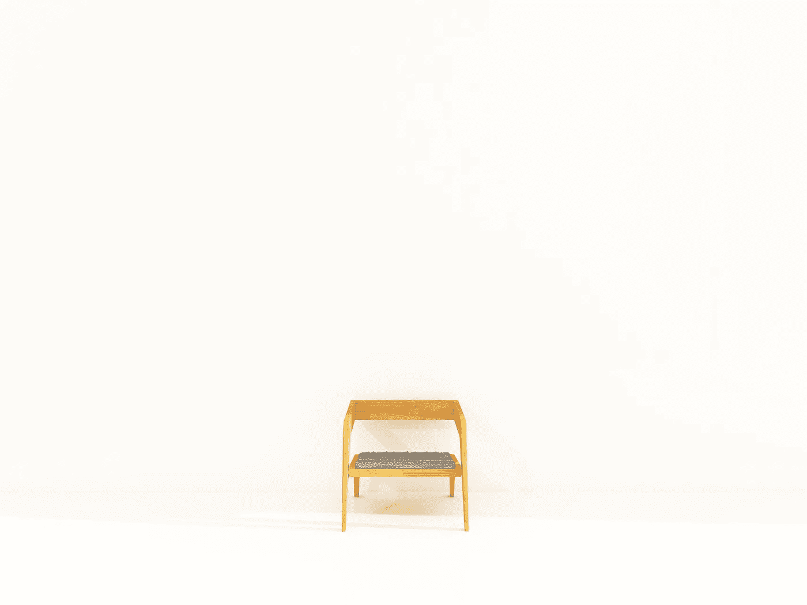

# 唯一通用的标准是质量

> 原文：<https://medium.com/swlh/the-only-universal-criteria-is-quality-67da74c2895c>

The world could do with more well-designed chairs. Photo by [Ron McClenny](https://unsplash.com/photos/pNG1WHerkrQ?utm_source=unsplash&utm_medium=referral&utm_content=creditCopyText) on [Unsplash](https://unsplash.com/search/photos/chair?utm_source=unsplash&utm_medium=referral&utm_content=creditCopyText)

老师会分发上面有盒子的纸。每个盒子里都有单词，用来说明你是如何得到某个分数的。每个盒子里的单词都一样，只是有一两处变化。

这个学生表现出对这个话题有很好的理解。这是一个 c 值的声音是中档。不太好。声音。

这名学生对这个话题表现出了很强的理解。B.

这名学生对这个话题表现出了非凡的理解。这是钱。够了这些盒子，你就得了 a。

我一直不明白为什么 a 用 exceptional 这个词，我以为它的意思是接受。你的工作被接受了，给你一个 a。

做作业时，我从来不注意标准表。它总是溢于言表。太多了，它失去了意义。

我只想知道我该做什么。为了不惹上麻烦我不得不交的钱，这样我就可以继续玩游戏了。

我所有的作业看起来都很棒。我确保了这一点。我喜欢好看的文件。我会完成一项物理作业并交上去。审美 A+，内容 B。

大学也是一样。更多标准表。更缺乏阅读。更多地阅读任务表 6 次，并问自己，“我实际上需要做什么？”

然后是网上创作。没有标准表。一切皆有可能。

我的第一篇博客帖子是垃圾。废话，但诚实。我试图让我的女朋友读它。她善于言辞。从那以后，我大概写了 6 个很棒的，277 个声音和 3 个特别的帖子。

互联网上没有标准表。所以很难开始做任何东西。“我实际上需要/想做什么，”请注意 want 的添加。

你可能有很多想做的事情。太多了。所以你不太可能因为缺乏想法而停滞不前。相反，缺乏方向。

解药？

普遍标准。

你已经知道这个了。

人们喜欢高质量的东西。

教会他们一些东西的东西。娱乐他们的东西。适合他们每天重复告诉自己的故事的事情。有用的东西。

如果你是一个创造者，正在寻找一个指南或一些标准来遵循，那就让它有质量。

其他一切都有待讨论。

附注:我的特别帖子在[中](/@mrdourke)继续。其余的每天都在 mrdbourke.com 的[上(这就是这个的来源)。](http://mrdbourke.com)

## 这篇文章发表在 [The Startup](https://medium.com/swlh) 上，这是 Medium 最大的创业刊物，有+411，714 人关注。

## 订阅接收[我们的头条新闻](http://growthsupply.com/the-startup-newsletter/)。

