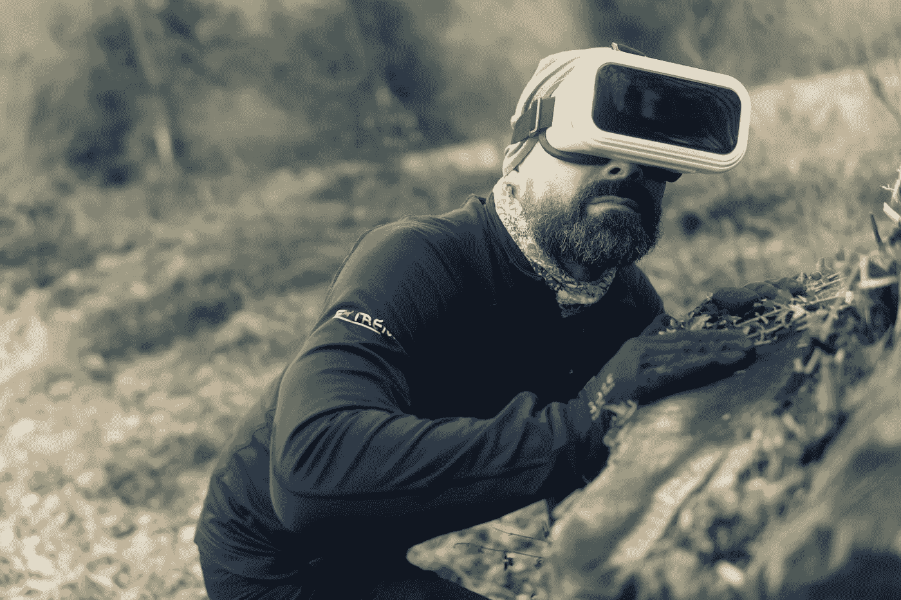

# 唯一的出路是通过:在退伍军人中使用虚拟现实治疗 PTSD

> 原文：<https://medium.com/swlh/the-only-way-out-is-through-using-virtual-reality-for-ptsd-in-veterans-a0a3a0b1b3db>

Photo by [mali maeder](https://www.pexels.com/@mali?utm_content=attributionCopyText&utm_medium=referral&utm_source=pexels) from [Pexels](https://www.pexels.com/photo/man-in-black-sweatshirt-with-vr-752724/?utm_content=attributionCopyText&utm_medium=referral&utm_source=pexels)

我读研的第一个夏天，我在新奥尔良的退伍军人管理局工作。对我来说，这是一个有点不寻常的位置，因为我正在接受儿童心理学的培训。然而，由于负责这个项目的教授的前学生喜欢我，而我又是他的另一个学生的好朋友，我得到了三个名额中的一个。