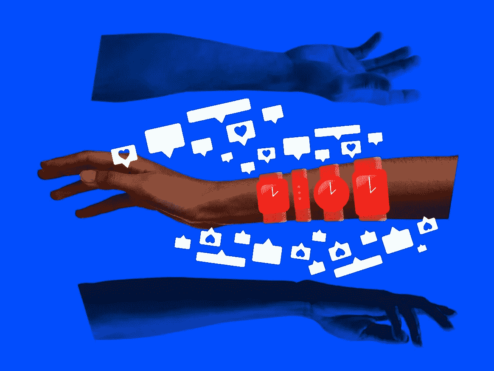

# 优化跑步机

> 原文：<https://medium.com/swlh/the-optimization-treadmill-6c11cb624e>

## 我们已经达到了色情的高峰。现在怎么办？

Photo: Tricia Hipps/Getty Images

在 [第 21 期](https://www.theproofwellness.com/nate-bosshard)的 [The Proof](https://www.theproofwellness.com/) 中，一个专注于建立可操作习惯的健康平台，Tonal 的联合创始人内特·博斯哈德以一个关于他早上例行工作的有趣轶事开场，巧妙地概括了硅谷大师们的超优化咒语。凌晨 4 点醒来，乔科·威灵克风格。磨碎一些来自日本手工农民的抹茶。然后进行 2 小时的锻炼、桑拿浴和冷水循环。

内特很快结束了这个想法，“开个玩笑。我有三个孩子。”他进一步阐述了这一点，认为“对大多数人来说，达到那种程度的一致性是完全不现实的。”我同意。把你一天中的每一分钟都变成一个为了最佳表现和升级生活方式设计而优化的例行程序是完全不可行的。话虽如此，也没有对错之分——这是个人适合度的问题。

尽管他的语气轻松愉快，但 Nate 触及了一些重要的东西，促使我更深入地思考与这种生产力和优化热潮相关的负面外部性。本报告试图回答一个简单的问题:*永无止境的优化会带来哪些成本？*

更重要的是，我们如何才能开发出可行的解决方案，而不创建一个充斥着数字极简主义、禅宗哲学和玛丽近藤生活方式设计的并行优化跑步机？

在硅谷诱人的财富和加里·维纳查克等有影响力的人物的推动下，色情业达到了顶峰。由于缺乏更好的术语，喧嚣色情泛指超优化的趋势。这种范式包括不懈地专注于改进个人的底层操作系统，以及看似永无止境的生产力黑客循环。

虽然许多媒体报道了这一趋势的负面影响，但他们提出的大多数解决方案都助长了自我改进黑客的平行跑步机。例如,《纽约时报》最近发表了《无所事事的理由》,作者在其中论证了无所事事的好处。作者引用心理学家桑迪·曼的话写道，无所事事“确实让我们更有创造力，更善于解决问题，更善于提出创造性的想法。”

虽然作者的观点在经验上是有效的，但这篇文章很快就变成了无用的指令，比如“重组你的环境”和“跳出框框思考”更重要的是，它倾向于由 Marie Kondo 推广的并行优化跑步机。

这两个周期对 A 型性格的人同样有吸引力，这种性格在创业领域通常被奉为偶像。然而，永无止境的跑步机所固有的封闭循环的缺乏会让你的大脑超负荷运转。这种过度驱动的状态会导致压力、焦虑和多种形式的倦怠——通常表现为健康问题、睡眠困难和社会孤立。

令人不安的结论是，这些优化跑步机的工作。

真他妈的好。

T 他的理念类似于马克·扎克伯格最初的脸书口头禅:“快速行动，打破常规。”起初，这句格言创造了奇迹。然而，在某一点上，它制造了更多的问题而不是解决方案。正如我们现在所知，扎克伯格刚刚开始体验这一原始原则带来的负面后果。

通过优化你的生活方式和日常习惯来快速行动。是啊，你动作很快。它工作了。*但代价是什么？*重要的是，我们要主动检查我们已经使用的跑步机，同时考虑尚未被质疑的相关成本。

这里出现了另一个有趣的相似之处。随着最近一波直接面向消费者的品牌筹集了风险资本，它们同样发现自己陷入了不可避免的获取客户的跑步机，以达到预定的增长指标。在每个季度的基础上，DTC 品牌可以指出他们的早期购买指标和转换率，并说——嘿，它的工作！但重要的是要记住，这是一个跑步机。

这个定义的内在含义是它永远不会结束。

以类似的方式，新兴的 DTC 品牌开始主动(或在某些情况下追溯)考虑在游戏中过早筹集过多风险融资的后果。

如果这里有争论的话，那就是关于*觉知*的争论。一个论点是要意识到你每天都在做的个人行为。如果你做了成本效益分析，并决定，嘿，这些习惯和优化工具太有帮助了，不能停下来，这是完全没问题的。坦率地说，我也在那列火车上。也就是说，你应该意识到你移动的速度有多快，你放弃了什么，以及哪些不经意的压力可能正在积累。

诺贝尔奖获得者丹尼尔·卡内曼在《思考快与慢》中写道，“直觉就是识别。”卡尼曼认为，通过几十年的经验，任何领域的专家都有卓越的直觉。冒着过于简单化的风险:为了出类拔萃，一个人必须提高直觉，进而提高识别能力。*至关重要的是，世界级的认可需要高度的认知和持续的关注。*

当你过度计划、过度跟踪、过度监控时，要注意。当你只是为了“忙”而“忙”的时候，要有意识。借用詹姆斯·克利尔的话，当你倾向于行动而不是行动时，要注意。增强的意识让你能够利用这段“忙碌”的时间，在优化跑步机之外，拓展你的兴趣、欲望和关系的表面积。更重要的是，增强的意识创造了时间，在这段时间里，你所策划的意外收获可以自然发生。这是创造力不受常规束缚的地方。

为了避免陷入另一个习惯性的跑步机，我并不主张一个特定的路径，指令，或反周期的黑客。相反，我提倡意识。你可以根据自己的判断来运用这种意识的成果。无所事事有它的好处，特别是在创意部门——这是一个非常有用的创业工具。然而，我不认为安排无所事事的行为有任何帮助。

相反，意识到这样做的好处和过度优化的坏处是非常有利的。

2017 年，布克奖获得者乔治·桑德斯在《纽约时报》上写了一篇专栏文章，报道他的小说《中阴身中的林肯》的发布。他在书中写道:“我们似乎生来就是为了爱，但我们所爱的一切都会结束。我们该拿它怎么办？”

桑德斯把这个问题称为一个可怕的难题，一个我同样面临的困境。令人不安的现实是，我的优化跑步机经验已经证明对我的职业生涯非常有益。与此同时，这也导致了一段时间的精疲力尽，迫使我牺牲了很多——熬夜、休假和与朋友在一起的时间——仅举几例。虽然我对通过桑德斯的作品进入深刻的哲学理论持谨慎态度，但他很好地阐明了在这个跑步机上导航的困难。

跑步机工作，但它从不停止。*我们该怎么办？我不确定答案是什么，但是意识是一个好的开始。*

这篇 [**文章**](https://www.theproofwellness.com/the-optimization-treadmill) 最初发表在 [**The Proof**](https://www.theproofwellness.com/) 上，这是一个专注于建立可操作习惯的健康平台。点击 了解更多关于我们 [**。**](https://www.theproofwellness.com/about)