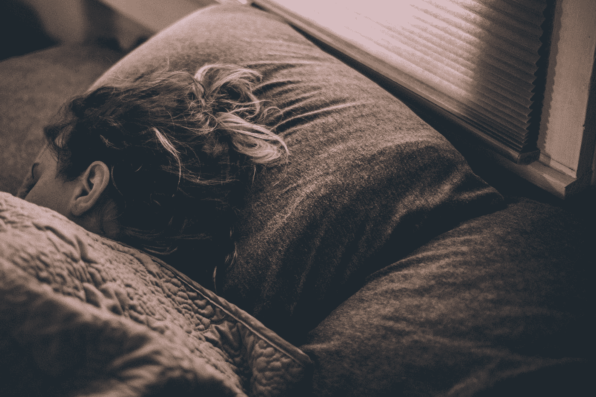

# 有一天，我带着这种感觉醒来。

> 原文：<https://medium.com/swlh/the-other-day-i-woke-up-with-that-feeling-b85c1cb26304>

## 寻找更多东西的探索

Photo by [Gregory Pappas](https://unsplash.com/@sekibaku?utm_source=medium&utm_medium=referral) on [Unsplash](https://unsplash.com?utm_source=medium&utm_medium=referral)

前几天，我带着那种感觉醒来。

这种感觉让我很难起床。我的双臂难以抬起，根本动弹不得。就像我的四肢被推向地面，随着时间的推移，它们会融入床单，拉着我的意识。