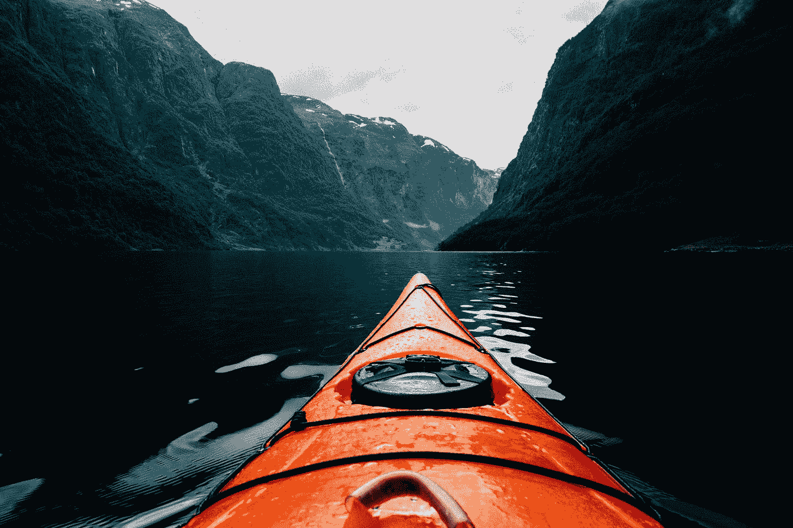

# 探险旅游营销、炒作和销售的弥天大谎:谁是你真正的市场？

> 原文：<https://medium.com/swlh/the-outright-lie-that-is-adventure-travel-marketing-hype-and-sales-whos-really-out-there-2c1e7000d7d3>

Photo by [Benjamin Davies](https://unsplash.com/@bendavisual?utm_source=medium&utm_medium=referral) on [Unsplash](https://unsplash.com?utm_source=medium&utm_medium=referral)

户外行业协会刚刚在丹佛结束了它的第二届丹佛装备展，它在犹他州之后的新位置不会玩得很好。很高兴我的州有他们。OIA 的总部设在博尔德，这是美国最具运动性(也是惊人昂贵)的小山城之一。今年不能去了。我在……冒险。