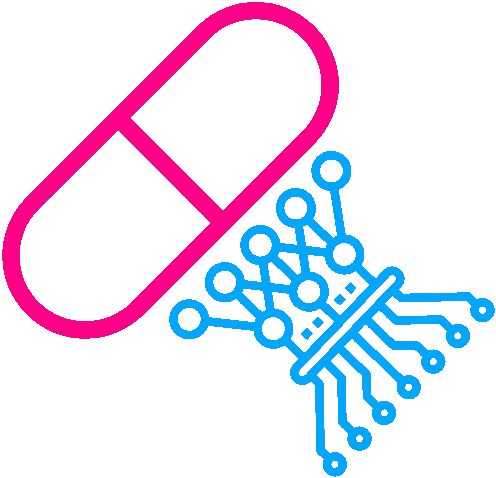

# 基于人工智能的药物发现之路

> 原文：<https://medium.com/swlh/the-path-to-ai-based-drug-discovery-8550b0d5225d>

你可以在这里了解更多关于 AIDDT 的信息: [aiddt.de](http://aiddt.de)

AIDDT 是在[英特尔 DevCloud](https://software.intel.com/en-us/devcloud) 的支持下构建的。

[AIDDT](https://bit.ly/2RGSDhA)

在化学信息学中使用机器学习方法并不是什么新鲜事。我们一直在化学中使用各种学习算法，例如在复杂化学反应的近似结果或分子设计中。