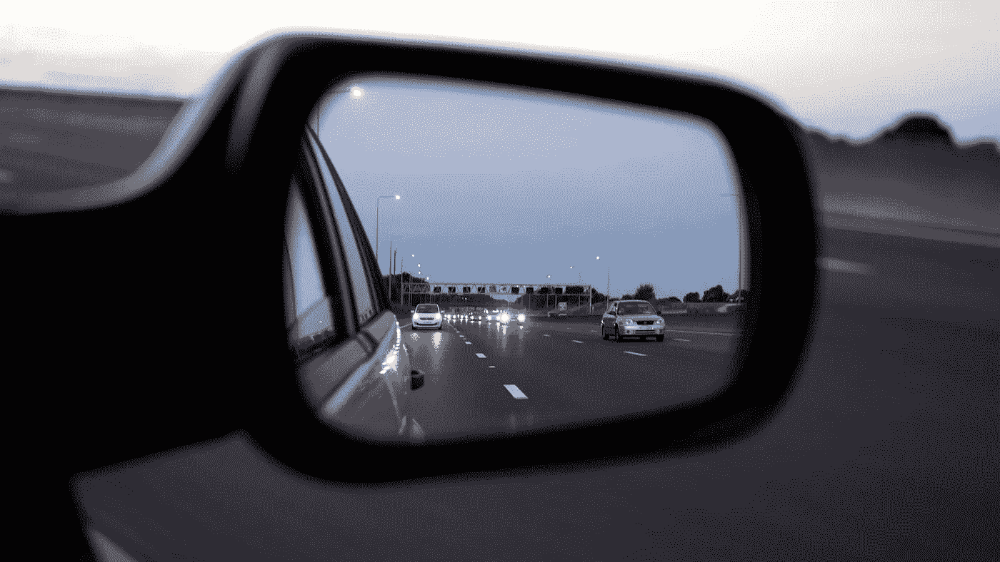

# 根据过去预测未来的危险

> 原文：<https://medium.com/swlh/the-perils-of-predicting-the-future-based-on-the-past-9de0f248c183>

## 当心确认偏差

You can’t go forward by looking back… (Photo by [Mikes Photos](https://www.pexels.com/@mikebirdy?utm_content=attributionCopyText&utm_medium=referral&utm_source=pexels) from [Pexels](https://www.pexels.com/photo/asphalt-auto-autobahn-automobile-133826/?utm_content=attributionCopyText&utm_medium=referral&utm_source=pexels))

我想我们都曾在某个阶段遇到过强调同一基本理念的小字、健康警告和免责条款:

过去的事件对于预测未来并不总是有效或有用的。