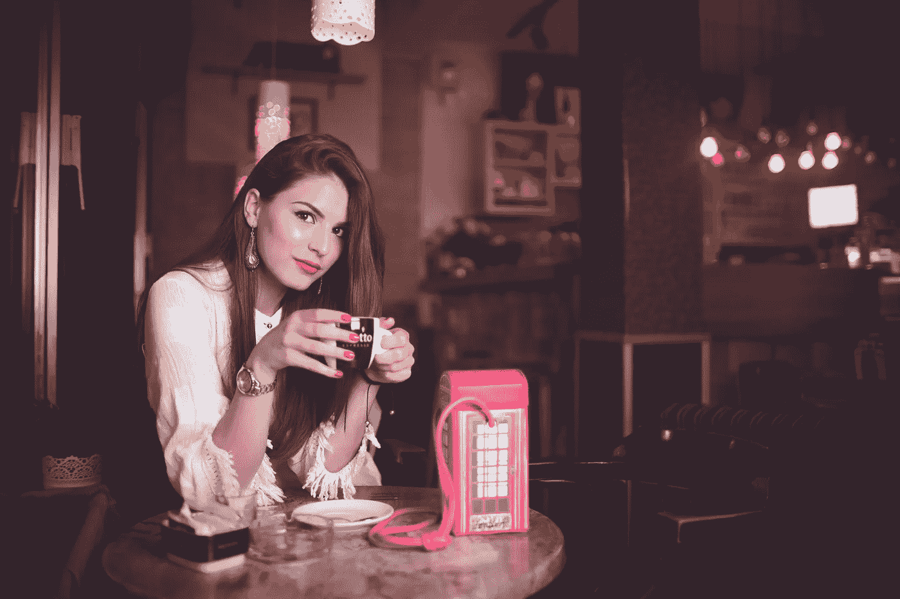

# 这张照片里的人不是我。故事缩略图可以接受视觉点击诱饵吗？

> 原文：<https://medium.com/swlh/the-person-in-this-image-isnt-me-are-story-thumbnails-acceptable-visual-click-bait-612f823de5a0>

This isn’t me. Photo by [Ramiz Dedaković](https://unsplash.com/photos/5zXnQgMNR0M?utm_source=unsplash&utm_medium=referral&utm_content=creditCopyText) on [Unsplash](https://unsplash.com/search/photos/woman-drinking-wine?utm_source=unsplash&utm_medium=referral&utm_content=creditCopyText)

如果你想知道，上图中的人不是我。这是一个可爱的图片，但我的名字是乔希。我不知道这个人是谁，也不知道她喜欢别人怎么称呼她。

## 我注意到许多媒体作者使用人物图片来宣传他们的文章，这些文章…