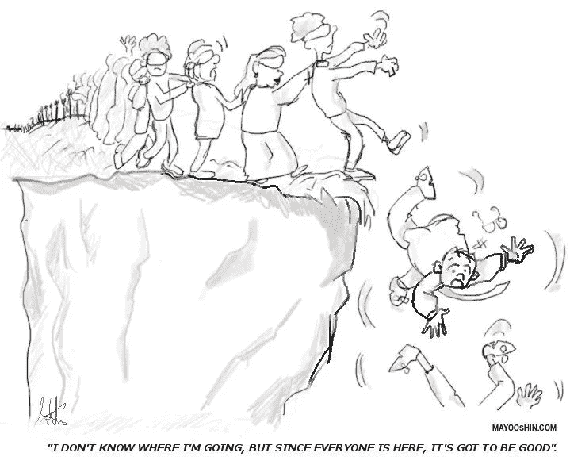
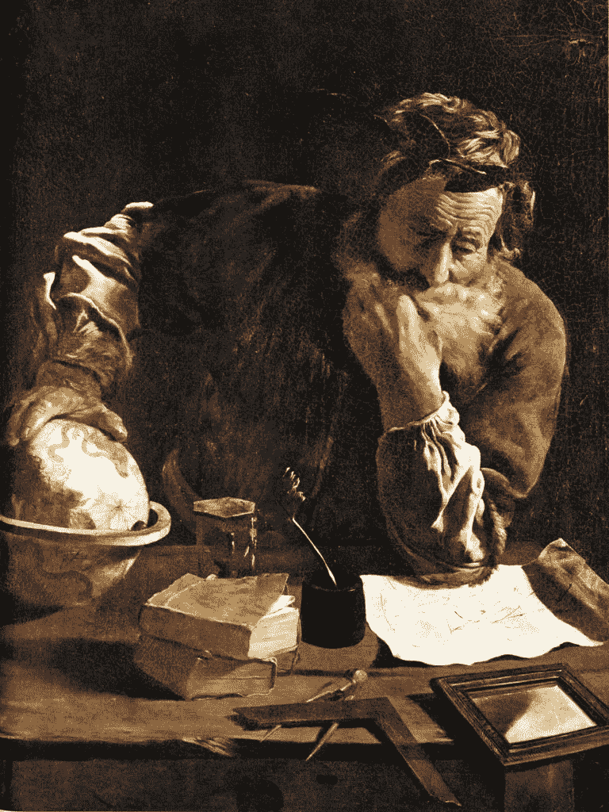
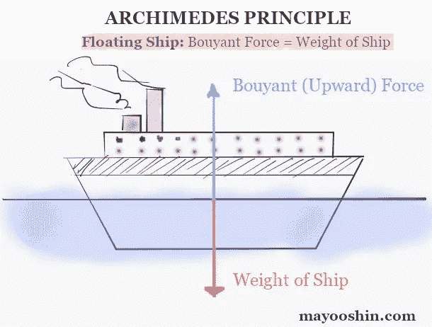
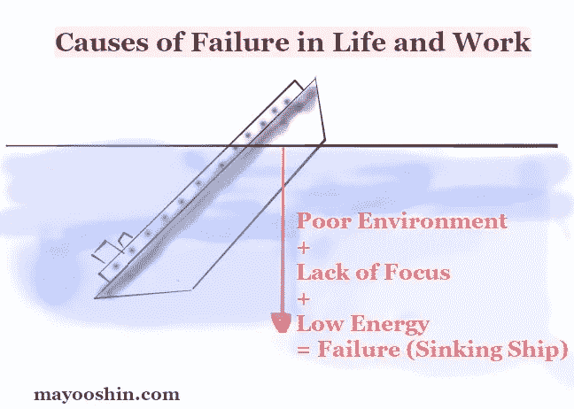

# 为什么我们在生活和工作中失败的物理学原理(以及如何应对)

> 原文：<https://medium.com/swlh/the-physics-of-why-we-fail-in-life-and-work-and-what-to-do-about-it-3840f3d64945>

公元前 3 世纪的一天，西西里岛锡拉丘兹的国王希罗二世召见了年轻的希腊物理学家和数学家阿基米德，他蓄着长长的、飘逸的白胡子，以证实他的新王冠是由纯金制成的，或者一些银被金匠欺骗性地替换了。

对于阿基米德来说，这本来是一项简单的任务，但是国王有一个警告:王冠不能被损坏，否则将会有严重的后果。

几个星期以来，阿基米德一直在思考国王王冠问题的可能解决方案，但他无法破解密码，时间不多了。

一天晚上，当阿基米德洗澡时，他注意到当他把身体伸进浴缸时，浴缸的水位会上升并溢出。

把两者结合起来，阿基米德计算出从浴缸中溢出的水量对应于他的身体浸入水中的量。

不久之后，阿基米德进行了一个快速实验来验证王冠的真实性:他测试国王的王冠是否能排出与一块同样重量的纯金等量的水。

令人惊讶的是，实验显示，国王的王冠比纯金块置换出的水多得多，证明其中掺入了一些银，是赝品。

阿基米德对他的突破性发现兴奋不已，他尖叫道:“找到了！”一丝不挂地跑到街上。[1](https://mayooshin.com/why-do-we-fail-in-life#easy-footnote-bottom-1-2679)T2 2

他从这个实验中得到的见解后来被正式确定为*阿基米德原理*——流体力学的一个基本物理定律——今天，除了发明了“Eureka！”阿基米德被认为是古代最伟大的数学家，是有史以来最伟大的数学家之一。

特别是，*阿基米德原理*包含有用的类比，可以为一个重要问题提供答案:

为什么我们在生活和工作中会失败？

*阿基米德在沉思。domenico Fetti[公有领域]。*

# 阿基米德的失败原理

打个比方，想象一艘船是你的生活，船上漂浮的水是你的环境，即你周围的人、物品和声音。

在这种情况下，下沉的船代表失败，而漂浮的船代表稳定和成功。

在 [**论浮体**](https://www.stmarys-ca.edu/sites/default/files/attachments/files/On_Floating_Bodies.pdf) 中，阿基米德解释了为什么有些船会浮起来，而有些船会沉下去:

> 任何全部或部分浸在液体中的物体，都会被一个力浮起，这个力等于该物体所排开的液体的重量。

换句话说，一艘船要浮在水面上，它需要排出与自身重量相等的水。

如果船排开的水的重量小于它自身的重量，它就会下沉。

这是因为水施加的浮力(或上推力)将小于船重量的向下力。 [3](https://mayooshin.com/why-do-we-fail-in-life#easy-footnote-bottom-3-2679)

为了使船保持漂浮，船的重量必须小于或等于浮力。如果船的重量大于浮力，船就会下沉。

这一物理定律，即众所周知的阿基米德原理，也可以用这个简单的公式来表示(该公式已被转换为船舶类比示例):

> 浮力=(水的密度减去船的密度)乘以重力加速度和排水量。 [4](https://mayooshin.com/why-do-we-fail-in-life#easy-footnote-bottom-4-2679)

简而言之，密度是给定空间中的物质数量。

相同空间里的东西越多，密度就越大。因为液体像水一样有密度，密度比水大的船会沉，密度比水小的船会浮。

现在，让我们玩转阿基米德原理来揭示生活和工作中失败的原因。

**修正公式:**

> 成功=(你的环境支持好习惯的程度减去你追求的目标数量)乘以你采取行动的能力。

根据这个公式，生活和工作中失败的原因主要有三个。

日常生活中阿基米德原理的简化解释。

**#1。环境差**

我们在环境中能看到、闻到、尝到、听到和触摸到的东西，以我们通常看不到的强大方式塑造着我们的行为。

例如，如果你的手机在视线范围内，你就很难集中注意力完成重要的事情。

相反，一个没有可见杂物和干扰的工作环境会大大提高生产力和减少压力。

根据经验，在一个设计糟糕的环境中，长期坚持好习惯要困难得多。

每天围绕在你周围的人、事物和声音将最终决定你人生成败的几率。

**溶液:**就像水一样，不同的液体有不同的密度。例如，盐水比淡水密度大，由于我们的体重比水的密度小，所以我们在死海这样的盐湖中漂浮比在淡水中容易得多。 [5](https://mayooshin.com/why-do-we-fail-in-life#easy-footnote-bottom-5-2679)

同样，我们可以 [**设计我们的环境**](https://mayooshin.com/environment-shapes-life/) 让我们更容易长期坚持好习惯。

我们的环境设计得越好，我们与目标保持一致并在过程中实现目标的可能性就越大。

**#2。缺乏焦点**

就像一艘过于密集的船，我们常常追求超过我们所能处理的目标。

我们兴奋地开始新的目标，但是过了一会儿，我们失去了注意力，无法完成我们开始的事情。

因此，在几个月或几年的时间里，我们的努力没有什么成果。

**解决方案:**为了防止船只沉没，造船工程师从船体中移除不必要的内容，只留下空间和空气。这样，船的密度保持低于水的密度，使其漂浮。

同样，避免生活失败的最好方法是无情地剔除不必要的东西，专注于最重要的事情。

有几个强有力的策略可以做到这一点:[5 件要做的事情方法](https://mayooshin.com/5-things-to-do-too-many-ideas/)，[李锦梅方法](https://mayooshin.com/the-ivy-lee-method/)，[沃伦巴菲特的 5/25 策略](https://mayooshin.com/buffett-5-25-rule/)和[戒烟](https://mayooshin.com/the-upside-of-quitting-why-quitters-always-win-and-losers-never-quit/)。

通过消除不必要的事情，把我们的注意力转移到最重要的事情上，我们创造了必要的时间和精力来持续完成我们开始的事情。

**#3。能量低(没有足够的能力采取行动)**

能力可以归结为三点:时间、精力和能力。

当我们追求一个目标或任务时，如果没有足够的时间、精力或能力去完成它，我们就会让自己失败。

这个问题的一个典型例子是睡眠不足导致的低能量水平。几个晚上几乎不睡觉之后，我们思考、学习、记忆和解决问题的能力会急剧下降到无能的程度。 [6](https://mayooshin.com/why-do-we-fail-in-life#easy-footnote-bottom-6-2679)

**解决方案:**保持全天高能量水平的最好方法之一是练习[**【Zan shin】**](https://mayooshin.com/zanshin-art-of-focus/)，保持 [**规律的睡眠时间表**](https://mayooshin.com/5-scientific-tricks-to-fall-asleep-fast/) ，吃均衡的 [**蓝区饮食**](https://mayooshin.com/blue-zones-diet/) **。**

如果一项任务需要的时间和能力超出了你的承受能力，考虑要么延长完成的期限，完全取消这项任务，要么减少你必须完成的任务量。

# 勉强逃脱困境

同样，有多种因素会导致一艘船在大海中沉没，有多种力量的组合会导致生活和工作中的失败。

阿基米德原理提供了有用的类比，帮助我们解开这些隐藏的力量:设计糟糕的环境、缺乏专注和低能量水平。

正是这些隐藏力量的相互作用最终塑造了我们的生活和命运。

*Mayo Oshin 在 MayoOshin.com**的* [*写作，在这里他分享了科学、艺术和哲学交汇处的实用想法，以求更好的习惯。要让这些想法坚持你的目标，避免愚蠢，你可以在这里*](http://mayooshin.com/) *加入他的免费周报* [*。*](https://mayooshin.com/newsletter/)

## 脚注

1.  公元前 1 世纪的罗马作家和建筑师维特鲁威在他的书《建筑》第九卷中记录了王冠的故事。然而，它并没有出现在阿基米德的著作中。
2.  根据希腊历史学家普鲁塔克的记载，阿基米德是在锡拉丘兹城被罗马人围攻时被杀的。在解决一个数学问题的时候，一个罗马士兵命令阿基米德去见一个罗马将军，但是阿基米德拒绝了，说“不要打扰我的圈子”，指的是他的数学图画。愤怒的罗马士兵用他的剑屠杀了阿基米德。
3.  如果你曾经试图把一个沙滩球推进一个水池，你就会体验到这种与你的努力相反的浮力。
4.  请注意，这篇文章中对阿基米德原理的解释是对公式的复杂力学的过度简化。
5.  一般来说，盐水比相同体积的淡水重 2.5%。
6.  马修·沃克的《我们为什么睡觉:睡眠和梦的新科学》。

*原载于*【mayooshin.com】

**

## *这篇文章发表在 [The Startup](https://medium.com/swlh) 上，这是 Medium 最大的创业刊物，拥有+417，678 名读者。*

## *在这里订阅接收[我们的头条新闻](http://growthsupply.com/the-startup-newsletter/)。*

**