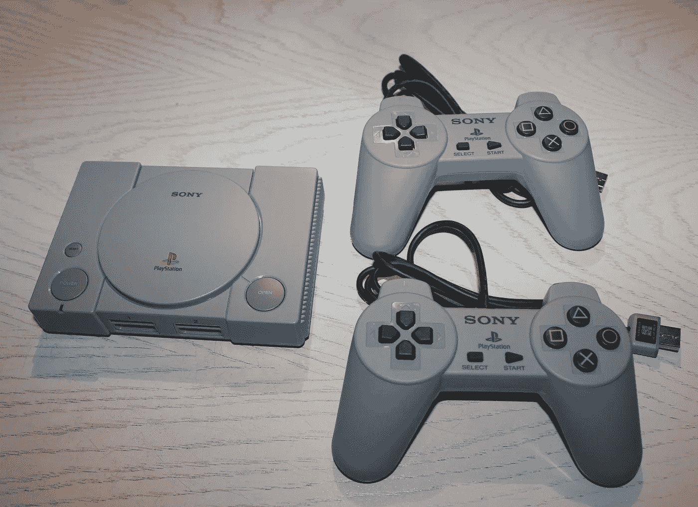

# PlayStation Classic 是新的虚拟男孩

> 原文：<https://medium.com/swlh/the-playstation-classic-is-the-new-virtual-boy-ba417451b3b2>

Photo by MarcelBuehner used under the [Creative Commons](https://en.wikipedia.org/wiki/en:Creative_Commons) [Attribution-Share Alike 4.0 International](https://creativecommons.org/licenses/by-sa/4.0/deed.en) license.

当索尼在 2018 年 9 月首次宣布 PlayStation Classic 时，守旧派 PlayStation 的粉丝们把它当成了一件大事。但是当 20 游戏系统在 12 月发布的时候，它已经尽可能的低调了。游戏商店推迟了订单，甚至在圣诞节前对 79.99 美元的建议零售价进行了打折。就在假期后几周，沃尔玛削减了他们的…