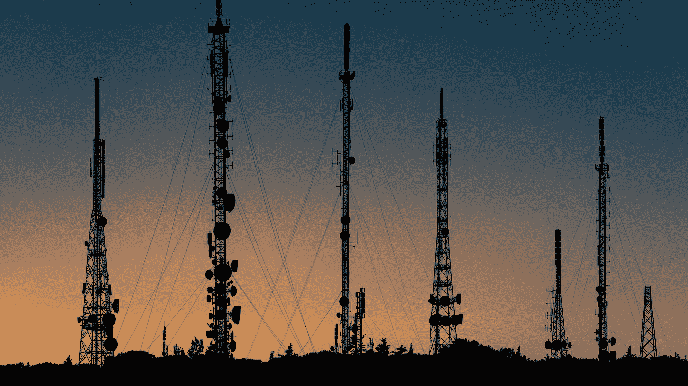

# 采用 5G 的潜在健康风险

> 原文：<https://medium.com/swlh/the-potential-health-risks-of-adopting-5g-d333ffd82515>

## 事实证明，所有这些喧嚣和抗议并不是没有意义的。但在这种情况下，无知是福吗？

几周前，我让[在推特上](https://twitter.com/vnynyr/status/1112529263188676608?s=12)表达了我对 **5G 技术**的持续兴趣，该技术将于 2020 年在一些国家推出。这是一项目前正在掀起波澜的技术，并且…