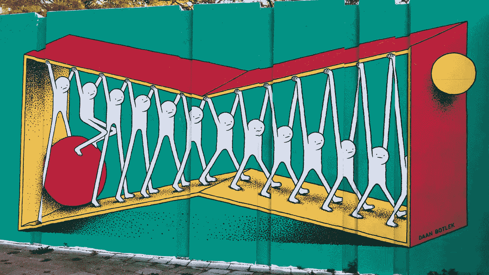

# 困难时期“开放和创造性思维”的力量

> 原文：<https://medium.com/swlh/the-power-of-an-open-creative-mind-in-difficult-times-c3f0210a4052>

## 好奇和拥抱新事物可能是你许多问题的答案

Street Art in Eindhoven, The Netherlands

我们都很开明。至少，我们喜欢认为我们是。每个人都想相信他们对新思想持开放态度，并且没有偏见。思想开放似乎对我们很重要。我们不喜欢别人这么说。